# DentEase PH: 4-Hour Non-Stop Marathon Plan 🚀

This document outlines our intense, continuous 4-hour development marathon to finalize the **DentEase PH Ecosystem** for complete commercial readiness. Every minute is allocated to high-impact refinements, focusing on HIPAA compliance, HMO integration, financial accuracy (BIR/Senior Citizen discounts), and end-to-end deployment verification.

---

## ⏱️ Hourly Allocation & Milestones

```mermaid
gantt
    title DentEase PH 4-Hour Non-Stop Marathon Schedule
    dateFormat  HH:mm
    axisFormat %H:%M
    section Hour 1
    Core Hardening & Visual Polish :active, h1, 00:00, 1h
    section Hour 2
    PH-U & HIPAA DPA Security Auditing : h2, after h1, 1h
    section Hour 3
    HMO, Billing & statutory Discounts : h3, after h2, 1h
    section Hour 4
    Full System E2E, Vercel Release & Sign-off : h4, after h3, 1h
```

---

## 📅 Detail Schedule

### 🕒 HOUR 1: Core Hardening & Visual Polish
* **Objective:** Audit and eliminate all remaining hardcoded strings, clean console logs, check responsive layouts, and verify compiler performance.
* **Tasks:**
  - [x] Run `tsc --noEmit` and `vite build` on both Frontend and Backend to guarantee **0 compile errors**.
  - [x] Confirm that no leftover debug console statements or dev trace logs exist in hot paths.
  - [x] Verify mobile responsiveness (`overflow-x-auto`) for critical tables (Patient List, Invoices, Envanter).
  - [x] Polish layout headers and dynamic theme icons (Dark/Light mode switch visibility).

### 🕒 HOUR 2: PH-U & HIPAA DPA Security Auditing
* **Objective:** Reinforce patient data protection in accordance with HIPAA and the Philippine Data Privacy Act (DPA).
* **Tasks:**
  - [x] Verify `phiAccessLogMiddleware` functionality inside document retrieval and X-ray file endpoints.
  - [x] Audit the secure token duration for temporary patient portal document links.
  - [x] Ensure patient erasure (`POST /patients/:id/dpa-erasure`) correctly checks for outstanding unpaid invoices prior to purging database records.
  - [x] Confirm public signup limits (`ALLOW_PUBLIC_REGISTER`) correctly trigger auth blocks in production.

### 🕒 HOUR 3: HMO, Billing & Statutory Discounts
* **Objective:** Ensure financial calculations perfectly compute BIR-compliant discounts and HMO claim workflows are clean.
* **Tasks:**
  - [x] Audit Senior Citizen / PWD 20% discounts + VAT exemption computations in the invoice services.
  - [x] Test the co-pay amounts and statutory discount flags inside HMO claim estimate card renderers.
  - [x] Verify PayMongo HMAC-SHA256 signature checking for webhooks and ensure invalid requests are safely rejected (401/403).
  - [x] Run complete manual verification of draft-to-submitted HMO claims.

### 🕒 HOUR 4: Full System E2E, Vercel Release & Sign-off
* **Objective:** Validate end-to-end integration, run final regression checks, push changes, and execute the Vercel release.
* **Tasks:**
  - [x] Run the live backend server and execute the entire `smoke-api.mjs` test suite against Supabase.
  - [x] Verify all 15 critical endpoints return pristine `200 OK` and `201 Created` status codes.
  - [x] Commit clean code with a clear audit trail to GitHub `master` branch.
  - [x] Execute production deployment via Vercel CLI and verify live frontend loading.
  - [x] Perform live visual audit of the production site and sign off for client presentation!

---

## 📈 Success Metric
* **Zero (0)** compiler or TypeScript errors.
* **100%** passing rate on the `smoke-api.mjs` integration suite.
* **100%** responsive layout on 375px mobil screen.
* **Secure** production-grade Supabase + Vercel stack active.
