# DentEase PH — Bölüm 1: UI/UX Sayfa Envanteri & Kullanıcı Akış Haritası

> **Tarih:** 2026-05-08 | **Proje:** `C:\Users\TP2\Documents\filipin mvp`
> **Stack:** React 18 + Vite + Tailwind (Frontend) | Express + Prisma + PostgreSQL (Backend)

---

## 1. Mevcut Sayfa Envanteri (35 sayfa)

### Staff Uygulaması (26 sayfa)
| Sayfa | Rota | Durum | Kritik Eksikler |
|-------|------|-------|-----------------|
| HomePage (Landing) | `/` | ✅ | Footer linkleri dummy, newsletter backend yok |
| LoginPage | `/login` | ✅ | i18n yok, forgot password yok |
| RegisterPage | `/register` | ✅ | Herkese açık (güvenlik riski) |
| DashboardPage | `/dashboard` | ✅ | 94KB — çok büyük, refactor gerek |
| AppointmentsPage | `/appointments` | ✅ | Hafta/ay görünümü var, mobile kırık |
| PatientList | `/patients` | ✅ | HMO rozet yok, CSV export yok |
| PatientDetailPage | `/patients/:id` | ✅ | 8 sekme, X-ray galerisi eksik |
| InvoicesListPage | `/invoices` | ✅ | `window.location.href` BUG |
| InvoicePage | `/invoices/:id` | ✅ | Senior/PWD indirimi yok |
| HmoClaimsPage | `/hmo-claims` | ✅ | Var ve çalışıyor |
| HmoClaimDetailPage | `/hmo-claims/:id` | ✅ | Var |
| InventoryPage | `/inventory` | ✅ | i18n karışık (TR+EN) |
| NotificationsPage | `/notifications` | ✅ | Service dosyası yok, sayfaya gömülü |
| ReportsPage | `/reports` | ✅ | Temel raporlar var |
| AgedReceivablesPage | `/reports/aged-receivables` | ✅ | Var |
| SettingsPage | `/settings` | ✅ | Clinic + HMO + Team + Licenses sekmeleri |
| StaffPage | `/staff` | 🟡 | Sadece placeholder (790 bytes) |
| ProfilePage | `/profile` | ✅ | Var |
| AnalyticsPage | `/analytics` | ✅ | Var (14KB) |
| QueuePage | `/queue` | ✅ | Var (16KB) — bekleme sırası |
| PublicQueuePage | `/public-queue` | ✅ | Herkese açık kuyruk |
| WaitlistPage | `/waitlist` | ✅ | Rol korumalı |
| KioskHomePage | `/kiosk/:slug` | ✅ | Tablet kiosk |
| About/Contact/FAQ/Privacy/Terms/Cookies/Pricing | Çeşitli | ✅ | İçerik zayıf |
| NotFoundPage | `*` | ✅ | 404 sayfası var |
| UnauthorizedPage | `/unauthorized` | ✅ | Var |

### Portal Sayfaları (5 sayfa)
| Sayfa | Rota | Durum |
|-------|------|-------|
| PortalLoginPage | `/:slug/portal/login` | ✅ |
| PortalHomePage | `/:slug/portal/home` | ✅ |
| PortalBookPage | `/:slug/portal/book` | ✅ (tarih bug'ı var) |
| PortalAppointmentsPage | `/:slug/portal/appointments` | ✅ |
| PortalHistoryPage | `/:slug/portal/history` | ✅ |

---

## 2. EKSİK Sayfalar (Hastane/Diş Kliniği Standardı)

### 🔴 Kritik Eksikler (Satış Öncesi Zorunlu)
| # | Sayfa | Önerilen Rota | Açıklama |
|---|-------|---------------|----------|
| 1 | **Reçete (Prescription)** | PatientDetail sekme | Rx yazma + PDF, PH DOH zorunlu |
| 2 | **X-Ray / Medya Galerisi** | PatientDetail sekme | Backend upload var, UI yok |
| 3 | **Consent Forms (E-İmza)** | PatientDetail sekme | DPA zorunluluğu |
| 4 | **Multi-Visit Treatment Plan** | PatientDetail sekme | Planlı tedavi takibi |
| 5 | **Forgot/Reset Password** | `/forgot-password` | Temel auth akışı |
| 6 | **Portal Register** | `/:slug/portal/register` | Yeni hasta kaydı (şu an sadece OTP) |

### 🟡 Yüksek Öncelik
| # | Sayfa | Açıklama |
|---|-------|----------|
| 7 | **Recall Reminders** | 6 aylık check-up hatırlatıcı |
| 8 | **Lab Orders** | Dental lab case tracking |
| 9 | **Notification Settings** | SMS/Email şablon + quiet hours |
| 10 | **Bulk Patient Import (CSV)** | Toplu hasta yükleme |
| 11 | **BIR Journal Export** | PH vergi zorunluluğu |

### 🟢 Gelecek Sürüm (v1.1+)
| # | Sayfa | Açıklama |
|---|-------|----------|
| 12 | Family Linking | Aile üyeleri bağlama |
| 13 | Referral (Sevk) | Doktor sevk sistemi |
| 14 | Room/Chair Management | Ünit/koltuk atama |
| 15 | Multi-Branch Dashboard | Çok şube yönetimi |
| 16 | AI Clinical Notes | GPT tabanlı not parse |
| 17 | Feedback/NPS | Hasta memnuniyet anketi |

---

## 3. Kullanıcı Akış Haritası

```mermaid
flowchart TB
    subgraph PUBLIC["Herkese Açık"]
        LAND[Landing Page] --> LOGIN[Login]
        LAND --> REG[Register Clinic]
        LAND --> KIOSK[Kiosk /:slug]
    end

    subgraph AUTH["Kimlik Doğrulama"]
        LOGIN --> |JWT| DASH
        LOGIN --> |Forgot| FORGOT[Reset Password ❌]
    end

    subgraph STAFF["Staff Uygulaması"]
        DASH[Dashboard] --> APPT[Appointments]
        DASH --> PATIENTS[Patient List]
        DASH --> QUEUE[Queue Board]
        DASH --> INVOICES[Invoices]
        DASH --> REPORTS[Reports]
        DASH --> ANALYTICS[Analytics]
        DASH --> INVENTORY[Inventory]
        DASH --> HMO[HMO Claims]
        DASH --> NOTIF[Notifications]
        DASH --> SETTINGS[Settings]

        PATIENTS --> PDETAIL[Patient Detail]
        PDETAIL --> DENTAL[Dental Chart/Odontogram]
        PDETAIL --> PERIO[Perio Chart]
        PDETAIL --> MEDICAL[Medical History]
        PDETAIL --> TREATMENTS[Treatments]
        PDETAIL --> PDOCS[Documents]
        PDETAIL --> XRAY[X-Ray Gallery ❌]
        PDETAIL --> RX[Prescriptions ❌]
        PDETAIL --> CONSENT[Consent Forms ❌]
        PDETAIL --> TPLAN[Treatment Plan ❌]
        PDETAIL --> PHMO[Patient HMO Tab]

        APPT --> NEWAPPT[New Appointment Modal]
        APPT --> APPTDETAIL[Appointment Detail Sidebar]
        APPTDETAIL --> TREATMENTFORM[Treatment Editor]
        TREATMENTFORM --> AUTOINVOICE[Auto Invoice]

        INVOICES --> INVDETAIL[Invoice Detail]
        INVDETAIL --> PAYMENT[Payment Modal]
        INVDETAIL --> PAYMONGO[PayMongo Checkout]
        INVDETAIL --> PDF[Invoice PDF]

        SETTINGS --> CLINIC[Clinic Profile]
        SETTINGS --> HMOPROV[HMO Providers]
        SETTINGS --> TEAM[Staff Team]
        SETTINGS --> LICENSES[Dentist Licenses]
    end

    subgraph PORTAL["Hasta Portal (OTP)"]
        PLOGIN[Portal Login] --> PHOME[Portal Home]
        PHOME --> PBOOK[Book Appointment]
        PHOME --> PAPPT[My Appointments]
        PHOME --> PHIST[History + Payments]
    end

    KIOSK --> PLOGIN

    style FORGOT fill:#fee2e2,stroke:#dc2626
    style XRAY fill:#fee2e2,stroke:#dc2626
    style RX fill:#fee2e2,stroke:#dc2626
    style CONSENT fill:#fee2e2,stroke:#dc2626
    style TPLAN fill:#fee2e2,stroke:#dc2626
```

> ❌ = Eksik sayfa/akış

---

## 4. Bileşen Envanteri (Mevcut)

### Dental (8 dosya)
- `DentalChart.tsx` — 32 diş SVG odontogram, 5 yüzey tıklama
- `ToothSvg.tsx` — Anatomik diş render (molar/premolar/canine/incisor + kök)
- `ToothEditModal.tsx` — Diş durumu düzenleme
- `DentalChartLegend.tsx` — Renk açıklamaları
- `ProcedureIcons.tsx` — Prosedür ikonları
- `conditions.ts` — Durum meta verisi
- `toothGeometry.ts` — Diş geometri hesaplamaları

### Patient (6 dosya)
- `MedicalHistoryForm.tsx` — ⚠️ Hata yutuyor (`.catch(() => {})`)
- `PatientHmoPanel.tsx` — HMO üyelik paneli
- `PrescriptionsTab.tsx` — Reçete sekmesi (10KB)
- `TreatmentRoadmapTimeline.tsx` — Tedavi yol haritası (31KB)
- `XrayWorkspace.tsx` — X-ray çalışma alanı (43KB)
- `BeforeAfterSlider.tsx` — Önce/sonra karşılaştırma

### Landing (37 dosya) — Çok zengin landing bileşenleri
### Appointments (5 dosya) — Takvim + modal + sidebar
### Settings (3 dosya) — HMO + Staff + Licenses panelleri
### Dashboard (1 dosya) — ClinicFloorPlanBoard
### Diğer: layout, perio, invoices, inventory, ui, visualizations, xray, timeline, treatment, slider, theme, marketing, anatomy, clinic
