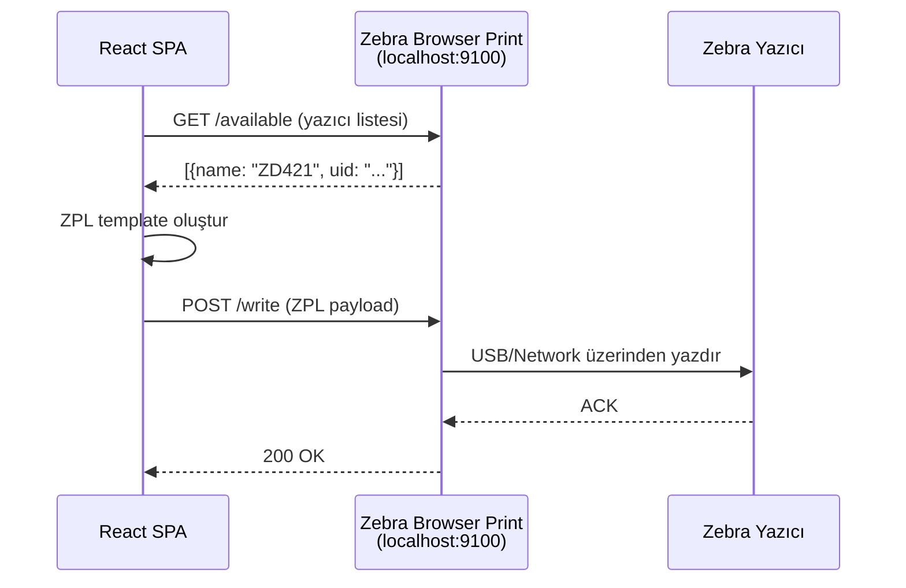
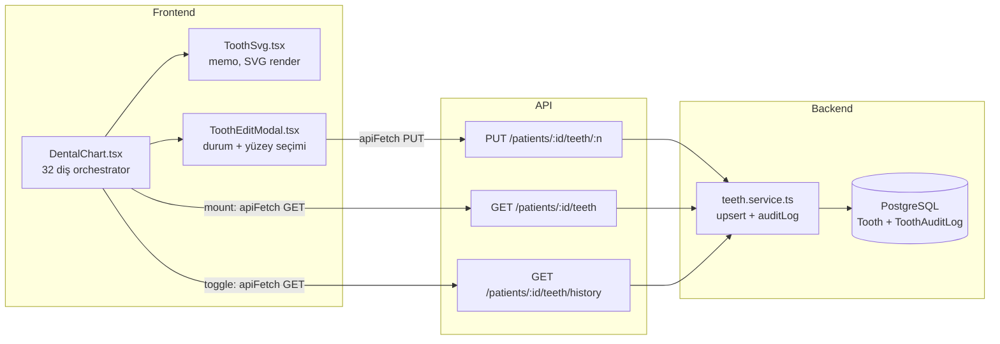
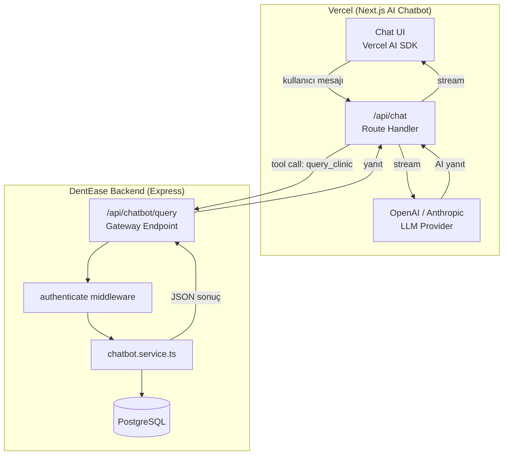

# DentEase PH — Bölüm 3: Entegrasyon Mimarileri

> Zebra Yazıcı + SVG Odontogram + Next.js AI Chatbot

---

## 1. Zebra Barkod/Etiket Yazıcı Entegrasyonu

### Problem
Web uygulamasından (UniGUI veya React SPA) doğrudan Zebra yazıcıya yazdırmak. Tarayıcıların donanım erişim kısıtlamaları nedeniyle klasik `window.print()` yetersiz.

### Önerilen Mimari: Zebra Browser Print SDK



### Implementasyon

```typescript
// frontend/src/services/zebraPrint.ts

const BROWSER_PRINT_URL = 'http://localhost:9100';

interface ZebraPrinter {
  name: string;
  uid: string;
  connection: string;
  deviceType: string;
}

/** Bağlı Zebra yazıcıları listele */
export async function getAvailablePrinters(): Promise<ZebraPrinter[]> {
  const res = await fetch(`${BROWSER_PRINT_URL}/available`);
  if (!res.ok) throw new Error('Zebra Browser Print not running');
  return res.json();
}

/** ZPL komutu gönder */
export async function printZpl(printerUid: string, zpl: string): Promise<void> {
  const res = await fetch(`${BROWSER_PRINT_URL}/write`, {
    method: 'POST',
    headers: { 'Content-Type': 'application/json' },
    body: JSON.stringify({ uid: printerUid, data: zpl }),
  });
  if (!res.ok) throw new Error('Print failed');
}

/** Hasta bilgi etiketi ZPL şablonu */
export function patientLabelZpl(patient: {
  name: string;
  id: string;
  phone: string;
  birthDate: string;
}): string {
  return `
^XA
^FO50,30^A0N,30,30^FD${patient.name}^FS
^FO50,70^A0N,20,20^FDID: ${patient.id}^FS
^FO50,100^A0N,20,20^FDTel: ${patient.phone}^FS
^FO50,130^A0N,20,20^FDDOB: ${patient.birthDate}^FS
^FO50,170^BY2^BCN,60,Y,N,N^FD${patient.id}^FS
^XZ`;
}

/** Stok barkod etiketi */
export function inventoryBarcodeZpl(item: {
  name: string;
  sku: string;
  lot: string;
  expiry: string;
}): string {
  return `
^XA
^FO30,20^A0N,25,25^FD${item.name}^FS
^FO30,50^A0N,18,18^FDSKU: ${item.sku}^FS
^FO30,75^A0N,18,18^FDLot: ${item.lot} Exp: ${item.expiry}^FS
^FO30,110^BY2^BCN,50,Y,N,N^FD${item.sku}^FS
^XZ`;
}
```

### Alternatif: WebSocket Yaklaşımı (Browser Print olmadan)

```typescript
// Backend proxy — doğrudan ağ yazıcısına TCP bağlantısı
// backend/src/routes/printer.routes.ts
import net from 'net';

router.post('/print', authenticate, async (req, res) => {
  const { printerIp, port = 9100, zpl } = req.body;
  
  const client = new net.Socket();
  client.connect(port, printerIp, () => {
    client.write(zpl);
    client.end();
    res.json({ success: true });
  });
  client.on('error', (err) => {
    res.status(500).json({ success: false, error: err.message });
  });
});
```

### Karar Matrisi

| Yöntem | Kurulum | Güvenilirlik | USB Desteği | Ağ Desteği |
|--------|---------|-------------|-------------|------------|
| Browser Print SDK | İstemciye yükle | ⭐⭐⭐⭐⭐ | ✅ | ✅ |
| Backend TCP Proxy | Sunucuda | ⭐⭐⭐⭐ | ❌ | ✅ |
| window.print() | Yok | ⭐⭐ | ✅ | ✅ |

**Öneri:** USB yazıcılar için **Browser Print SDK**, ağ yazıcılar için **Backend TCP Proxy**.

---

## 2. SVG Odontogram Asenkron Veri Akışı

### Mevcut Mimari (Analiz)



### Güçlü Yanlar ✅
- `ToothSvg` `memo()` ile sarılı — gereksiz re-render yok
- `apiFetch` ile JWT otomatik ekleniyor
- `ToothAuditLog` ile tam değişiklik geçmişi
- Upsert pattern — diş yoksa oluştur, varsa güncelle
- `clinicId` tenant isolation her sorguda var

### İyileştirme Önerileri

```typescript
// 1. Debounced batch save (hızlı ardışık tıklamalar için)
// frontend/src/hooks/useDebouncedTeethSave.ts
export function useDebouncedTeethSave(patientId: string) {
  const pendingRef = useRef<Map<number, ToothPayload>>(new Map());
  const timerRef = useRef<NodeJS.Timeout>();
  
  const queueSave = useCallback((toothNumber: number, payload: ToothPayload) => {
    pendingRef.current.set(toothNumber, payload);
    clearTimeout(timerRef.current);
    timerRef.current = setTimeout(async () => {
      const batch = Array.from(pendingRef.current.entries());
      pendingRef.current.clear();
      // Tek istek ile batch kaydet
      await apiFetch(`/patients/${patientId}/teeth/batch`, {
        method: 'PUT',
        body: JSON.stringify({ updates: batch.map(([n, p]) => ({ toothNumber: n, ...p })) }),
      });
    }, 500); // 500ms debounce
  }, [patientId]);
  
  return { queueSave };
}

// 2. Backend batch endpoint
// backend/src/routes/patient.routes.ts
router.put('/:id/teeth/batch', authenticate, async (req, res) => {
  const { updates } = req.body; // [{toothNumber, condition, surfaces, notes}]
  const results = await prisma.$transaction(
    updates.map((u) => prisma.tooth.upsert({
      where: { patientId_toothNumber: { patientId: req.params.id, toothNumber: u.toothNumber } },
      create: { patientId: req.params.id, ...u },
      update: u,
    }))
  );
  res.json({ success: true, data: results });
});
```

---

## 3. Next.js AI Chatbot Entegrasyonu

### Mimari Yaklaşım



### Backend: Güvenli API Gateway

```typescript
// backend/src/routes/chatbot.routes.ts
import { Router } from 'express';
import { authenticate } from '../middleware/authMiddleware.js';

const router = Router();

// API key doğrulama (Vercel → DentEase)
function verifyChatbotApiKey(req, res, next) {
  const apiKey = req.headers['x-chatbot-api-key'];
  if (apiKey !== process.env.CHATBOT_API_KEY) {
    return res.status(401).json({ error: 'Invalid API key' });
  }
  next();
}

// Chatbot'un kullanabileceği read-only sorgular
router.post('/query', verifyChatbotApiKey, async (req, res) => {
  const { clinicId, queryType, params } = req.body;
  
  const ALLOWED_QUERIES = [
    'today_appointments',
    'patient_search',
    'available_slots',
    'inventory_status',
    'revenue_summary',
    'pending_claims',
  ];
  
  if (!ALLOWED_QUERIES.includes(queryType)) {
    return res.status(400).json({ error: 'Query type not allowed' });
  }
  
  const result = await executeChatbotQuery(clinicId, queryType, params);
  res.json({ success: true, data: result });
});

export { router as chatbotRouter };
```

### Next.js: AI Chatbot (Vercel AI SDK)

```typescript
// next-chatbot/app/api/chat/route.ts
import { openai } from '@ai-sdk/openai';
import { streamText, tool } from 'ai';
import { z } from 'zod';

const DENTEASE_API = process.env.DENTEASE_API_URL;
const CHATBOT_KEY = process.env.CHATBOT_API_KEY;

export async function POST(req: Request) {
  const { messages, clinicId } = await req.json();
  
  const result = streamText({
    model: openai('gpt-4o'),
    system: `You are a dental clinic assistant for DentEase PH. 
      Help staff with appointment queries, patient lookups, and inventory checks.
      Always respond in the user's language. Use Philippine Peso (₱) for amounts.
      Never reveal patient medical details — only names and appointment info.`,
    messages,
    tools: {
      queryClinic: tool({
        description: 'Query the clinic database for appointments, patients, inventory',
        parameters: z.object({
          queryType: z.enum([
            'today_appointments', 'patient_search', 
            'available_slots', 'inventory_status',
            'revenue_summary', 'pending_claims'
          ]),
          params: z.record(z.string()).optional(),
        }),
        execute: async ({ queryType, params }) => {
          const res = await fetch(`${DENTEASE_API}/api/chatbot/query`, {
            method: 'POST',
            headers: {
              'Content-Type': 'application/json',
              'x-chatbot-api-key': CHATBOT_KEY!,
            },
            body: JSON.stringify({ clinicId, queryType, params }),
          });
          return res.json();
        },
      }),
    },
  });
  
  return result.toDataStreamResponse();
}
```

### Güvenlik Katmanları

| Katman | Mekanizma | Açıklama |
|--------|-----------|----------|
| 1. API Key | `x-chatbot-api-key` header | Vercel ↔ DentEase arası |
| 2. Clinic Scope | `clinicId` zorunlu parametre | Tenant isolation |
| 3. Query Whitelist | `ALLOWED_QUERIES` dizisi | Sadece okuma sorguları |
| 4. Rate Limit | IP + API key bazlı | Abuse koruması |
| 5. Data Masking | Hassas alan filtreleme | `passwordHash`, `phone` gizle |
| 6. CORS | Vercel domain whitelist | Cross-origin koruması |

### DentEase'e Chatbot Widget Gömme

```typescript
// frontend/src/components/ChatbotWidget.tsx
import { useState } from 'react';

const CHATBOT_URL = import.meta.env.VITE_CHATBOT_URL;

export function ChatbotWidget() {
  const [open, setOpen] = useState(false);
  const clinicId = useAuth().user?.clinicId;
  
  return (
    <>
      <button
        onClick={() => setOpen(v => !v)}
        className="fixed bottom-6 right-6 z-50 h-14 w-14 rounded-full 
          bg-emerald-600 text-white shadow-lg hover:bg-emerald-700"
        aria-label="AI Assistant"
      >
        💬
      </button>
      {open && (
        <iframe
          src={`${CHATBOT_URL}?clinicId=${clinicId}&embedded=true`}
          className="fixed bottom-24 right-6 z-50 h-[500px] w-[380px] 
            rounded-2xl border shadow-2xl"
          title="AI Clinic Assistant"
        />
      )}
    </>
  );
}
```
