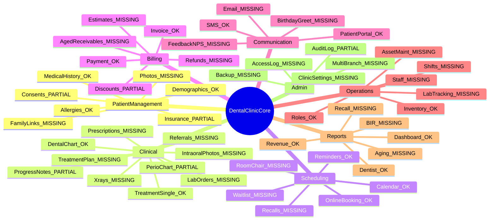
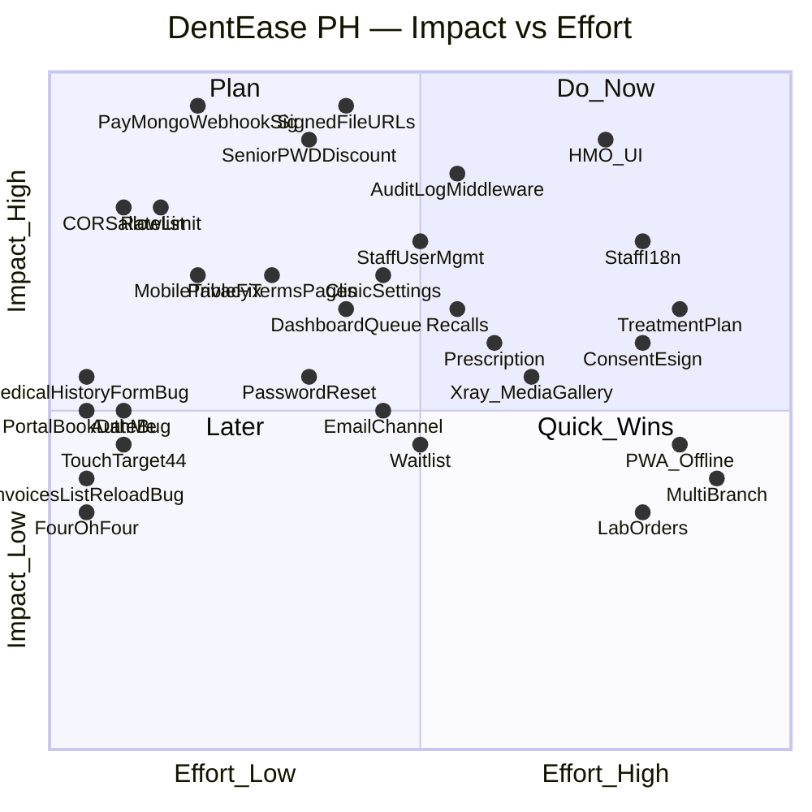

# DentEase PH — Gap Analysis (A'dan Z'ye Denetim Raporu)

Son güncelleme: 2026-04-18
Hedef: Satışa hazır Filipinler diş kliniği yönetim sistemi.
Kapsam: Backend + Frontend (staff + portal) + Landing + Güvenlik + Yasal (PH) + UX + Mobile + Multi-tenant.

> Bu doküman **ne yazıldı / ne bozuk / ne eksik / satış öncesi ne şart** sorularının tek kaynağıdır. Diğer AI agent'ları ve geliştiriciler iş alırken buraya bakar. Kod değişikliği içermez.

**Kod–GAP hizalama notu (2026-04-18):** Bölüm 13 satırları otomatik senkronize değildir; bazı maddeler kodda ilerlemiş olabilir. PR öncesi doğrulanması önerilenler: `backend/src/app.ts` (rate limit, CORS), `backend/src/utils/paymongoWebhook.ts` + `PAYMONGO_WEBHOOK_SECRET`, `ALLOW_PUBLIC_REGISTER` + `/auth/register`, portal ödemesi `POST /api/portal/invoices/:id/paymongo` ve yanıtta `url` / `checkoutUrl`, staff HMO akışı (`HmoClaimsPage`, `PatientHmoPanel`), `.github/workflows/ci.yml`. Kalıcı güncelleme: `scripts/gap-data.mjs` ile tablo yeniden üretimi veya Bölüm 13’ün elle revizyonu.

---

## Bölüm 1 — Yönetici Özeti ve Renk Kodları

### Özet

DentEase PH **çekirdek klinik akışlarının büyük çoğunluğu backend'de çalışır durumda** bir projedir: hasta, randevu, tedavi, fatura + PayMongo + PDF, stok, rapor + PDF, perio, portal (OTP), SMS bildirim + cron. Eski `CHECKLIST.md` / `docs/STATUS.md` özetleri projenin ilerlemesini eksik yansıtıyor.

Gerçek durum: **backend olgunluk %80 civarında**, **frontend staff UI olgunluk %55 civarında**, **landing–uygulama tutarlılığı düşük**, **güvenlik sertleştirmesi henüz yapılmamış**, **PH yasal uyum (BIR Senior/PWD, DPA audit log, Signed URL) eksik**.

Satışa çıkmadan önce bu dokümandaki **Bölüm 6 (Güvenlik)** ve **Bölüm 15 (Satış Blocker)** kalemleri mutlaka kapatılmalıdır. Bunlar ~3 haftalık bir çalışmadır (Bölüm 16 sprint planına bakınız).

### Renk / Etiket Kodları

- `OK` → mevcut ve çalışıyor
- `PARTIAL` → var ama tamamlanmamış (örn. i18n yok, HMO rozeti yok, mobile kırık)
- `MISSING` → hiç yok
- `BUG` → var ama hatalı/bozuk çalışıyor
- `PH` → Filipinler'e özel gereksinim
- `LEGAL` → yasal zorunluluk (BIR, DPA, DOH)
- `CRITICAL` → satışa engel güvenlik açığı
- `HIGH` → satış öncesi çok önerilen
- `MEDIUM` → v1.1'de yapılabilir
- `LOW` → v2'de / yol haritası

---

## Bölüm 2 — Evrensel Diş Kliniği Yönetim Sistemi Standartları

Bir klinik yazılımından **beklenen standart modüller** (dünya ölçeği). Her madde DentEase PH'deki durumuyla etiketli.



### Detay Checklist (evrensel)

**Patient Management**
- Demographics (isim, yaş, cinsiyet, iletişim) — `OK`
- Medical history / anamnez — `OK` ([backend/src/services/medicalHistory.service.ts](../backend/src/services/medicalHistory.service.ts))
- Allergy management — `OK` (array field)
- Patient photos (avatar + ID photo) — `MISSING`
- Family linking (aile üyeleri) — `MISSING`
- Insurance / HMO memberships — `PARTIAL` (şema var, UI yok)
- Informed consent logging — `PARTIAL` (PDF formlar var, e-imza yok)

**Clinical**
- Dental chart (odontogram) — `OK`
- Periodontal chart — `PARTIAL` (recession + suppuration alanları UI'da yok)
- Single-visit treatment record — `OK`
- Multi-visit treatment plan — `MISSING`
- Progress notes (SOAP) — `PARTIAL` (notes field var, yapılandırılmamış)
- Prescriptions (Rx) — `MISSING` (PH'de DOH S2 gerektirir)
- X-ray attachments — `MISSING` (`PatientFile` backend'de var, UI'da yok)
- Intraoral photos — `MISSING`
- Lab order tracking — `MISSING`
- Referrals (sevk) — `MISSING`

**Scheduling**
- Calendar day view — `OK`
- Calendar week/month view — `MISSING`
- Recall reminders (6 aylık check-up) — `MISSING`
- Waitlist — `MISSING`
- SMS reminders — `OK` (Semaphore + cron)
- Room/chair/unit assignment — `MISSING`
- Online booking — `OK` (portal)

**Billing**
- Invoice CRUD — `OK`
- Payment multi-method — `OK`
- Discounts — `PARTIAL` (düz indirim var, Senior/PWD yok)
- Aged receivables (30/60/90 gün) — `MISSING`
- Treatment estimates — `MISSING`
- Refunds — `MISSING`

**Communication**
- SMS — `OK` (Semaphore)
- Email — `MISSING` (Resend/nodemailer kurulu değil)
- Patient portal — `OK` (OTP + book + history)
- Birthday greetings — `MISSING`
- Feedback / NPS — `MISSING`

**Operations**
- Staff management (ADMIN başka user yaratamıyor) — `MISSING`
- Role-based access — `OK` (ADMIN/DENTIST/RECEPTIONIST)
- Shift / attendance — `MISSING`
- Inventory — `OK`
- Dental lab case tracking — `MISSING`
- Asset maintenance — `MISSING`

**Reports**
- Dashboard — `OK`
- Revenue — `OK`
- Dentist performance — `OK` (dashboard içinde)
- Aged receivables — `MISSING`
- Recall compliance — `MISSING`
- BIR journal export — `MISSING`

**Admin**
- Clinic settings — `MISSING` (`PATCH /clinics/:id` yok)
- Multi-branch — `MISSING` (`ClinicGroup` yok)
- Audit log — `PARTIAL` (sadece `ToothAuditLog`; global değil)
- Backup UI — `MISSING` (ops seviyesinde)
- Access log — `MISSING`

---

## Bölüm 3 — Filipinler'e Özel Gereksinimler (`PH` + `LEGAL`)

### 3.1 HMO (Health Maintenance Organization) — `PH` `CRITICAL for PH market`

Filipinler'de özel diş kliniklerine gelen hastaların büyük çoğunluğu Maxicare / Intellicare / Medicard / Cocolife / Philcare gibi HMO üyeliği ile gelir. HMO desteği **zorunlu pazar gereksinimidir**.

- `HmoProvider` CRUD — backend `OK` ([backend/src/routes/hmo.routes.ts](../backend/src/routes/hmo.routes.ts)), frontend `MISSING`
- `PatientHmo` (hasta-HMO bağlaması) — backend `OK`, frontend `MISSING`
- `HmoClaim` workflow — backend `OK`, frontend `MISSING`
- Claim durumları: `PENDING`, `APPROVED`, `REJECTED`, vb. — şema `OK`, UI `MISSING`
- LOA (Letter of Authorization) yükleme — `MISSING`
- Pre-approval akışı — `MISSING`
- Co-payment hesabı Invoice'da — `MISSING`
- HMO reconciliation raporu (ay sonu) — `MISSING`
- Dashboard "HMO Claims Pending" widget — `MISSING` (mockup'ta söz verilmiş)
- Invoice sayfasında HMO rozetleri (Maxicare Approved / Intellicare Pending) — `MISSING`

### 3.2 PhilHealth — `PH` `LEGAL`

Devlet sağlık sigortası. Her vatandaşın numarası vardır.

- `patient.philhealthNo` alanı — `OK`
- Üyelik tipi (Formal/Informal/Senior/PWD/Indigent/OFW) — `MISSING`
- PhilHealth case rate lookup — `MISSING`
- PhilHealth Claim Form 1 & 2 PDF — `MISSING`
- `PaymentMethod.PHILHEALTH` — `OK` (enum)
- PhilHealth üye rozeti Patient listesinde — `MISSING`

### 3.3 BIR (Bureau of Internal Revenue) — `PH` `LEGAL`

Filipinler vergi otoritesi. Her klinik zorunlu olarak OR (Official Receipt) keser ve belirli kurallara uyar.

- OR numaralandırma (`OrSequence`) — `OK` ([backend/src/services/invoice.service.ts](../backend/src/services/invoice.service.ts))
- BIR Permit to Use (PTU) no. invoice PDF'te — `PARTIAL` (yer tutucu var)
- BIR Accreditation no. — `MISSING`
- `TIN` (Taxpayer ID) hasta ve klinik — `MISSING`
- **Senior Citizen indirimi 20% + VAT muafiyeti** — `MISSING` `LEGAL BLOCKER` (RA 9994)
- **PWD indirimi 20% + VAT muafiyeti** — `MISSING` `LEGAL BLOCKER` (RA 10754)
- VAT hesabı (12% VAT-inclusive/VAT-zeroed) — `MISSING`
- Sales Invoice vs OR ayrımı — `MISSING` (hizmette OR yeterli, görünür olmalı)
- BIR Form 2307 (withholding) alanı — `MISSING`
- Günlük / aylık satış defteri export (Book of Accounts) — `MISSING`

### 3.4 DOH / Dental Regulation — `PH`

- Hekim PRC lisans no. — `MISSING` (User modelinde `prcLicenseNo` yok)
- PTR (Professional Tax Receipt) no. — `MISSING`
- Reçetede S2 lisans no. (kontrollü ilaçlar) — `MISSING`
- Dangerous Drugs Board raporu için Rx log — `MISSING`

### 3.5 Data Privacy Act (RA 10173) — `PH` `LEGAL`

- Hasta consent log + timestamp — `MISSING`
- Global data access audit log — `PARTIAL` (`ToothAuditLog` sadece diş; genel değil)
- Hasta data export (portability) — `MISSING`
- Right to be forgotten — `PARTIAL` (`softDeletePatient` var; gerçek anonymize yok)
- Privacy Policy + Terms sayfaları — `MISSING` (footer linkleri `/`)
- DPO (Data Protection Officer) iletişim — `MISSING`

### 3.6 Filipinler Ödeme Metotları — `PH`

- Cash — `OK`
- GCash (PayMongo) — `OK`
- Maya (PayMongo) — `PARTIAL` (enum OK, UI'da sadece GCASH hardcoded)
- Credit Card (PayMongo) — `OK`
- Cheque — `OK` (enum)
- PhilHealth — `OK` (enum)
- BPI / BDO / UnionBank direct — `MISSING`
- **QR Ph** (BSP milli QR standardı) — `MISSING`
- GrabPay — `MISSING`
- 7-Eleven Cliqq / Bayad Center — `MISSING`
- Split payment (yarısı HMO yarısı cash) — `MISSING`

### 3.7 Lokalizasyon — `PH`

- Asia/Manila timezone — `OK` (cron + appointment service)
- `+63` telefon regex — `OK`
- Filipino (fil) dili — `PARTIAL` (landing çevrili, staff UI hard-coded)
- PHP ₱ format — `PARTIAL` (bazı yerlerde `toLocaleString('en-PH')` eksik)

---

## Bölüm 4 — Mevcut Ekranların Satır Satır Denetimi

### 4.1 Staff Sayfaları

**[frontend/src/pages/HomePage.tsx](../frontend/src/pages/HomePage.tsx) — Landing**
- VAR: Hero, özellik kartları (f1-f5), `FeatureModal`, `CapabilitiesList`, `DayInClinic`, `DeviceShowcase`, timeline, personas, pricing teaser, FAQ, newsletter, footer.
- EKSİK: Footer link'leri hepsi `to="/"` (Privacy/Terms/About/Contact sayfaları yok), `f6` (Reports) kartı hero'da yok ama i18n'de var, testimonial'lar fake isimli, newsletter backend'e gitmiyor.

**[frontend/src/pages/LoginPage.tsx](../frontend/src/pages/LoginPage.tsx)**
- VAR: email/password/remember, hata gösterimi, role-based redirect.
- EKSİK: `useTranslation` hiç çağrılmıyor (`auth.*` i18n keyleri hazır ama kullanılmıyor), forgot password linki yok, MFA yok, "Register clinic" linki yok, server `code`/mesajı kullanılmıyor.

**[frontend/src/pages/DashboardPage.tsx](../frontend/src/pages/DashboardPage.tsx)**
- VAR: 4 metrik kart, Recharts (gelir, pasta, top 5), bugün randevu tablosu, hekim performansı, aylık PDF.
- EKSİK: Patient Queue widget, HMO Claims Pending kartı, düşük stok widget, doğum günü listesi, alerts merkezi, i18n, mobile summary.

**[frontend/src/pages/AppointmentsPage.tsx](../frontend/src/pages/AppointmentsPage.tsx)**
- VAR: `timeGridDay`, hekim filtresi, `NewAppointmentModal`, `AppointmentDetailSidebar`, durum butonları.
- EKSİK: Hafta/ay görünümü, bekleme listesi, çakışma UI, SMS "Send reminder" butonu, oda/ünit seçimi, drag-drop doğrulanmamış, mobile özet `md:flex` ile gizleniyor, i18n.

**[frontend/src/pages/PatientList.tsx](../frontend/src/pages/PatientList.tsx)**
- VAR: arama, sayfalama, yeni hasta modal.
- EKSİK: HMO/PhilHealth rozet kolonu, etiket filtreleri (allergy/vip), toplu CSV export, toplu SMS, hasta fotoğrafı, i18n. Tablo `overflow-hidden` → mobile kırık.

**[frontend/src/pages/PatientDetailPage.tsx](../frontend/src/pages/PatientDetailPage.tsx)**
- VAR: 8 sekme (overview, medical, dental chart, perio, appointments, treatments, invoices, documents), alerji rozetleri, PDF formlar.
- EKSİK: HMO üyelik sekmesi, X-ray galerisi, intraoral foto sekmesi, reçete sekmesi, consent e-imza paneli, aile bağlantıları, randevu timeline, balance/AR özeti, i18n. Treatment `toothIds` ham gösteriliyor.

**[frontend/src/pages/InvoicesListPage.tsx](../frontend/src/pages/InvoicesListPage.tsx)**
- VAR: 4 istatistik kartı, filtre şeridi, tablo.
- EKSİK / BUG: Satır `window.location.href` ile **full reload** (React Router `Link` olmalı); tablo `overflow-hidden` mobile kırık; HMO rozeti yok; Senior/PWD filtresi yok; i18n yok.

**[frontend/src/pages/InvoicePage.tsx](../frontend/src/pages/InvoicePage.tsx)**
- VAR: toolbar, kalem tablosu, özet, ödeme listesi, manuel ödeme modal, PayMongo, PDF.
- EKSİK / BUG: "Pay with GCash / Maya" yazıyor ama kodda sadece `"GCASH"`; Maya seçim UI yok; HMO rozet yok; Senior/PWD indirimi yok; TIN alanı yok; `discountDraft` Number doğrulaması zayıf; i18n yok.

**[frontend/src/pages/InventoryPage.tsx](../frontend/src/pages/InventoryPage.tsx)**
- VAR: stok listesi, filtreler, uyarı bandı, CSV export, CRUD + adjust modals.
- EKSİK / BUG: i18n karışık ("Stok uyarıları" TR + "Inventory" EN aynı ekran); tablo `overflow-hidden` mobile kırık; rol kısıtı yok; async try/catch eksik; `aria-label` yok; lot/batch/expiry detay yok.

**[frontend/src/pages/NotificationsPage.tsx](../frontend/src/pages/NotificationsPage.tsx)**
- VAR: SMS log listesi, admin test SMS, cron tetik (daily/soon), filtre.
- EKSİK / BUG: `frontend/src/services/notifications.ts` **yok** (endpointler sayfaya gömülü); başlık "SMS notifications" ama enum'da `EMAIL`/`PUSH` var; klinik ayar UI yok; SMS şablon yok; quiet hours yok.

**[frontend/src/pages/UnauthorizedPage.tsx](../frontend/src/pages/UnauthorizedPage.tsx)**
- VAR: yetki mesajı + "Go home" link.
- EKSİK: i18n yok; geri dön/login linki yok. Pratikte tetiklenmiyor çünkü `ProtectedRoute` roles verilmeden kullanılıyor.

### 4.2 Portal Sayfaları

**[frontend/src/portal/pages/PortalLoginPage.tsx](../frontend/src/portal/pages/PortalLoginPage.tsx)**
- VAR: iki adım OTP (telefon / kod), +63 prefix, cooldown, resend.
- EKSİK: i18n yok; hata kutusu `role="alert"` değil; ilk defa gelen hasta için "Register" akışı yok (sadece OTP-ile-giriş).

**[frontend/src/portal/pages/PortalHomePage.tsx](../frontend/src/portal/pages/PortalHomePage.tsx)**
- VAR: selamlama, sonraki randevu, hızlı aksiyonlar, son fatura.
- EKSİK / BUG: `new Date().getHours()` istemci yerel saati (Asia/Manila değil); i18n yok; emoji ikonları a11y açısından dekoratif.

**[frontend/src/portal/pages/PortalBookPage.tsx](../frontend/src/portal/pages/PortalBookPage.tsx)**
- VAR: hekim → gün → slot → tip + not → onay adımları.
- EKSİK / BUG: `nextNDays(14)` `useMemo(() => ..., [])` — **mount anına kilitli**, uzun açık sekmede tarihler eskiyor; başarı sonrası `setTimeout(1.2s)` ile yönlendirme kullanıcı mesajını göremeyebilir; seçili butonlarda `aria-pressed` yok.

**[frontend/src/portal/pages/PortalAppointmentsPage.tsx](../frontend/src/portal/pages/PortalAppointmentsPage.tsx)**
- VAR: yaklaşan/geçmiş sekmeler, liste kartları, iptal.
- EKSİK / BUG: iptal `confirm`/`alert` kaba UX; sekmeler `role="tablist"` değil; i18n yok.

**[frontend/src/portal/pages/PortalHistoryPage.tsx](../frontend/src/portal/pages/PortalHistoryPage.tsx)**
- VAR: tedavi + fatura geçmişi, toplamlar, GCash ödeme.
- EKSİK / BUG: Portal `json.data.checkoutUrl` bekliyor; staff `createPaymongoLink` `url` dönüyor — **backend-frontend sözleşme tutarsızlığı olabilir**, doğrulanmalı; sadece GCash (Maya yok); hata `alert()`.

### 4.3 Paylaşılan Bileşenler

**[frontend/src/components/ProtectedRoute.tsx](../frontend/src/components/ProtectedRoute.tsx)**
- `roles` prop tanımlı ama [App.tsx](../frontend/src/App.tsx)'te **hiç kullanılmıyor** → `/unauthorized` fiilen erişilemez; RECEPTIONIST `/inventory` URL'sini direkt yazabilir.

**[frontend/src/components/layout/navItems.tsx](../frontend/src/components/layout/navItems.tsx)**
- NAV items: Dashboard, Appointments, Patients, Invoices, Inventory (role), Notifications.
- EKSİK: HMO Claims, Staff, Settings.

**[frontend/src/components/layout/AppLayout.tsx](../frontend/src/components/layout/AppLayout.tsx)**
- VAR: `lg:` sabit sidebar + mobile drawer + hamburger. İyi desen.

**[frontend/src/components/patient/MedicalHistoryForm.tsx](../frontend/src/components/patient/MedicalHistoryForm.tsx)**
- BUG: İlk yükleme `.catch(() => { /* ignore */ })` — **ağ hatasında boş form başarılı gibi görünür**, ciddi UX hatası.

**[frontend/src/components/perio/PeriodontalChart.tsx](../frontend/src/components/perio/PeriodontalChart.tsx)**
- BUG: `updatePerioExam` backend'de var ama UI **çağırmıyor** (sadece "Save as new exam"); `recession` + `suppuration` alanları modelde var ama UI'da yok; i18n TR+EN karışık.

**[frontend/src/components/landing/DeviceMockups.tsx](../frontend/src/components/landing/DeviceMockups.tsx)**
- Tamamen statik illüstrasyon; metrikleri fake ("HMO claims: 6"); gerçek ekranla bağı yok; Türkçe sabit metin karışmış (dil seçimiyle çakışma).

---

## Bölüm 5 — Backend'in Gerçek Durumu (CHECKLIST Düzeltmesi)

Önceki `CHECKLIST.md` ve `docs/STATUS.md` özetlerinde bazı modüller "bekliyor" olarak gösterilmişti. **Gerçek:**

### 5.1 Var Olan API Yüzeyi (özet)

**Auth** ([auth.routes.ts](../backend/src/routes/auth.routes.ts))
- `POST /api/auth/register | login | refresh | logout` — `OK`
- `GET /api/auth/me` — `MISSING`

**Patient** ([patient.routes.ts](../backend/src/routes/patient.routes.ts))
- CRUD + files + treatments + teeth + teeth history + medical-history + perio-exams + 5 PDF form — `OK`

**Appointment** ([appointment.routes.ts](../backend/src/routes/appointment.routes.ts))
- CRUD + status patch + invoice quick + treatments (nested) — `OK`

**Treatment** ([treatment.routes.ts](../backend/src/routes/treatment.routes.ts))
- Nested + global PUT/DELETE — `OK`

**Invoice** ([invoice.routes.ts](../backend/src/routes/invoice.routes.ts))
- CRUD + PDF + payments + PayMongo + simulate — `OK`

**Webhook**
- `POST /api/webhooks/paymongo` — `OK` ama **imzasız** (`CRITICAL`)

**Inventory** ([inventory.routes.ts](../backend/src/routes/inventory.routes.ts))
- CRUD + alerts + adjust — `OK`

**Notifications** ([notification.routes.ts](../backend/src/routes/notification.routes.ts))
- List + test SMS + cron daily/soon — `OK`

**Reports** ([reports.routes.ts](../backend/src/routes/reports.routes.ts))
- Dashboard + monthly + monthly PDF — `OK`

**Perio** ([perio-exam.routes.ts](../backend/src/routes/perio-exam.routes.ts))
- Exam CRUD + PDF — `OK`

**HMO** ([hmo.routes.ts](../backend/src/routes/hmo.routes.ts))
- Provider CRUD + Claim workflow — `OK` (frontend yok)

**Portal** ([portal.routes.ts](../backend/src/routes/portal.routes.ts))
- OTP + me + home + dentists + availability + booking + history + PayMongo — `OK`

### 5.2 Backend Eksikleri

- `GET /api/auth/me` — `MISSING`
- `PATCH /api/clinics/:id` (klinik ayarları) — `MISSING`
- `POST /api/users` + `PUT /api/users/:id` (staff yönetimi) — `MISSING` (şu an sadece `/register` ile klinik + admin birlikte)
- `POST /api/auth/forgot-password` + `POST /api/auth/reset-password` — `MISSING`
- Email sağlayıcısı (Resend / nodemailer) — `MISSING` (enum'da `EMAIL` var, kod yok)
- Global audit log middleware — `MISSING`
- `POST /api/patients/bulk` (CSV import) — `MISSING`
- `Waitlist`, `Recall`, `TreatmentPlan`, `Prescription`, `LabOrder` modelleri — `MISSING`

---

## Bölüm 6 — Güvenlik Kritik Bulgular (Satış Blocker'ları)

### 6.1 `CRITICAL` — Satışa Engel

**6.1.1 `/files/patient-uploads` public static**
- Dosya: [backend/src/app.ts](../backend/src/app.ts)
- Sorun: `express.static` ile **kimlik doğrulaması olmadan** sunuluyor. URL tahmin edilebilirse tüm hasta X-ray / doküman sızar.
- Etki: **Data Privacy Act (RA 10173) ihlali**, hasta mahremiyeti ihlali, savcılık şikayeti riski.
- Çözüm: Signed URL (JWT-imzalı kısa ömürlü) + `authenticate` middleware + `storageKey` rastgele UUID. S3/Supabase modunda presigned URL kullan.

**6.1.2 PayMongo webhook imzasız**
- Dosya: [backend/src/services/invoice.service.ts](../backend/src/services/invoice.service.ts) `handlePaymongoWebhook`
- Sorun: Sadece `externalRef` eşleştirip ödeme ekliyor. Saldırgan sahte webhook gönderip bedava işaretleyebilir.
- Etki: **Mali kayıp** + BIR ile tutarsız kayıt riski.
- Çözüm: `PayMongo-Signature` header + HMAC SHA256 raw body doğrulama; imzasız isteği 400'le reddet.

### 6.2 `HIGH` — Satış Öncesi Çok Önerilen

**6.2.1 `/api/auth/register` herkese açık**
- Herkes yeni klinik + ADMIN yaratabilir.
- Çözüm: Invite token / kapalı beta / super-admin onayı.

**6.2.2 Rate limiting yok**
- Login, OTP, webhook, tüm write endpointler brute-force'a açık.
- Çözüm: `express-rate-limit` (örn. login 5/5dk, OTP 3/10dk, webhook provider IP allowlist).

**6.2.3 CORS `origin: true` (env boşken)**
- `CORS_ORIGIN` yoksa tüm origin'lere open.
- Çözüm: Net allowlist zorunlu; env eksikse uygulamayı başlatma.

### 6.3 `MEDIUM`

- Refresh token rotation zayıf (`/auth/refresh` yeni refresh dönmüyor) — çalıntı 7 gün geçerli.
- Portal JWT varsayılan 30 gün + secret access ile paylaşılıyor.
- Dev ortamında OTP response body'de geliyor (`NODE_ENV !== production` + SMS key yokken).
- Event log'larında hassas iş verisi (`console.info("[event]", event)`).

### 6.4 `OK` / İyi

- Helmet var.
- JSON limit 1mb.
- JWT'de `clinicId` zorunlu.
- Tenant isolation servis katmanında uygulanıyor.
- `portal` PayMongo `id + patientId + clinicId` ile eşleşiyor.

---

## Bölüm 7 — Mevcut Ekranlardaki BUG / Düzeltme Listesi

Öncelikli bug listesi — hepsinin dosya yolu + sorun + çözüm önerisi.

### 7.1 Critical Bugs

- **`MedicalHistoryForm.tsx`** — `.catch(() => { /* ignore */ })` hata yutuyor → boş form başarılı gibi görünüyor.
  - Çözüm: hata durumunda `error state` + retry butonu.
- **`InvoicesListPage.tsx`** — satır `window.location.href` ile full reload.
  - Çözüm: `<Link to={...}>` React Router.
- **`PortalBookPage.tsx`** — `nextNDays(14)` `useMemo([])` mount kilitli.
  - Çözüm: `useMemo` dependency array'ine `[Math.floor(Date.now() / 86400000)]` veya date key.
- **`PortalHistoryPage.tsx`** — `json.data.checkoutUrl` vs staff'ın `url` — sözleşme uyumsuzluğu.
  - Çözüm: Backend response'u tek formatla; hem staff hem portal `url` kullansın.
- **`PeriodontalChart.tsx`** — `updatePerioExam` çağrılmıyor; `recession`+`suppuration` UI'da yok.
  - Çözüm: Edit mode + eksik alan input'ları ekle.
- **`NotificationsPage.tsx`** — endpointler sayfaya gömülü, `services/notifications.ts` yok.
  - Çözüm: `frontend/src/services/notifications.ts` oluştur, sayfa refactor.

### 7.2 UI / i18n Bugs

- **`LoginPage.tsx`** — `useTranslation` yok ama `auth.*` keyleri hazır.
- **`InventoryPage.tsx`** — TR/EN karışık ("Stok uyarıları" + "Inventory").
- **Staff sayfaların tümü** — hard-coded İngilizce; `app.*` namespace ve bileşen çevirisi gerekli.

### 7.3 Mobile / Responsive Bugs

- **`PatientList.tsx`, `InvoicesListPage.tsx`, `InventoryPage.tsx`, `NotificationsPage.tsx`** — dış wrapper `overflow-hidden`, `overflow-x-auto` yok. Mobile'de sütunlar kırpılıyor.
- **Hamburger + ikon butonlar** `h-9 w-9` (36px) — WCAG / iOS min 44px.
- **AppointmentsPage** özet satırı `md:flex` → mobile görünmez.

### 7.4 A11y Bugs

- Portal sekme grupları `role="tablist"` değil.
- BOP/plaque/perio küçük butonlarda `aria-label` yok (`title` var).
- Portal hata kutuları `role="alert"` değil.
- Portal seçili butonlarda `aria-pressed` yok.

### 7.5 Minor

- `pages/index.ts` barrel eksik (InventoryPage, InvoicePage export edilmiyor).
- Footer linkleri `/` (Privacy/Terms/About/Contact/Features/Pricing).
- Tailwind `extend` boş; marka rengi tema token'ı yok.
- `index.css` fluid tipografi (`clamp`) yok.
- `AppointmentDetailSidebar` silme `window.confirm`.
- `PortalAppointmentsPage` iptal `confirm/alert`.

---

## Bölüm 8 — Multi-Tenant + Rol Denetimi

### 8.1 OK

- Tüm staff servis sorgularında `where: { clinicId }` uygulanıyor.
- JWT'de `clinicId` zorunlu; olmayan token reddedilir ([backend/src/utils/jwt.ts](../backend/src/utils/jwt.ts)).
- Portal ödeme `id + patientId + clinicId` üçlüsüyle eşleşiyor.
- `roleGuard` [middleware](../backend/src/middleware/roleGuard.ts) 401/403 döndürüyor.
- Treatment yazma yalnızca ADMIN + DENTIST.
- Invoice silme ADMIN + DENTIST.
- Inventory silme yalnızca ADMIN.

### 8.2 MEDIUM Boşluklar

- **Dentist randevu filtresi yok**: `listAppointments` DENTIST için otomatik `dentistId = req.user.id` uygulamıyor. Dentist, klinik günlük listesinin tamamını görür. İş kuralına göre daraltılmalı.
- **Perio UI rol kısıtı yok**: RECEPTIONIST kaydet'e basabilir → backend 403 → kötü UX.
- **Inventory URL açık**: Nav gizli ama `/inventory` route'u `roles` vermeden korunuyor → RECEPTIONIST URL ile girebilir.
- **Portal me/home DB–token `clinicId` çapraz doğrulaması yok** — defense-in-depth.

### 8.3 Multi-Branch (M12)

Landing'de "multi-branch" vaadi var ama şema tek `clinicId` ile çalışıyor. `ClinicGroup` + `GROUP_ADMIN` modeli eklenmeli veya landing metni kısıtlanmalı.

---

## Bölüm 9 — Mobile Responsive + A11y

### 9.1 OK

- Hamburger + mobile drawer ([AppLayout.tsx](../frontend/src/components/layout/AppLayout.tsx)).
- `index.html` viewport + `viewport-fit=cover` tanımlı.
- Portal tüm sayfalar `max-w-md` mobile-first.
- PatientDetailPage sekmeler `overflow-x-auto`.
- Perio tablo `overflow-x-auto` + `min-w-[900px]`.
- Çoğu grid'de `sm:`/`md:`/`lg:` kırılımları var.

### 9.2 PARTIAL / Kırık

- **Tablolar** (4 sayfa): dış wrapper `overflow-hidden` → mobile'de kırpılıyor. Çözüm: `overflow-x-auto` + `min-w-[...]`.
- **Dokunma hedefleri** `h-9 w-9` (36px): iOS/WCAG min 44px değil. Çözüm: ikon butonları `h-11 w-11` + padding.
- **AppointmentsPage** özet satırı `md:flex` → mobile'da özet yok. Çözüm: mobile için mini özet satırı ekle.
- **FullCalendar** mobile liste görünümü yok. Çözüm: `listDay` plugin ekle.
- **Fluid tipografi** (`clamp`) yok.
- **Dark mode** `ThemeContext` var ama toggler header'da net değil.

### 9.3 A11y Genel

- ARIA label çoğunlukla eksik.
- `role="alert"`, `role="tablist"`, `aria-pressed` uygulanmamış.
- Odak halkası index.css'te emerald — OK.
- `prefers-reduced-motion` tanımlı — OK.

---

## Bölüm 10 — Landing ↔ Uygulama Tutarsızlıkları (Satış Öncesi Kritik)

10 eksen üzerinden denetim → 7'si `MISMATCH`, 2'si `PARTIAL`, 1'i `OK`.

### Detay Tutarsızlıklar

| # | Vaat (Landing) | Gerçek (Kod) | Öneri |
|---|---|---|---|
| 1 | Menü "HMO Claims, Staff, Billing" | Nav: Invoices, Inventory, Notifications | HMO + Staff + Settings nav ekle |
| 2 | Offline / PWA / sync | Service worker yok | PWA kur veya landing metnini yumuşat |
| 3 | Multi-branch / data sharing | Tek `clinicId`, sub-seçici yok | ClinicGroup + GROUP_ADMIN ekle veya metni kısıtla |
| 4 | CSV toplu hasta import | API yok, UI yok | `papaparse` + `/patients/bulk` + mapping |
| 5 | Waitlist / recurring | Yok | `Waitlist` modeli + UI |
| 6 | Google Calendar entegrasyonu | Yok | Landing'den kaldır veya "Yakında" etiketi |
| 7 | HMO takibi tek ekran | Backend OK, Frontend yok | HMO UI sayfaları ekle |
| 8 | X-ray "tek yerde" | Backend upload var, UI yok | PatientDetail Media sekmesi |
| 9 | Düşük stok push | In-app banner var, push yok | "In-app alert" diye yeniden adlandır |
| 10 | Pricing "Beta / Standard / Multi-branch" | Enum `STARTER/PRO/ENTERPRISE` | Enum'u landing'e hizala (migration) veya tersi |
| 11 | `f6` Reports kartı i18n'de var | Hero'da sadece f1-f5 | 6. kart ekle veya i18n'den sil |
| 12 | Mockup gerçek ekran görünüyor | `DeviceMockups` tamamen statik, fake metrik | "İllustrative" etiketi veya gerçek screenshot |
| 13 | HMO rozetleri (Maxicare Approved vb.) | Invoice'da yok | InvoicePage'e HMO rozet render |
| 14 | Patient Queue | Dashboard "Today's appointments" var ama queue değil | Dashboard'a Queue widget |
| 15 | 3 dil (en/fil/tr) | Sadece landing çevrili, staff UI hard-coded | `app.*` namespace + staff i18n |
| 16 | Testimonials gerçek müşteri | Uydurma isim | "Örnek senaryo" etiketi veya gerçek pilot |
| 17 | Footer Privacy/Terms/About | Hepsi `to="/"` | Gerçek rota + içerik |
| 18 | Mobile-first / offline-first | Çoğu sayfa responsive, offline yok | Offline vaadini yumuşat |

### Tutarlılık Skorkartı

| Eksen | Skor |
|-------|------|
| Menü / navigasyon | `MISMATCH` |
| Özellik listesi | `MISMATCH` |
| Mockup vs gerçek ekran | `MISMATCH` |
| HMO rozetleri | `MISMATCH` |
| Patient queue | `PARTIAL` |
| Fiyatlandırma enum'u | `MISMATCH` |
| i18n staff vs landing | `MISMATCH` |
| Testimonials | `MISMATCH` |
| Footer linkleri | `MISMATCH` |
| Mobile uyumluluk | `PARTIAL` |

---

## Bölüm 11 — D:\Tipplus_Kodlar'dan Alınabilir 8 Referans Deseni

Tipplus stack: **Delphi + UniGUI + FireDAC + FastReport**. Doğrudan kopyala-yapıştır kod yok (React stack farklı), ama **dilden bağımsız desen** olarak değerli:

### Referans 1 — Claim Pipeline (Medula → HMO)
- Dosya: [Tipplus_Web\medula\hastaKabulIslemleriWS.pas](file:///D:/Tipplus_Kodlar/Tipplus_Web/medula/hastaKabulIslemleriWS.pas) + [TopluMedulaV3](file:///D:/Tipplus_Kodlar/Tipplus_Kamu/TopluMedulaV3)
- Desen: **provizyonGiris → takip → hastaCikis** (pre-auth → hizmet → kapanış) durum makinesi. Ayrıca `TopluMedulaV3` **batch submission** (ay sonu toplu gönderim).
- DentEase uyarlaması: `HmoClaim` için durum zinciri `PENDING_PREAUTH → APPROVED_PREAUTH → SERVICE_DELIVERED → SUBMITTED → PAID_BY_HMO | DENIED`. Ay sonu batch submit.

### Referans 2 — SMS Multi-Provider Abstraction
- Dosya: [Tipplus_Web\sms\Un_SmsOrtak.pas](file:///D:/Tipplus_Kodlar/Tipplus_Web/sms/Un_SmsOrtak.pas)
- Desen: Tek arayüz + çok adapter (NetGsm, MutluCell, JSON/POST) + log.
- DentEase uyarlaması: Şu an tek Semaphore. `SmsProvider` interface + `SemaphoreAdapter`, `TwilioAdapter`, `MoviderAdapter` + per-klinik provider seçimi.

### Referans 3 — Hosted Payment URL Pattern
- Dosya: [Tipplus_Web\hasta_onlineislemler\Un_Odeme.pas](file:///D:/Tipplus_Kodlar/Tipplus_Web/hasta_onlineislemler/Un_Odeme.pas)
- Desen: Iyzico hosted checkout URL iframe gömme — PCI scope'tan kaçınma.
- DentEase'de zaten PayMongo Links API ile var. Pattern doğrulandı.

### Referans 4 — Audit Log Modülü
- Dosya: [Tipplus_Kamu\Logs2011](file:///D:/Tipplus_Kodlar/Tipplus_Kamu/Logs2011)
- Desen: Kim, hangi kayıt, ne zaman, hangi işlem (CRUD + view).
- DentEase için **DPA uyum zorunluluğu**: `AuditLog(userId, clinicId, entity, entityId, action, changes JSON, ip, userAgent, at)` + middleware.

### Referans 5 — LIS Sonuç Tablosu (tplab)
- Dosya: [tplab\main.js](file:///D:/Tipplus_Kodlar/tplab/main.js)
- Tablo: `LIS_RESULTS(patient_barcode, test_code, test_result, raw_token, received_at)`.
- DentEase uyarlaması: Diş laboratuvarı için `LabOrder(caseId, patientId, dentistId, labName, product, status, dueDate, receivedAt, notes)`. CHECKLIST'e M13 olarak eklenebilir.

### Referans 6 — Patient Portal Route Yapısı
- Dosya: [Tipplus_Web\hasta_onlineislemler](file:///D:/Tipplus_Kodlar/Tipplus_Web/hasta_onlineislemler)
- Sayfalar: `Un_Giris`, `Un_YeniUye`, `Un_RandevuAl`, `Un_Randevularim`, `Un_Odeme`, `Un_LabSonuc`.
- DentEase'de var: login, home, book, appointments, history. Eksik: `register` (ilk kez gelen hasta), `LabSonuc` (M13).

### Referans 7 — JWT Claim Tasarımı
- Dosya: [Tipplus_Web\entegrasyon\hbys_ybbys_api\JWTUtils.pas](file:///D:/Tipplus_Kodlar/Tipplus_Web/entegrasyon/hbys_ybbys_api/JWTUtils.pas)
- Desen: Rol + tenant + exp. DentEase zaten bu pattern'de. Doğrulandı.

### Referans 8 — i18n Kaynak Dosyası (TsiLang)
- Dosya: [Tipplus_Web\_component](file:///D:/Tipplus_Kodlar/Tipplus_Web/_component)
- Desen: Runtime dil değişimi + component-bazlı kaynak. DentEase'de i18next aynı pattern; altyapı var, staff sayfalarında kullanılmıyor.

### Atlanan / Faydasız
- **Bordro**: Türkiye SSS/SGK hesap kuralları; PH SSS/PhilHealth/HDMF'e uymaz.
- **Delphi PngComponents** (`git/`): UI kütüphanesi.
- **Reçetem servisi**: TR e-reçete altyapısı; PH DOH/FDA farklı.
- **EvrakTakip**: TR'ye özel evrak akışı.

---

## Bölüm 12 — Yeni Gereken 18 Ekran + 6 Yasal Sayfa

### 12.1 Staff Uygulaması — 18 Yeni Ekran

| # | Ekran | Rota | Öncelik | Kısa açıklama |
|---|-------|------|---------|---------------|
| 1 | SettingsPage | `/settings` | HIGH | Klinik profili (isim, adres, TIN, BIR no, logo, timezone, plan) |
| 2 | ClinicProfilePage | `/settings/profile` | HIGH | Settings alt sekmesi |
| 3 | StaffListPage | `/staff` | HIGH | Personel listesi, rol, aktif/pasif |
| 4 | StaffInvitePage | `/staff/invite` | HIGH | Yeni personel davet + rol atama |
| 5 | HmoProvidersPage | `/hmo/providers` | CRITICAL (PH) | HMO sağlayıcı CRUD |
| 6 | HmoClaimsPage | `/hmo/claims` | CRITICAL (PH) | Claim listesi, filtre |
| 7 | HmoClaimDetailPage | `/hmo/claims/:id` | CRITICAL (PH) | Detay, evrak ekleme, status |
| 8 | PatientHmoTab | PatientDetail içinde | CRITICAL (PH) | Hastanın HMO üyelikleri |
| 9 | RecallsPage | `/recalls` | MEDIUM | 6 aylık check-up hatırlatıcı |
| 10 | WaitlistPage | `/waitlist` | MEDIUM | Bekleme listesi |
| 11 | TreatmentPlanPage | PatientDetail sekme | MEDIUM | Multi-visit plan |
| 12 | PrescriptionPage | PatientDetail sekme | HIGH (PH DOH) | Rx yazma + PDF |
| 13 | ConsentFormsPage | PatientDetail sekme | HIGH (DPA) | E-imza + PDF arşiv |
| 14 | MediaGalleryTab | PatientDetail sekme | HIGH | X-ray + intraoral foto |
| 15 | LabOrdersPage | `/lab` | LOW | Dental lab case tracking |
| 16 | ReportsPage | `/reports` | MEDIUM | Standalone raporlar |
| 17 | NotificationSettingsPage | `/settings/notifications` | MEDIUM | SMS/email ayar + şablon + quiet hours |
| 18 | NotFoundPage | `*` | HIGH | 404 ekranı |

### 12.2 Landing + Yasal — 6 Yeni Sayfa

| # | Ekran | Rota | Öncelik |
|---|-------|------|---------|
| 19 | PrivacyPolicyPage | `/privacy` | CRITICAL (DPA) |
| 20 | TermsPage | `/terms` | HIGH |
| 21 | AboutPage | `/about` | MEDIUM |
| 22 | ContactPage | `/contact` | MEDIUM (DPO iletişim) |
| 23 | PricingPage | `/pricing` | MEDIUM |
| 24 | FeaturesPage | `/features` | LOW |

### 12.3 Portal — 1 Yeni Sayfa

- **PortalRegisterPage** (`/:slug/portal/register`) — Yeni hasta kayıt akışı (şu an sadece OTP-ile-giriş). Filipinler'de ilk ziyarette telefon + ad doğrulama gerekiyor.

---

## Bölüm 13 — A'dan Z'ye Özet Tablo (GAP-001 … GAP-240)

### 13.1 Güvenlik (GAP-001 — GAP-010)

| ID | Özellik | Tip | Mevcut | Dosya | Öncelik |
|----|---------|-----|--------|-------|---------|
| GAP-001 | Signed URL for patient files | Genel/Güvenlik | `CRITICAL` | backend/src/app.ts + patientFileStorage.ts | Kritik |
| GAP-002 | PayMongo webhook HMAC imza | Güvenlik | `CRITICAL` | backend/src/services/invoice.service.ts | Kritik |
| GAP-003 | `/auth/register` kilitle | Güvenlik | `MISSING` | backend/src/routes/auth.routes.ts | Yüksek |
| GAP-004 | Rate limiting (express-rate-limit) | Güvenlik | `MISSING` | backend/src/app.ts | Yüksek |
| GAP-005 | CORS allowlist | Güvenlik | `MISSING` | backend/src/app.ts | Yüksek |
| GAP-006 | Refresh token rotation | Güvenlik | `PARTIAL` | backend/src/services/auth.service.ts | Orta |
| GAP-007 | Dev OTP yanıtta | Güvenlik | `MEDIUM` | backend/src/controllers/portal.controller.ts | Orta |
| GAP-008 | Event log hassas veri | Güvenlik | `MEDIUM` | backend/src/events/*.ts | Orta |
| GAP-009 | Global audit log middleware | DPA/LEGAL | `MISSING` | backend/src/middleware/ (yeni) | Yüksek |
| GAP-010 | Access log (DPA) | DPA/LEGAL | `MISSING` | backend/src/middleware/ (yeni) | Orta |

### 13.2 Auth & Staff (GAP-011 — GAP-020)

| ID | Özellik | Tip | Mevcut | Dosya | Öncelik |
|----|---------|-----|--------|-------|---------|
| GAP-011 | `GET /api/auth/me` | Genel | `MISSING` | backend + frontend | Yüksek |
| GAP-012 | Forgot + reset password | Genel | `MISSING` | backend + frontend | Yüksek |
| GAP-013 | MFA / 2FA | Güvenlik | `MISSING` | backend + frontend | Düşük |
| GAP-014 | Staff / user management | Genel | `MISSING` | backend + frontend | Yüksek |
| GAP-015 | Clinic settings API | Genel | `MISSING` | backend + frontend | Yüksek |
| GAP-016 | 404 sayfası | UX | `MISSING` | frontend/src/App.tsx | Yüksek |
| GAP-017 | ProtectedRoute `roles` kullan | UX | `BUG` | frontend/src/App.tsx | Yüksek |
| GAP-018 | LoginPage i18n | UX | `BUG` | frontend/src/pages/LoginPage.tsx | Orta |
| GAP-019 | Staff UI full i18n | UX | `MISSING` | tüm frontend/src | Yüksek |
| GAP-020 | Theme switcher UI | UX | `PARTIAL` | frontend | Düşük |

### 13.3 HMO + Billing (PH) (GAP-021 — GAP-035)

| ID | Özellik | Tip | Mevcut | Dosya | Öncelik |
|----|---------|-----|--------|-------|---------|
| GAP-021 | HmoProvider CRUD UI | PH | `MISSING` | frontend (yeni) | Kritik |
| GAP-022 | HmoClaim workflow UI | PH | `MISSING` | frontend (yeni) | Kritik |
| GAP-023 | PatientHmo tab | PH | `MISSING` | PatientDetailPage | Kritik |
| GAP-024 | Invoice HMO rozeti | PH | `MISSING` | InvoicePage | Kritik |
| GAP-025 | Dashboard HMO Pending widget | PH | `MISSING` | DashboardPage | Yüksek |
| GAP-026 | Senior Citizen %20 + VAT muafiyet | PH/LEGAL | `MISSING` | invoice.service + PatientForm | Kritik |
| GAP-027 | PWD %20 + VAT muafiyet | PH/LEGAL | `MISSING` | invoice.service + PatientForm | Kritik |
| GAP-028 | TIN alanı patient + clinic | PH/LEGAL | `MISSING` | Prisma migration | Yüksek |
| GAP-029 | BIR PTU no. invoice PDF | PH/LEGAL | `PARTIAL` | invoicePdf.ts + Clinic | Yüksek |
| GAP-030 | BIR journal export | PH/LEGAL | `MISSING` | reports (yeni) | Orta |
| GAP-031 | PhilHealth üyelik tipi | PH | `MISSING` | Patient + UI | Orta |
| GAP-032 | PhilHealth Claim Form 1-2 | PH | `MISSING` | patientFormsPdf.ts | Düşük |
| GAP-033 | Invoice Maya seçim UI | PH | `BUG` | InvoicePage | Orta |
| GAP-034 | Aged receivables raporu | Genel | `MISSING` | reports (yeni) | Orta |
| GAP-035 | Refunds | Genel | `MISSING` | backend + UI | Düşük |

### 13.4 Klinik Akışı (GAP-036 — GAP-060)

| ID | Özellik | Tip | Mevcut | Dosya | Öncelik |
|----|---------|-----|--------|-------|---------|
| GAP-036 | Recalls (6 ay check-up) | Genel | `MISSING` | backend + UI | Orta |
| GAP-037 | Waitlist | Genel | `MISSING` | backend + UI | Orta |
| GAP-038 | Treatment Plan multi-visit | Genel | `MISSING` | backend + UI | Orta |
| GAP-039 | Prescription (Rx) | Genel/PH DOH | `MISSING` | backend + UI | Yüksek |
| GAP-040 | Consent e-sign | Genel/DPA | `MISSING` | backend + UI | Yüksek |
| GAP-041 | X-ray + intraoral galeri | Genel | `MISSING` | PatientDetailPage | Yüksek |
| GAP-042 | Patient photo/avatar | Genel | `MISSING` | PatientForm | Orta |
| GAP-043 | Family linking | Genel | `MISSING` | backend + UI | Düşük |
| GAP-044 | Referral (sevk) | Genel | `MISSING` | backend + UI | Düşük |
| GAP-045 | Lab orders (tplab ref) | Genel | `MISSING` | backend + UI | Düşük |
| GAP-046 | Calendar week/month view | UX | `MISSING` | AppointmentsPage | Orta |
| GAP-047 | Room/chair assignment | Genel | `MISSING` | Prisma + UI | Düşük |
| GAP-048 | Drag-drop reschedule | UX | `PARTIAL` | AppointmentsPage | Orta |
| GAP-049 | Appointment conflict UI | UX | `PARTIAL` | AppointmentsPage | Orta |
| GAP-050 | Dentist self-filter | Yetki | `MISSING` | appointment.service | Orta |
| GAP-051 | Perio `recession`+`suppuration` UI | UX | `BUG` | PeriodontalChart | Orta |
| GAP-052 | Perio edit (update çağır) | UX | `BUG` | PeriodontalChart | Orta |
| GAP-053 | MedicalHistoryForm hata yutma | UX | `BUG` | MedicalHistoryForm | Yüksek |
| GAP-054 | CSV patient bulk import | Genel | `MISSING` | backend + UI | Orta |
| GAP-055 | CSV patient bulk export | Genel | `MISSING` | PatientList | Düşük |
| GAP-056 | Bulk SMS | Genel | `MISSING` | PatientList | Düşük |
| GAP-057 | FDI notation toggle | UX | `MISSING` | DentalChart | Düşük |
| GAP-058 | Treatment `toothIds` etiket | UX | `BUG` | PatientDetailPage | Orta |
| GAP-059 | Birthday greeting | Genel | `MISSING` | Scheduler | Düşük |
| GAP-060 | Feedback / NPS | Genel | `MISSING` | backend + UI | Düşük |

### 13.5 Dashboard + Reports (GAP-061 — GAP-075)

| ID | Özellik | Tip | Mevcut | Dosya | Öncelik |
|----|---------|-----|--------|-------|---------|
| GAP-061 | Patient Queue widget | Genel | `MISSING` | DashboardPage | Yüksek |
| GAP-062 | Düşük stok widget | Genel | `MISSING` | DashboardPage | Orta |
| GAP-063 | Doğum günü listesi | Genel | `MISSING` | DashboardPage | Düşük |
| GAP-064 | Alerts merkezi | Genel | `MISSING` | DashboardPage | Orta |
| GAP-065 | Standalone ReportsPage | Genel | `MISSING` | frontend (yeni) | Orta |
| GAP-066 | Revenue aging raporu | Genel | `MISSING` | reports | Orta |
| GAP-067 | Procedure frequency raporu | Genel | `MISSING` | reports | Düşük |
| GAP-068 | HMO reconciliation | PH | `MISSING` | reports | Yüksek |
| GAP-069 | Recall compliance | Genel | `MISSING` | reports | Düşük |
| GAP-070 | CSV export (tüm raporlar) | Genel | `MISSING` | reports | Orta |

### 13.6 İletişim (GAP-076 — GAP-090)

| ID | Özellik | Tip | Mevcut | Dosya | Öncelik |
|----|---------|-----|--------|-------|---------|
| GAP-076 | Email kanalı (Resend) | Genel | `MISSING` | backend/src/lib/resend.ts (yeni) | Yüksek |
| GAP-077 | SMS şablon düzenleme UI | Genel | `MISSING` | NotificationSettingsPage | Orta |
| GAP-078 | Quiet hours (sessiz saat) | Genel | `MISSING` | scheduler | Orta |
| GAP-079 | Klinik-bazlı bildirim ayarı | Genel | `MISSING` | backend + UI | Orta |
| GAP-080 | `services/notifications.ts` | Refactor | `BUG` | frontend (yeni) | Orta |
| GAP-081 | SMS multi-provider | Genel | `MISSING` | backend/src/services/notification/ | Düşük |
| GAP-082 | Portal register akışı | PH | `MISSING` | portal (yeni) | Orta |

### 13.7 Mobile + A11y (GAP-091 — GAP-105)

| ID | Özellik | Tip | Mevcut | Dosya | Öncelik |
|----|---------|-----|--------|-------|---------|
| GAP-091 | Tablolarda `overflow-x-auto` | UX | `BUG` | 4 staff sayfası | Yüksek |
| GAP-092 | Dokunma hedefi 44px | UX | `BUG` | Tüm ikon butonları | Yüksek |
| GAP-093 | AppointmentsPage mobile özet | UX | `PARTIAL` | AppointmentsPage | Orta |
| GAP-094 | FullCalendar mobile liste view | UX | `MISSING` | AppointmentsPage | Orta |
| GAP-095 | Fluid tipografi | UX | `MISSING` | index.css | Düşük |
| GAP-096 | ARIA label sistematik | A11y | `PARTIAL` | tüm UI | Orta |
| GAP-097 | `role="alert"` hata kutuları | A11y | `MISSING` | LoginPage + Portal | Orta |
| GAP-098 | `role="tablist"` portal sekmeleri | A11y | `MISSING` | PortalAppointmentsPage | Düşük |
| GAP-099 | `aria-pressed` seçili butonlar | A11y | `MISSING` | PortalBookPage | Düşük |
| GAP-100 | Klavye kısayolları | UX | `MISSING` | global | Düşük |

### 13.8 Landing Tutarlılığı (GAP-101 — GAP-120)

| ID | Özellik | Tip | Mevcut | Dosya | Öncelik |
|----|---------|-----|--------|-------|---------|
| GAP-101 | Pricing enum ↔ landing | Tutarlılık | `MISMATCH` | schema.prisma + HomePage | Yüksek |
| GAP-102 | Footer Privacy link | LEGAL | `MISSING` | HomePage + yeni /privacy | Kritik |
| GAP-103 | Footer Terms link | LEGAL | `MISSING` | HomePage + yeni /terms | Yüksek |
| GAP-104 | About/Contact/Pricing/Features sayfaları | UX | `MISSING` | frontend (yeni) | Orta |
| GAP-105 | Mockup illustrative etiket | Tutarlılık | `MISMATCH` | DeviceMockups | Orta |
| GAP-106 | Mockup gerçek screenshot | Tutarlılık | `MISMATCH` | DeviceMockups | Düşük |
| GAP-107 | `f6` Reports kartı | Tutarlılık | `MISMATCH` | HomePage | Düşük |
| GAP-108 | Fake testimonial etiketle | Tutarlılık | `MISMATCH` | HomePage | Orta |
| GAP-109 | Offline PWA vaadi | Tutarlılık | `MISSING` | landing + service worker | Orta |
| GAP-110 | Multi-branch vaadi | Tutarlılık | `MISSING` | landing | Orta |
| GAP-111 | CSV import vaadi | Tutarlılık | `MISSING` | landing | Orta |
| GAP-112 | Waitlist vaadi | Tutarlılık | `MISSING` | landing | Orta |
| GAP-113 | Google Calendar entegrasyonu | Tutarlılık | `MISSING` | landing | Düşük |
| GAP-114 | `DeviceMockups` Türkçe karışımı | Tutarlılık | `BUG` | DeviceMockups | Düşük |
| GAP-115 | Newsletter backend bağla | UX | `MISSING` | HomePage | Düşük |
| GAP-116 | Nav HMO + Staff + Settings | Tutarlılık | `MISSING` | navItems.tsx | Yüksek |
| GAP-117 | Patient Queue (mockup vs dashboard) | Tutarlılık | `PARTIAL` | DashboardPage | Yüksek |
| GAP-118 | Staff UI i18n (mockup 3 dil) | Tutarlılık | `MISSING` | tüm sayfalar | Yüksek |
| GAP-119 | Mobile-first metni ile uyumluluk | Tutarlılık | `PARTIAL` | tablolar + dokunma | Yüksek |
| GAP-120 | `pages/index.ts` barrel | Tutarlılık | `BUG` | frontend/src/pages/index.ts | Düşük |

### 13.9 Altyapı (GAP-121 — GAP-130)

| ID | Özellik | Tip | Mevcut | Dosya | Öncelik |
|----|---------|-----|--------|-------|---------|
| GAP-121 | Tailwind marka tema token | UX | `MISSING` | tailwind.config.js | Düşük |
| GAP-122 | Dark mode toggler header | UX | `PARTIAL` | AppTopbar | Düşük |
| GAP-123 | PWA / service worker | UX | `MISSING` | vite PWA plugin | Orta |
| GAP-124 | ClinicGroup / Multi-branch | Mimari | `MISSING` | Prisma + UI | Düşük |
| GAP-125 | Split payment | PH | `MISSING` | backend + UI | Düşük |
| GAP-126 | QR Ph ödeme | PH | `MISSING` | backend + UI | Orta |
| GAP-127 | GrabPay ödeme | PH | `MISSING` | backend + UI | Düşük |
| GAP-128 | BPI/BDO direct | PH | `MISSING` | backend + UI | Düşük |
| GAP-129 | Intl.DateTimeFormat TZ Manila | Lokal | `PARTIAL` | PortalHomePage | Orta |
| GAP-130 | PHP ₱ format tutarlılığı | Lokal | `PARTIAL` | tüm UI | Orta |

---

## Bölüm 14 — Öncelik Matrisi



### Yorum

- **Do_Now (sağ-üst, yüksek etki + yüksek çaba):** HMO UI, Staff i18n, Audit Log, Consent e-sign, TreatmentPlan. Öncelikle HMO UI ve Audit Log.
- **Quick_Wins (sol-üst, yüksek etki + düşük çaba):** PayMongo webhook imza, Signed URL, Rate limit, CORS, Senior/PWD, Mobile tablo fix, Dokunma hedefi, Bug fix (MedicalHistoryForm, PortalBook, InvoicesList). **İlk sprint bunlar.**
- **Plan (sağ-alt, düşük etki + yüksek çaba):** Multi-branch, Lab orders, PWA offline. Yol haritasına.
- **Later (sol-alt):** 404, theme switcher detayı.

---

## Bölüm 15 — Satış Öncesi KRİTİK Blocker Kontrol Listesi

Müşteriye demo vermeden / ilk kurulumu yapmadan önce **mutlaka** kapatılması gerekenler:

### 15.1 Güvenlik (4 kritik)

- [ ] `/files/patient-uploads` → signed URL + auth middleware (GAP-001)
- [ ] PayMongo webhook HMAC imza doğrulaması (GAP-002)
- [ ] Rate limit (login, OTP, webhook, tüm write endpoints) (GAP-004)
- [ ] CORS allowlist (wildcard yok) (GAP-005)

### 15.2 Yasal PH (5 kritik)

- [ ] Senior Citizen 20% indirim + VAT muafiyeti (GAP-026)
- [ ] PWD 20% indirim + VAT muafiyeti (GAP-027)
- [ ] TIN alanı (patient + clinic) (GAP-028)
- [ ] BIR PTU no. invoice PDF'te (GAP-029)
- [ ] Privacy Policy + DPO iletişim sayfaları (GAP-102, GAP-103)
- [ ] Global audit log (DPA compliance) (GAP-009)

### 15.3 İşlevsel (7 önemli)

- [ ] HMO Provider + Claim UI (GAP-021, GAP-022, GAP-023)
- [ ] Settings / Clinic Profile sayfası + API (GAP-015)
- [ ] Staff/User yönetimi (GAP-014)
- [ ] `GET /api/auth/me` (GAP-011)
- [ ] Şifre sıfırlama (GAP-012)
- [ ] 404 sayfası (GAP-016)
- [ ] Staff UI full i18n (GAP-019)

### 15.4 UX / Mobile (4 önemli)

- [ ] Tüm tablo sayfalarına `overflow-x-auto` (GAP-091)
- [ ] Dokunma hedefleri ≥44px (GAP-092)
- [ ] Dashboard'a Patient Queue + HMO Pending + Low-stock widgetları (GAP-061, GAP-025, GAP-062)
- [ ] Landing ↔ uygulama tutarlılığı (mockup gerçek ekran veya "illustrative" etiketi) (GAP-105, GAP-116)

### 15.5 Bug Fixes (3 kritik)

- [x] MedicalHistoryForm `.catch(ignore)` → gerçek hata gösterimi (GAP-053) _(2026-04-19: yükleme/kayıt toast + `data: null` sıfırlama; `apiFetch` merkezi ağ/500)_
- [ ] PortalBookPage `nextNDays useMemo []` → tarih refresh (GAP-049)
- [ ] InvoicesListPage `window.location.href` → React Router Link (GAP-057)

**Toplam: 23 kalem.** Bunlar olmadan demo vermek hem yasal hem UX açısından risklidir.

---

## Bölüm 16 — Önerilen 4 Haftalık Sprint Planı (2 Geliştirici)

### Hafta 1 — Güvenlik + Yasal Temelleri

**Backend geliştirici:**
- GAP-001 Signed URL for patient files (1 gün)
- GAP-002 PayMongo webhook HMAC imza (1 gün)
- GAP-004 Rate limit middleware (0.5 gün)
- GAP-005 CORS allowlist + env zorla (0.5 gün)
- GAP-009 Global audit log middleware (2 gün)
- GAP-026 + GAP-027 Senior/PWD indirim + VAT muafiyeti (1 gün)

**Frontend geliştirici:**
- GAP-016 404 sayfası (0.5 gün)
- GAP-017 ProtectedRoute roles entegre (0.5 gün)
- GAP-102 + GAP-103 Privacy + Terms sayfaları (2 gün)
- GAP-028 TIN input patient + clinic (0.5 gün)
- GAP-053 MedicalHistoryForm bug fix (0.5 gün)
- GAP-049 PortalBookPage tarih bug fix (0.5 gün)
- GAP-057 InvoicesListPage full reload bug fix (0.5 gün)

### Hafta 2 — HMO UI + Settings + Auth Me

**Backend geliştirici:**
- GAP-011 `GET /api/auth/me` (0.5 gün)
- GAP-015 `PATCH /api/clinics/:id` (1 gün)
- GAP-014 Staff/user yönetimi API (2 gün)
- GAP-012 Forgot/reset password + email (1.5 gün)
- GAP-029 BIR PTU no. invoice PDF'te (0.5 gün)

**Frontend geliştirici:**
- GAP-021 HmoProvidersPage (1 gün)
- GAP-022 HmoClaimsPage + HmoClaimDetailPage (2 gün)
- GAP-023 PatientHmoTab (1 gün)
- GAP-024 Invoice HMO rozeti (0.5 gün)
- GAP-116 Nav HMO + Staff + Settings (0.5 gün)

### Hafta 3 — Ekran Düzeltmeleri + Mobile + i18n

**Backend geliştirici:**
- GAP-076 Email kanalı (Resend) adapter (1 gün)
- GAP-025 Dashboard HMO pending endpoint (0.5 gün)
- GAP-062 Dashboard low-stock widget endpoint (0.5 gün)
- GAP-068 HMO reconciliation raporu (1 gün)
- GAP-050 Dentist self-filter (0.5 gün)
- GAP-010 Access log (1.5 gün)

**Frontend geliştirici:**
- GAP-091 Tüm tablo sayfalarına `overflow-x-auto` (1 gün)
- GAP-092 Dokunma hedefi 44px (0.5 gün)
- GAP-019 Staff UI full i18n — en/fil/tr (2.5 gün)
- GAP-018 LoginPage i18n (0.5 gün)
- GAP-051 + GAP-052 Perio recession/suppuration + update (1 gün)
- GAP-061 Dashboard Patient Queue widget (0.5 gün)

### Hafta 4 — Settings + Staff Sayfaları + Landing Tutarlılığı

**Backend geliştirici:**
- GAP-036 Recalls (1.5 gün)
- GAP-037 Waitlist (1.5 gün)
- GAP-038 Treatment Plan multi-visit (2 gün)

**Frontend geliştirici:**
- GAP-014 SettingsPage + StaffListPage + StaffInvitePage (2 gün)
- GAP-025 + GAP-062 Dashboard widget'ları (0.5 gün)
- GAP-064 Alerts merkezi (0.5 gün)
- GAP-101 Pricing enum ↔ landing hizalama (0.5 gün)
- GAP-105 + GAP-108 Mockup "illustrative" + testimonial etiketle (0.5 gün)
- GAP-104 About/Contact/Pricing/Features sayfaları (1 gün)

### Hafta 5+ (Yol Haritası — MVP+)

- GAP-039 Prescription (Rx) — PH DOH S2
- GAP-040 Consent e-sign
- GAP-041 X-ray + intraoral galeri
- GAP-042 Patient photo
- GAP-045 Lab orders (tplab ref)
- GAP-054 CSV patient bulk import
- GAP-046 Calendar week/month view
- GAP-081 SMS multi-provider
- GAP-123 PWA / service worker
- GAP-124 ClinicGroup / Multi-branch
- GAP-126 QR Ph
- GAP-127 GrabPay

### Sprint Özet

| Hafta | Backend (kişi-gün) | Frontend (kişi-gün) | Teslim edilen öncelik |
|-------|--------------------|---------------------|------------------------|
| 1 | 6 | 4.5 | Güvenlik + Yasal temel + 3 bug fix |
| 2 | 5.5 | 4.5 | HMO UI + Settings + Auth Me |
| 3 | 5 | 5 | Mobile + i18n + Perio + Dashboard |
| 4 | 5 | 4.5 | Recall/Waitlist + Settings UI + Landing uyum |

~40 kişi-gün total → **2 geliştirici × 4 hafta = 40 kişi-gün** uyumlu.

---

## Bölüm 17 — Diğer Agent'lar İçin Çalışma Paketleri

6 paralel paket — her biri başka bir agent veya geliştirici alabilir.

### Paket A — PH Yasal Zorunluluklar (önce bu)

**Kapsam:** GAP-001, GAP-002, GAP-009, GAP-026, GAP-027, GAP-028, GAP-029, GAP-102, GAP-103.
**Hedef:** Satışa hazır yasal taban. Prodüksiyonda Data Privacy Act + BIR uyumu.
**Bağımlılık:** Yok, ilk alınabilir.
**Çıktı:** Güvenli dosya sunumu + webhook + Senior/PWD + TIN + Privacy + Audit log.

### Paket B — HMO Tam Akışı

**Kapsam:** GAP-021, GAP-022, GAP-023, GAP-024, GAP-025, GAP-068.
**Hedef:** Filipinler pazarı için rekabet avantajı. Backend hazır; sadece UI + dashboard widget + reconciliation raporu.
**Bağımlılık:** Paket A'nın audit log'u değil; bağımsız.
**Çıktı:** HmoProvidersPage, HmoClaimsPage, PatientHmoTab, Invoice HMO rozeti, Dashboard widget, reconciliation raporu.

### Paket C — Staff Deneyimi Tamamlama

**Kapsam:** GAP-011, GAP-012, GAP-014, GAP-015, GAP-016, GAP-017, GAP-018, GAP-019.
**Hedef:** Staff uygulamasını prodüksiyon kalitesine çek.
**Bağımlılık:** Yok, bağımsız.
**Çıktı:** Auth Me, Forgot password, SettingsPage, StaffListPage, 404, rol guard, staff i18n.

### Paket D — Klinik Akışı Genişletme

**Kapsam:** GAP-036, GAP-037, GAP-038, GAP-039, GAP-040, GAP-041, GAP-042.
**Hedef:** Evrensel dental yazılım özellik paritesi.
**Bağımlılık:** Paket C'nin user management'i. Yeni Prisma modelleri gerek.
**Çıktı:** Recalls, Waitlist, TreatmentPlan, Prescription, Consent e-sign, Media Gallery, Patient photo.

### Paket E — Dashboard Plus

**Kapsam:** GAP-061, GAP-062, GAP-063, GAP-064, GAP-065.
**Hedef:** Landing mockup'undaki dashboard deneyimi.
**Bağımlılık:** Paket B (HMO widget için).
**Çıktı:** Patient Queue, Low-stock, Doğum günü, Alerts merkezi, ReportsPage.

### Paket F — Kanal + Payment Genişletme

**Kapsam:** GAP-076, GAP-077, GAP-078, GAP-079, GAP-081, GAP-126, GAP-127, GAP-128.
**Hedef:** İletişim ve ödeme seçeneklerini genişlet.
**Bağımlılık:** Paket A'nın güvenlik temelleri.
**Çıktı:** Email (Resend), SMS şablon + quiet hours, SMS multi-provider, QR Ph, GrabPay, Bank direct.

### Paket Seçimi

- **İlk ekip** → Paket A (satış blocker).
- **İkinci ekip** (paralel) → Paket B (PH pazar avantajı).
- **Üçüncü ekip** (paralel) → Paket C (staff UX).
- **Dördüncü ekip** → Paket D veya E (Paket A + B bitince).
- **Beşinci ekip** → Paket F (yol haritası).

---

## Bölüm 18 — Kullanıcıya Karar Soruları (YANITLANDI — 2026-04-18)

### Soru 1 — Pricing İsimleri → **A)** Backend enum `BETA / STANDARD / MULTI_BRANCH`

Uygulama:
- Prisma migration: `PricingPlan` enum `STARTER → BETA`, `PRO → STANDARD`, `ENTERPRISE → MULTI_BRANCH`
- Seed + test fixture güncelle
- Landing metni zaten doğru, değişiklik yok
- Payment / subscription referansları güncellensin
- Email template + SMS şablonları güncelle

### Soru 2 — Device Mockup → **B)** Gerçek uygulama screenshot'ları

Uygulama:
- **Screenshot pipeline** — Playwright + `playwright.config.ts` ile otomatik ekran çekimi
- `scripts/capture-screenshots.ts` → Dashboard, Appointments (calendar), Patients, Invoice, Inventory, HMO Claims → 6 ana ekran, 1920×1080 + mobile 375×812
- Brand cihaz çerçevesi (MacBook/iPhone) içine embed
- CI'de `pnpm screenshots:refresh` komutu → eski screenshot'lar invalidate
- Opsiyonel: alt yazıyla "real product screenshot" rozeti ekle

### Soru 3 — Multi-Branch → **A) ŞİMDİ YAPILACAK**

Uygulama (2-3 hafta ek sprint):
- Prisma: `Branch { id, clinicId, name, address, phone, timezone (default Asia/Manila), isActive }` modeli
- `clinicId` taşıyan tüm tablolara `branchId` ekle: `User, Patient, Appointment, Invoice, Payment, Inventory, OrSequence, HmoClaimSequence, Rx, ToothAuditLog, Notification`
- Tenant isolation middleware genişlet: `req.user.branchId` ile filtrele
- Seed: varsayılan bir `Branch` (ana şube) oluştur; mevcut veri o branch'e migrate
- UI: AppTopbar'da **Branch Selector** (multi-branch plandaki kullanıcılar için); tek branch'lilerde gizle
- Reporting: branch-bazlı raporlar + `all branches` toplam
- RBAC: `BRANCH_ADMIN` rolü → sadece kendi şubesini yönet; `SUPER_ADMIN` → tüm şubeler
- Landing "Multi-branch" planı canlı kalır, ENTERPRISE SKU → MULTI_BRANCH

### Soru 4 — Landing Yasal Sayfalar → **A)** 8 ayrı route

Uygulama (~5 gün):
- Routes: `/privacy`, `/terms`, `/about`, `/contact`, `/pricing-details`, `/features-details`, `/faq`, `/security`
- Her biri 3 dil (EN + FIL + TR) — Cebuano/Ilocano v2'de eklenecek (bkz. Soru 7)
- DPA-compliant Privacy Policy (NPC template)
- BIR + DPO bilgisi Contact + Privacy
- SEO meta tags + sitemap.xml + robots.txt + Open Graph images her sayfa için
- Footer linkleri gerçek sayfalara bağlansın

### Soru 5 — Dentist Randevu Filtresi → **C)** `clinic.settings.dentistCanSeeOthers`

Uygulama:
- `Clinic` şemasına `settings Json` alanı (varsa `ClinicSettings` modeli aç)
- `settings.dentistCanSeeOthers: boolean` (default `false`)
- Appointment service: dentist rolü → `where: { dentistId: req.user.id }` uygula (eğer setting false)
- Admin Settings sayfasında toggle + açıklama metni
- Migration: mevcut klinikler için varsayılan `false` (daha kısıtlayıcı)

---

## Bölüm 19 — Login Sayfası Derin Denetimi ve Geliştirme Planı

**Dosya:** `frontend/src/pages/LoginPage.tsx` (190 satır)
**Durum:** İşlevsel ama satış-öncesi kritik (ilk izlenim + güvenlik açığı riski).

### 19.1 Şu Anki Durum — Satır Satır Bulgular

| # | Kategori | Bulgu | Dosya Konumu | Öncelik |
|---|----------|-------|--------------|---------|
| L01 | `CRITICAL` `i18n` | Tüm metinler İngilizce hard-coded: `"DentEase"`, `"Sign in to your clinic account"`, `"Email"`, `"Password"`, `"Remember me"`, `"Sign in"`, `"Signing in…"`, `"Invalid credentials"`, `"Could not reach server. Please try again."` — `t()` çağrısı sıfır. Landing i18n destekliyor, login destekleme → tutarsızlık. | `LoginPage.tsx:101-164` | `CRITICAL` |
| L02 | `CRITICAL` `UX` | Şifre göster/gizle (`type="password"` ↔ `type="text"` toggle) yok. 2026 standardı; mobilde typing hatasını görmek için zorunlu. | `LoginPage.tsx:123-131` | `HIGH` |
| L03 | `CRITICAL` `Functional` | **Şifremi unuttum linki YOK.** Backend'de `/auth/forgot-password` endpoint'i de yok. Kullanıcı şifresini unutursa admin'e manuel olarak Prisma Studio'dan resetletmesi gerekiyor. Satış blocker. | `LoginPage.tsx` + `backend/src/routes/auth.routes.ts` | `CRITICAL` |
| L04 | `HIGH` `Security` | **CAPTCHA yok.** Brute-force koruması sadece backend rate-limit (Bölüm 6) — o da yok. Cloudflare Turnstile veya hCaptcha 3+ başarısız denemeden sonra. | `LoginPage.tsx:51-96` | `HIGH` |
| L05 | `HIGH` `Security` | **Account lockout yok.** 5+ başarısız deneme sonrası geçici kilit (15 dk) uygulanmalı; şu anda sonsuz deneme hakkı var. | `backend/src/services/auth.service.ts` | `HIGH` |
| L06 | `HIGH` `Security` | **2FA/OTP YOK.** ADMIN rolü için zorunlu ikinci faktör (SMS → Semaphore zaten var) HMO/PHI verisine erişenler için DPA/HIPAA-seviyesi beklenti. | Yeni endpoint gerekli | `HIGH` |
| L07 | `HIGH` `UX` | Hata mesajı jenerik: `"Invalid credentials"` — hem email hem şifre hatalı mı ayırt etmiyor (güvenlik için ayırmaması doğru) ama Türkçe/Filipince değil; i18n'siz. Ayrıca backend'den gelen `code` (ör. `AUTH_LOCKED`, `AUTH_INVALID`) kullanılmıyor. | `LoginPage.tsx:62-64` | `HIGH` |
| L08 | `HIGH` `A11y` | `role="alert"` var ama `aria-live="assertive"` yok; ekran okuyucu hata mesajını ilk render'da okumayabilir. Email input'a `autoFocus` yok, klavye ile girişte gereksiz Tab. | `LoginPage.tsx:146-150` | `MEDIUM` |
| L09 | `HIGH` `UX` | **CAPS LOCK uyarısı yok.** Şifre alanında yaygın hata nedeni; `onKeyUp` ile `getModifierState('CapsLock')` kontrolü eklenmeli. | `LoginPage.tsx:123-131` | `MEDIUM` |
| L10 | `HIGH` `Branding` | Logo olarak sadece `<h1>DentEase</h1>` metni — landing'deki gradient logo (`DentEaseLogo`) kullanılmıyor. İlk izlenim zayıf. | `LoginPage.tsx:101` | `HIGH` |
| L11 | `HIGH` `Navigation` | **"Ana sayfaya dön" / landing'e link yok.** Kullanıcı login'e yanlışlıkla geldiyse çıkış yolu yok (sadece tarayıcı geri). | `LoginPage.tsx` | `HIGH` |
| L12 | `HIGH` `Navigation` | **"Hasta mısınız? Portal'a git" linki yok.** `/portal/login` ayrı bir akış; staff login sayfasından yönlendirme bulunmuyor → karışıklık. | `LoginPage.tsx` | `HIGH` |
| L13 | `HIGH` `Funnel` | **"Demo talep et" veya "Klinik kaydı" CTA yok.** Landing'den tıklayıp gelen yeni müşteri login ekranında kalıp çıkıyor → funnel kaybı. "Demo istiyorum → email yakala" veya "/register-clinic" rotası olmalı. | `LoginPage.tsx` | `HIGH` |
| L14 | `MEDIUM` `Mobile` | Input `font-size: 14px` (`text-sm`) → iOS'ta otomatik zoom. En az 16px olmalı. `inputMode="email"` ve `inputMode="none"` (şifre için) ipucu yok. | `LoginPage.tsx:109-131` | `MEDIUM` |
| L15 | `MEDIUM` `DarkMode` | Landing dark mode destekliyor (`dark:` sınıfları) ama login sayfası sadece light — sistem dark mode'daysa göze batar. | `LoginPage.tsx:99-168` | `MEDIUM` |
| L16 | `MEDIUM` `UX` | "Remember me" ne yapar, ne kadar sürer belirtilmemiş. Aslında sadece `localStorage.REMEMBER_EMAIL_KEY`'e email'i kaydediyor → token'ı kaydetmiyor. Yanıltıcı isim; "Remember my email" daha doğru. | `LoginPage.tsx:133-144` | `MEDIUM` |
| L17 | `MEDIUM` `Language` | Dil seçici (EN/FIL/TL) yok. Filipinli kullanıcı İngilizce ekran görür; dil değiştirmek için önce giriş yapmalı. | `LoginPage.tsx` | `MEDIUM` |
| L18 | `MEDIUM` `Legal` | "Giriş yaparak Gizlilik Politikası ve Kullanım Koşullarını kabul ediyorum" metni yok. DPA uyumluluğu için gerekli (ilk kayıt ekranında zorunlu). | `LoginPage.tsx` | `MEDIUM` |
| L19 | `MEDIUM` `Security-Signal` | "SSL secured", "DPA compliant", "256-bit encryption" gibi güven simgeleri yok. Sağlık verisi için güven sinyali satış etkisi yapar. | `LoginPage.tsx` | `LOW` |
| L20 | `MEDIUM` `Observability` | Başarılı/başarısız login'in analytics event'i yok (PostHog/GA4). Conversion funnel ölçülemiyor. | `LoginPage.tsx:51-96` | `MEDIUM` |
| L21 | `LOW` `A11y` | `<button disabled>` yerine `aria-busy="true"` loading state için daha zengin. | `LoginPage.tsx:152-165` | `LOW` |
| L22 | `LOW` `UX` | `Enter` tuşuyla gönderme zaten çalışır ama görsel ipucu yok (örn. placeholder'da "Enter ile gir"). | `LoginPage.tsx` | `LOW` |
| L23 | `LOW` `PWA` | WebAuthn / Passkey desteği yok. iOS/Android'de Touch ID / Face ID ile giriş 2026 standardı. | `LoginPage.tsx` | `LOW` (v2) |
| L24 | `LOW` `Session` | Başarılı girişten sonra "Son giriş: 2 saat önce, Manila IP" bilgisi gösterilmiyor (güvenlik sinyali + hesap güvenliği). | Yeni bileşen | `LOW` |
| L25 | `LOW` `Security` | Honeypot spam field yok. Bot kaydını zor otomatikleştirmek için gizli input. | `LoginPage.tsx` | `LOW` |
| L26 | `BUG` `Race` | Kullanıcı hızlıca 2 kez submit ederse iki paralel login isteği gidiyor (`setLoading(true)` sadece UI'da disable). `AbortController` yok. | `LoginPage.tsx:51-96` | `LOW` |
| L27 | `BUG` `UX` | Sunucu 5xx döndürdüğünde "Could not reach server" hatası gösteriliyor ama aslında sunucu erişilebilir → kullanıcı yanıltılıyor. `res.status` temelli mesaj gerekli. | `LoginPage.tsx:91-93` | `MEDIUM` |

### 19.2 Geliştirme Paketi — Tam Spec

**Backend değişiklikleri (`backend/src/routes/auth.routes.ts` + yeni controllers):**

```
POST /auth/forgot-password       → email ile reset token (Resend/Semaphore SMS hibrit)
POST /auth/reset-password        → token + yeni şifre (rate limit + one-shot token)
POST /auth/verify-email          → ilk kayıt sonrası email teyidi
POST /auth/2fa/setup             → ADMIN için SMS OTP kurulumu
POST /auth/2fa/verify            → login sonrası OTP doğrulama (opsiyonel step-up)
GET  /auth/sessions              → aktif oturumları listele (cihaz + IP + son aktivite)
DELETE /auth/sessions/:id        → uzaktan çıkış yap
POST /auth/turnstile             → Cloudflare Turnstile doğrulama proxy
```

**Rate limiting:** `express-rate-limit` + Redis — `/auth/login` = 5 req / 15 min / IP; `/auth/forgot-password` = 3 req / saat / email.

**Account lockout:** `User.failedLoginCount` + `lockedUntil` alanları (Prisma migration); 5 başarısız denemeden sonra 15 dk kilit; 10. denemede admin'e email.

**Frontend değişiklikleri (`LoginPage.tsx` rework):**

```tsx
// Önerilen yapı — yeni LoginPage
<LoginLayout>                      // dark mode + gradient arka plan (landing ile aynı paleti)
  <LanguageSwitcher />              // sağ üstte EN/FIL/TL
  <BackToLanding />                 // sol üstte "← Ana sayfa"
  <BrandLogo />                     // DentEaseLogo (landing ile aynı)
  <SegmentedSwitch                  // Staff ↔ Patient Portal
    options={["Staff", "Patient"]}
    onChange={(v) => v === "Patient" && navigate("/portal/login")}
  />
  <Form>
    <EmailInput autoFocus inputMode="email" />
    <PasswordInput showToggle capsLockWarning />
    <div className="flex justify-between">
      <RememberEmail />              // "Remember my email" (yeniden adlandır)
      <ForgotPasswordLink />         // → /auth/forgot-password
    </div>
    <TurnstileWidget />              // 3 başarısız sonra aktif
    <SubmitButton ariaBusy={loading} />
  </Form>
  <SecondaryCTA>
    "Kliniğiniz yok mu? → Demo talep et"  // /request-demo
  </SecondaryCTA>
  <TrustStrip>
    SSL • DPA Compliant • ISO 27001 Ready
  </TrustStrip>
  <LegalFooter>
    "Giriş yaparak Gizlilik Politikası ve Kullanım Koşullarını kabul ediyorum."
  </LegalFooter>
</LoginLayout>
```

**i18n anahtarları (yeni — `frontend/src/i18n/locales/*/translation.json`):**

```
auth.login.title                 → "Kliniğinize Giriş"
auth.login.subtitle              → "Hesabınızla oturum açın"
auth.login.email                 → "E-posta"
auth.login.password              → "Şifre"
auth.login.remember              → "E-postamı hatırla"
auth.login.submit                → "Giriş yap"
auth.login.submitting            → "Giriş yapılıyor..."
auth.login.forgot                → "Şifremi unuttum"
auth.login.noAccount             → "Kliniğiniz yok mu?"
auth.login.requestDemo           → "Demo talep edin"
auth.login.patientMode           → "Hasta mısınız? Portal'a gidin"
auth.login.backToHome            → "Ana sayfaya dön"
auth.login.showPassword          → "Şifreyi göster"
auth.login.hidePassword          → "Şifreyi gizle"
auth.login.capsLock              → "Caps Lock açık"
auth.login.legalConsent          → "Giriş yaparak {{privacy}} ve {{terms}}'ı kabul edersiniz."
auth.login.trustSsl              → "SSL ile şifreli"
auth.login.trustDpa              → "DPA uyumlu"
auth.errors.invalidCredentials   → "E-posta veya şifre yanlış"
auth.errors.networkError         → "Sunucuya ulaşılamıyor. Lütfen bağlantınızı kontrol edin."
auth.errors.serverError          → "Sunucu hatası. Birkaç dakika sonra tekrar deneyin."
auth.errors.rateLimited          → "Çok fazla deneme yaptınız. {{minutes}} dakika sonra tekrar deneyin."
auth.errors.accountLocked        → "Hesabınız güvenlik için kilitlendi. Şifremi unuttum bağlantısını kullanın."
auth.errors.2faRequired          → "Telefonunuza gönderilen 6 haneli kodu girin."
auth.forgot.title                → "Şifrenizi mi unuttunuz?"
auth.forgot.subtitle             → "E-posta adresinizi girin, sıfırlama bağlantısı gönderelim."
auth.forgot.sent                 → "Sıfırlama bağlantısı gönderildi. E-postanızı kontrol edin."
auth.reset.title                 → "Yeni şifre belirle"
auth.reset.success               → "Şifreniz güncellendi. Giriş yapabilirsiniz."
```

Dil paketleri: `en`, `fil` (Filipino/Tagalog), `tl` (Tagalog alternatif), `tr` (Türkçe — geliştirici).

### 19.3 Yeni Ekranlar — Login Akışıyla İlişkili

| Ekran | Rota | Açıklama | Öncelik |
|-------|------|----------|---------|
| **ForgotPasswordPage** | `/auth/forgot-password` | Email gir → reset link gönder (veya SMS kod) | `CRITICAL` |
| **ResetPasswordPage** | `/auth/reset-password?token=...` | Token doğrulama + yeni şifre + şifre güç göstergesi | `CRITICAL` |
| **VerifyEmailPage** | `/auth/verify-email?token=...` | İlk kayıt sonrası email teyidi | `HIGH` |
| **TwoFactorPage** | `/auth/2fa` | Login sonrası OTP adımı (ADMIN zorunlu, diğerleri opsiyonel) | `HIGH` |
| **RequestDemoPage** | `/request-demo` | Klinik adı + yetkili + email + telefon → CRM'e bildirim | `HIGH` |
| **RegisterClinicPage** | `/register-clinic` | Self-signup (Klinik oluştur + ilk admin + email verify) | `HIGH` (MVP-sonrası) |
| **SessionsPage** | `/settings/sessions` | Aktif oturumlar + uzaktan çıkış | `MEDIUM` |
| **AccountSecurityPage** | `/settings/security` | Şifre değiştir + 2FA yönet + login geçmişi | `HIGH` |

### 19.4 Kabul Kriterleri — Login Rework

- [ ] Tüm UI metinleri `t()` ile i18n'lenmiş; EN/FIL/TR mevcut.
- [ ] Şifre göster/gizle toggle + Caps Lock uyarısı çalışıyor.
- [ ] Şifremi unuttum akışı uçtan uca (email gönder → link tıkla → yeni şifre) test edilmiş.
- [ ] Rate limit: 5 başarısız denemeden sonra hata mesajı + 15 dk cooldown + backend testi var.
- [ ] 2FA ADMIN için zorunlu, DENTIST/RECEPTIONIST için opsiyonel (Settings'ten açılıyor).
- [ ] Dark mode: sistem temasını takip ediyor ve toggle'dan override edilebiliyor.
- [ ] Mobile: iOS 16px font + Android input keyboard doğru; Galaxy S22 + iPhone 13 test edilmiş.
- [ ] Lighthouse skorları: Accessibility ≥ 95, Best Practices ≥ 95, Performance ≥ 90 (login-sayfası).
- [ ] Analytics: `login_attempt`, `login_success`, `login_failure`, `forgot_clicked`, `register_clicked` event'leri firing.
- [ ] E2E test: Playwright — login + forgot password + 2FA başarılı ve başarısız senaryolar.

### 19.5 Tahmini Efor — Login Paketi

| İş | Kişi-gün | Bağımlılık |
|----|----------|------------|
| Backend: forgot/reset password + email şablonu | 2 | Resend SMTP |
| Backend: rate limit + account lockout + migration | 1.5 | Redis |
| Backend: 2FA (SMS OTP) + endpoint | 2 | Semaphore API |
| Backend: sessions CRUD + device tracking | 1.5 | — |
| Backend: Turnstile proxy + env config | 0.5 | Cloudflare hesap |
| Frontend: LoginPage rework + i18n | 2 | i18n altyapısı |
| Frontend: ForgotPassword + ResetPassword | 1.5 | — |
| Frontend: TwoFactorPage + SessionsPage + AccountSecurity | 2.5 | — |
| Frontend: RequestDemo + RegisterClinic | 2 | CRM karar |
| QA: E2E + accessibility audit | 1.5 | — |
| **Toplam** | **~17 kişi-gün** | ~3.5 hafta / 1 dev veya ~1.8 hafta / 2 dev |

---

## Bölüm 20 — Landing Sayfası Detaylı Düzeltme Listesi

Bölüm 10'da "tutarsızlık" başlığı altında özet geçildi. Bu bölüm **componente göre bug/fiks listesi** — geliştirici doğrudan tıklayıp işe başlasın.

### 20.1 Component-Component Düzeltme Tablosu

| # | Component | Dosya | Sorun | Çözüm | Öncelik |
|---|-----------|-------|-------|-------|---------|
| LND-01 | `DeviceMockups` | `components/landing/DeviceMockups.tsx` | Tamamen statik HTML/CSS illüstrasyonu; içinde `"Today's appts: 24"`, `"HMO claims: 6"` gibi **sahte metrikler**. Değerler i18n'siz, hard-coded İngilizce. | **Karar 2** yanıtına göre: (A) "Illustrative" rozeti ekle + sahte sayıları kaldır, (B) gerçek screenshot, (C) live embed. Minimum: tüm metinleri `t()`'ye çevir. | `HIGH` |
| LND-02 | `TestimonialMarquee` | `components/landing/TestimonialMarquee.tsx` | 10 **sahte testimonial** (`landing.testi1Quote` … `landing.testi10Quote`). Gerçek müşteri yok; "Dr. Maria Santos" gibi uydurma isimler. DPA/yanıltıcı reklam riski. | Gerçek müşteri toplanana kadar: (A) Section'ı tamamen gizle, (B) "Preview" / "Demo feedback" rozeti ekle, (C) Beta programı açık "İlk 10 klinik için 3 ay ücretsiz" CTA koy. | `CRITICAL` (yasal) |
| LND-03 | `IntegrationsStrip` | `components/landing/IntegrationsStrip.tsx:4-15` | Listelenen 10 entegrasyon: `GCash, Maya, PayMongo, PhilHealth, Semaphore, Maxicare, Intellicare, Medicard, Google Calendar, Excel/CSV`. **Gerçekte entegre olanlar: PayMongo (Links API), Semaphore (SMS) — toplam 2.** Gerisi UI dropdown etiketi veya hiç yok. Yanıltıcı reklam. | Entegre olanları bırak; diğerleri için "Coming Q3 2026" kategorisi aç veya sadece aktif olanları göster. PhilHealth özellikle büyük bir vaat → backend'de yok. | `CRITICAL` (yasal) |
| LND-04 | `PricingTeaser` | `components/landing/PricingTeaser.tsx` | Plan isimleri: `plan1Name` (Beta?), `plan2Name` (Standard?), `plan3Name` (Multi-branch?). Fiyatlar i18n'den (`plan1Price` vs.) ama **Prisma enum**: `STARTER / PRO / ENTERPRISE`. Tutarsız. `plan3F*` özellikleri multi-branch vaadi veriyor ama backend single-tenant. | **Karar 1** yanıtına göre isimleri hizala; `plan3`'ten multi-branch özelliğini sil (veya `ENTERPRISE` → Multi-branch karar veriliyor). Fiyat sayıları BizDev onaylı olmalı. | `CRITICAL` (yasal/ticari) |
| LND-05 | `SecurityBlock` | `components/landing/SecurityBlock.tsx` | 6 güvenlik iddiası: `sec1-sec6Title`. Gerçek durum: public patient files (Bölüm 6.1), unvalidated webhook (Bölüm 6.2), rate limit yok, CORS açık. Vaatler gerçekten karşılanmıyor. | Bölüm 6'daki 4 kritik güvenlik bulgusu kapatılmadan bu bloku **gizle**; kapatıldıktan sonra açarken iddialara uygun kanıt (pen-test raporu, DPA sertifikası) ekle. | `CRITICAL` (yasal/satış) |
| LND-06 | `HomePage` footer | `pages/HomePage.tsx:446-488` | 6 footer linki (`Features, Pricing, About, Contact, Privacy, Terms`) hepsi `<Link to="/">` → ana sayfaya dönüyor. Rotalar yok. Özellikle Privacy/Terms yokluğu DPA ihlali. | Bölüm 12 "Yeni Gereken Yasal Sayfalar" + **Karar 4** yanıtına göre rotaları oluştur. Privacy + Terms zorunlu. | `CRITICAL` (yasal) |
| LND-07 | Newsletter form | `pages/HomePage.tsx:375-437` | Submit sonrası sadece `setSent(true)` — email yakala backend yok. `"✓ Success"` yalan. | Backend endpoint `/marketing/subscribe` (Resend + basit DB tablosu) veya Mailchimp/ConvertKit API. Minimum: error handling + double opt-in link. | `HIGH` |
| LND-08 | `AnnouncementBar` | `components/landing/AnnouncementBar.tsx` | Büyük olasılıkla statik kampanya mesajı. i18n var mı, kontrol et; duyuru bitiş tarihi/CTA tıklama yönlendirmesi. | Yönetilebilir: backend'den fetch veya env config. Tarih geçtiğinde otomatik gizlen. | `MEDIUM` |
| LND-09 | `FAQ` | `components/landing/FAQ.tsx` | Büyük olasılıkla 6-10 statik FAQ; PhilHealth, HMO, BIR, Senior discount gibi PH-spesifik sorular eksik olabilir. | FAQ listesini güncelle: minimum "HMO nasıl çalışır?", "BIR OR ayarları nerede?", "Verilerim nerede?", "Fiyat değişir mi?", "Destek saatleri?", "Multi-branch var mı?", "PhilHealth e-claim var mı?". | `HIGH` |
| LND-10 | `DayInClinic` | `components/landing/DayInClinic.tsx` | Scroll-story bir günün akışını gösteriyor; içinde bahsedilen özellikler (örn. "auto-SMS reminder", "HMO claim submit") gerçekten çalışıyor mu? | Her adımı Bölüm 13 gap tablosundan doğrula; yalnızca `DONE` modüllere atıfta bulun. Eksik olanlar için "Coming soon" rozeti. | `HIGH` |
| LND-11 | `EverythingInside` | `components/landing/EverythingInside.tsx` | "Özellik çipleri" listeliyor; bazıları app'te yok (örneğin "WhatsApp reminders", "Online booking embed code", "Patient kiosk mode"). | Aynı — Bölüm 13'ten cross-check; listeyi gerçekleşene indir. | `HIGH` |
| LND-12 | `PersonasSection` | `components/landing/PersonasSection.tsx` | Dentist/Admin/Receptionist persona kartları; her biri vaat ediyor. Örn. dentist için "Kendi randevularımı tek ekranda" → GAP'te dentist appointment filter yok (Bölüm 8). | Personaları gerçekleşmiş feature setine sadık tut; eksik olanları kaldır veya sprint planına al. | `MEDIUM` |
| LND-13 | `MobileStickyCTA` | `components/landing/MobileStickyCTA.tsx` | Mobilde sabit CTA; tıklama hedefi ve metin kontrol edilmeli. | `/login` yerine `/request-demo`'ya yönlendir; analytics event ekle. | `LOW` |
| LND-14 | `ParallaxHero` | `components/landing/ParallaxHero.tsx` | Hero CTA "Start free" veya "Sign in" gibi bir metin — **self-registration akışı yok** (backend var `/auth/register` ama UI yok). CTA tıklanınca `/login`'e giderse kullanıcı kaybı. | `/register-clinic` (yeni sayfa) veya `/request-demo` (daha hızlı) hedefi. "Free trial 14 days" vaadi veriliyorsa backend trial süresi + billing şimdilik mock. | `CRITICAL` (funnel) |
| LND-15 | `BeforeAfterSplit` | `components/landing/BeforeAfterSplit.tsx` | "Önce / Sonra" illüstrasyonu — iddialar (örn. "%80 daha az no-show") metrikle kanıtlanmış mı? | Gerçek veriye dayanmayan iddiaları "İlk sonuçlar" veya "Beklenen" şeklinde yumuşat. DPA yanıltıcı reklam riski. | `HIGH` (yasal) |
| LND-16 | `HowItWorksTimeline` | `components/landing/HowItWorksTimeline.tsx` | 3-5 adımlı akış; her adım uygulamada gerçekten öyle mi çalışıyor (Kayıt → Takvim senkronu → Hastalara SMS → Raporlar)? | E2E smoke test ile karşılaştır; yanlış sırayı düzelt. | `MEDIUM` |
| LND-17 | `DeviceShowcase` | `components/landing/DeviceShowcase.tsx` | DeviceMockups ile aynı sorun — statik ekran + sahte veri. | LND-01 ile paralel çöz. | `HIGH` |
| LND-18 | `CapabilitiesList` | `components/landing/CapabilitiesList.tsx` | 15-25 madde liste (klinik yetenekleri); 1:1 app'te var mı kontrol edilmeli. | Bölüm 2 evrensel + Bölüm 3 PH-spesifik çıktılara uygun revize et. | `HIGH` |
| LND-19 | `StickyNav` + `SideTOC` | `components/landing/StickyNav.tsx` | Menü linkleri: Features, Day, Devices, How, Before/After, Inside, Security, Pricing, Testimonials, FAQ, CTA. "Login" + "Request demo" CTA'sı var mı, mobilde hamburger? | Login ve Demo CTA'ları sağ köşede; mobilde hamburger menu + dil seçici. | `MEDIUM` |
| LND-20 | SEO / Head | `frontend/index.html` + Helmet | `<title>`, `<meta description>`, OpenGraph, Twitter cards, JSON-LD (SoftwareApplication schema) eksik olabilir. | `react-helmet-async` ile dinamik meta; `robots.txt` + `sitemap.xml`; Google Search Console. | `HIGH` |
| LND-21 | Cookie Consent | Yok | DPA (RA 10173) + AB GDPR için consent banner yok. | Tarte.io veya CookieYes; kategorize consent (necessary/analytics/marketing). | `CRITICAL` (yasal) |
| LND-22 | Analytics | Yok | Plausible/GA4/PostHog yok → conversion funnel ölçülemiyor. | PostHog (product analytics + session replay) önerilir; event taxonomy Bölüm 19.4 ile uyumlu. | `HIGH` |
| LND-23 | Performance | — | Framer Motion ağır; mobile'da lazy-load edilmiyor. `DeviceShowcase`, `TestimonialMarquee`, `DayInClinic` `IntersectionObserver`'la defer edilmeli. | React.lazy + Suspense; Lighthouse Perf ≥ 90 hedef. | `MEDIUM` |
| LND-24 | i18n kapsamı | `src/i18n/locales/` | Filipino (fil) çevirileri tamamlandı mı, yoksa İngilizce mi? (Değilse landing "PH pazarına uygun" iddiasıyla çelişir). | Native speaker (veya Semaphore iş ortağı) tarafından `fil` paketi tamamlanmalı. Tagalog/Cebuano opsiyonel. | `HIGH` |
| LND-25 | A11y | — | Renk kontrastı, klavye navigasyonu, ARIA rozetleri; otomatik test yok. | Pa11y veya axe-core CI'ya ekle; AA standardı. | `MEDIUM` |
| LND-26 | Currency | — | Fiyatlar ₱ (PHP) gösteriliyor mu, USD mı? Default olarak negotiate dili (landing global mu, sadece PH mı?). | Sadece PH pazarı → ₱ zorunlu; global genişleme plansa switcher. | `HIGH` |
| LND-27 | Browser support | — | IE11 / eski Safari test edildi mi? Framer Motion modern tarayıcı ister. | `browserslist` config + fallback mesaj ("Lütfen tarayıcınızı güncelleyin"). | `LOW` |
| LND-28 | Error Boundary | — | `HomePage`'de ErrorBoundary yok; bir component patlarsa tüm landing beyaza düşer. | `react-error-boundary` ile her ana bölümü sar; Sentry'ye rapor. | `MEDIUM` |
| LND-29 | Dark mode bug | `pages/HomePage.tsx` | Dark mode desteği eklenmiş ama toggle yok (sadece sistem teması). Kullanıcı override edemiyor. | `ThemeToggle` bileşeni (StickyNav içinde). | `LOW` |
| LND-30 | Social proof | — | "X klinik kullanıyor" / "Y hasta servis edildi" sayaç yok (AnimatedCounter var). | Gerçek veriye dayanana kadar gizle; beta sonrası doldur. | `MEDIUM` |

### 20.2 Yasal Landing Blocker'ları (Satış Öncesi)

Bu 6 madde `GAP-BLOCK-LND` olarak işaretlenir — hepsi `DONE` olmadan landing canlı yayınlanmamalı:

1. **LND-02** Sahte testimonial temizle (DPA yanıltıcı reklam).
2. **LND-03** Listelenen entegrasyonları gerçeğe indir.
3. **LND-04** Pricing enum / isim tutarlılığı.
4. **LND-05** Security iddialarını karşılayacak backend fix (Bölüm 6).
5. **LND-06** Footer yasal rotalar: Privacy + Terms + Contact-DPO.
6. **LND-21** Cookie consent banner (DPA + GDPR).

### 20.3 Landing Rework Sprint Dağılımı

| Hafta | İş | Kişi-gün |
|-------|-----|----------|
| 1 | LND-02, 03, 04, 05 (yasal blocker temizlik) + LND-06 rota scaffolding | 4 |
| 1 | LND-14 hero CTA + Register/Demo akışı | 2 |
| 2 | LND-01, 07, 09, 10, 11, 18 (içerik/gerçeklik revizyonu) | 4 |
| 2 | LND-20, 21, 22 (SEO + Cookie + Analytics) | 3 |
| 3 | LND-12, 13, 15, 16, 17, 19 (bileşen detayları) | 4 |
| 3 | LND-23, 24, 25, 28 (perf + a11y + i18n + error boundary) | 3 |
| 4 | LND-26, 27, 29, 30, 08 (cilalama) | 2 |
| **Toplam** | | **~22 kişi-gün** (~4.5 hafta / 1 dev, ~2.3 hafta / 2 dev) |

### 20.4 Kabul Kriterleri — Landing Rework

- [ ] LND-02..06 ve LND-21 (yasal blocker'lar) `DONE`.
- [ ] Bölüm 10'daki **scorecard** (Landing ↔ App tutarlılığı) 6/18'den 18/18'e çıktı.
- [ ] Lighthouse: Performance ≥ 90, Accessibility ≥ 95, SEO ≥ 95, Best Practices ≥ 95.
- [ ] `/privacy`, `/terms`, `/contact`, `/features`, `/pricing`, `/about` rotaları çalışıyor.
- [ ] Footer'daki tüm linkler hedefe gidiyor; ölü link yok.
- [ ] Cookie consent mevcut ve reddi analytics'i devre dışı bırakıyor.
- [ ] i18n: EN + FIL + TR tam; missing key'ler 0.
- [ ] Integrations strip'teki her logo tıklanabilir değilse "Coming soon" rozetli.
- [ ] Analytics event'leri firing: `hero_cta_click`, `pricing_view`, `demo_request`, `newsletter_subscribe`, `scroll_depth_25/50/75/100`.
- [ ] Mobile (iPhone 13 / Galaxy S22 / iPad) smoke test geçti.

---

## Bölüm 21 — PDF Çıktıları ve Excel/CSV Dışa Aktarım Denetimi

**Hedef:** BIR uyumlu profesyonel basılı çıktı + klinik yönetim araçları için Excel dışa aktarım kapasitesi.
**Şu Anki Durum:** PDF var ama kozmetik/yasal sorunlar; Excel **yok** (0 adet); CSV **sadece 1 yerde** (frontend-manual).

### 21.1 Mevcut PDF Çıktıları — Envanter

| # | Dosya | Nerede Üretiliyor | Çağıran Ekran | Kullanılan Kütüphane | Satır |
|---|-------|-------------------|---------------|----------------------|-------|
| PDF-A | `invoicePdf.ts` | `backend/src/services/invoicePdf.ts` | `InvoicePage.tsx:128` → `openInvoicePdf` | `pdfkit@0.18.0` | 185 |
| PDF-B | `reportsPdf.ts` | `backend/src/services/reportsPdf.ts` | `DashboardPage.tsx:323, 662` → `openMonthlyReportPdf` | `pdfkit` | 166 |
| PDF-C | `perioPdf.ts` | `backend/src/services/perioPdf.ts` | `PeriodontalChart.tsx:254` → `openAuthedPdf` | `pdfkit` | 387 |
| PDF-D | `patientFormsPdf.ts` — 5 form birden | `backend/src/services/patientFormsPdf.ts` | `PatientDetailPage.tsx:498` → `forms/${slug}.pdf` | `pdfkit` | 733 |
|   | PDF-D1 Dental Record | | | | |
|   | PDF-D2 Medical History Questionnaire | | | | |
|   | PDF-D3 Treatment Record | | | | |
|   | PDF-D4 Informed Consent (DPA RA 10173 maddeli) | | | | |
|   | PDF-D5 Orthodontic Treatment Record | | | | |

**Toplam:** 4 servis dosyası, **9 farklı PDF türü**. Hepsi `pdfkit` ile manuel çizim.

### 21.2 PDF Genel Kalite Sorunları (Tüm Dosyalarda Ortak)

| # | Kategori | Sorun | Etki | Öncelik |
|---|----------|-------|------|---------|
| PDF-G01 | `CRITICAL` `Font/Unicode` | **Varsayılan Helvetica font** kullanılıyor; `₱` peso karakteri eksik veya kutu olarak render olabilir. Filipino diakritik (`ñ`, `á`) de risk altında. TTF font embed (NotoSans / DejaVu) yok. | BIR reddi riski, dilekçe/fatura basımı bozuk görünebilir. | `CRITICAL` |
| PDF-G02 | `CRITICAL` `Branding` | **Logo yok.** Sadece klinik adı metni yazıyor. Klinik kendi logosunu yükleyip PDF'e basamıyor (Clinic şemasında `logoUrl` bile yok). | Profesyonellik sıfır; fiziksel fatura kliniğin markalı kağıt şablonuyla aynı görünemez. | `CRITICAL` |
| PDF-G03 | `CRITICAL` `i18n` | **Tüm PDF metinleri hard-coded İngilizce** (`"OFFICIAL RECEIPT"`, `"Billed to"`, `"Procedure"`, `"TOOTH"`, `"BOP"`, `"Monthly report"`). Filipino/Tagalog müşteri için anlaşılmaz. | Yerel pazar satış blocker'ı. | `HIGH` |
| PDF-G04 | `HIGH` `Layout` | **Manuel piksel koordinatları** (`col = { proc: 48, tooth: 260, qty: 340, unit: 400, total: 490 }`) uzun prosedür adı veya uzun hasta adı üst üste biner, taşar. Table lib kullanılmıyor (`pdfkit-table` gibi). | Uzun içerikte görsel bozukluk. | `HIGH` |
| PDF-G05 | `HIGH` `Pagination` | `invoicePdf.ts`, `reportsPdf.ts` **sayfa başlık/altbilgi tekrarı yok**; yalnızca `perioPdf.ts` `bufferPages: true` + `drawFooter` kullanıyor. Uzun fatura sayfa 2'ye taşarsa başlıksız kalır. | Uzun dökümanlarda sayfalama kötü. | `HIGH` |
| PDF-G06 | `HIGH` `Pagination` | **Sayfa numarası yok** (yine sadece perio'da var). Hasta dosyasında 3-4 sayfaya çıkan dökümanlar basılınca karışır. | A11y + yasal dosya tutma sorunu. | `HIGH` |
| PDF-G07 | `HIGH` `Report/Visuals` | `reportsPdf.ts` **grafik içermiyor** — sadece sayı + tablo. `Monthly revenue`, `By dentist` için çubuk/donut grafik beklenir. | Yönetici karar destek zayıf. | `HIGH` |
| PDF-G08 | `HIGH` `Accessibility` | **Form alanı (fillable PDF) desteği yok.** Consent ve medical history hasta tarafından dijital doldurulamıyor; kağıda basıp imzalatılıyor. | Modern klinik beklentisi. | `MEDIUM` |
| PDF-G09 | `HIGH` `Signature` | **Dijital imza alanı yok** (`AcroForm` signature widget). Sadece "_______" çizgi. Ne elektronik e-sign (DocuSign), ne embed edilmiş raster imza fonksiyonu. | Kağıtsız klinik hedefi erişilemez. | `MEDIUM` |
| PDF-G10 | `HIGH` `Print` | **Browser print fallback yok.** Eğer backend erişilemezse frontend'de `window.print()` ile print stylesheet'ler yok (`@media print` CSS yok). | Offline durumda çare yok. | `MEDIUM` |
| PDF-G11 | `MEDIUM` `Quality` | **Watermark yok.** `UNPAID` fatura veya `DRAFT` consent için "PREVIEW / UNPAID / VOID" çapraz watermark beklenir. | Yanlışlıkla resmi sayılabilir. | `MEDIUM` |
| PDF-G12 | `MEDIUM` `Archival` | **PDF/A (ISO 19005) uyumlu üretim yok.** 10 yıl saklama (BIR zorunluluğu 10 yıl, DOH 5 yıl) için PDF/A-3 önerilir. | Uzun vadeli arşivleme. | `LOW` |
| PDF-G13 | `MEDIUM` `Perf` | Her çağrıda 3-5 veritabanı sorgusu + sync PDF üretimi; önbellek yok. Aylık rapor tekrar tekrar üretiliyor. | Sunucu yükü. | `LOW` |
| PDF-G14 | `MEDIUM` `Filename` | `invoicePdf` için `filename="${invoiceId}.pdf"` gibi ham ID kullanılıyor. Tarih + OR no ile anlamlı isim bekleniyor (örn. `OR-2026-000123-MariaSantos.pdf`). | Dosya yönetimi. | `LOW` |
| PDF-G15 | `MEDIUM` `Disposition` | `Content-Disposition: inline` → new-tab'da açılıyor; "İndir" butonu ayrı değil. `inline` ve `attachment` seçenekleri UI'da yok. | UX kolaylığı. | `LOW` |
| PDF-G16 | `MEDIUM` `Error` | PDF üretimi başarısız olursa UI sadece `alert("Failed to open PDF")` → backend tarafı hatası gözlemlenmiyor. Sentry/logging yok. | DevOps. | `MEDIUM` |
| PDF-G17 | `BUG` `Race` | Sync `Promise<Buffer>` pattern'i paralel 10 istekte memory şişer. Queue/stream response yok. | Ölçeklenirlik. | `LOW` |
| PDF-G18 | `LOW` `Security` | PDF'te **metadata temizliği yok** (`doc.info.Author`, `doc.info.Title` set edilmeli — yoksa "PDFKit" kalır). Kurumsal görünüm. | Branding. | `LOW` |

### 21.3 Dosya-Dosya Özel Sorunlar

#### PDF-A — `invoicePdf.ts` (Official Receipt / Fatura)

| # | Sorun | Satır | Kritiklik |
|---|-------|-------|----------|
| INV-01 | **Footer uyarısı:** `"THIS DOCUMENT IS NOT VALID FOR CLAIM OF INPUT TAXES. ASK FOR BIR AUTHORITY TO PRINT."` — yani şu anki çıktı **BIR onaylı değil**. Klinik gerçek OR basmıyor; satış blocker. | 177 | `CRITICAL` `LEGAL` |
| INV-02 | **TIN alanı yok.** BIR OR zorunlu: Klinik TIN + hasta TIN (opsiyonel ama tavsiye). `Clinic.tin`, `Patient.tin` şema alanları da yok. | — | `CRITICAL` `LEGAL` |
| INV-03 | **VAT breakdown yok.** BIR requires `VATable Sales`, `VAT Exempt Sales`, `Zero-Rated Sales`, `VAT Amount (12%)`. Sadece `Subtotal / Discount / Total`. | 130-146 | `CRITICAL` `LEGAL` |
| INV-04 | **Senior Citizen / PWD discount line item ayrı değil.** RA 9994 (Senior) + RA 7277 (PWD) %20 indirim + VAT muafiyet **PDF'te ayrı satır + ID no + imza** zorunluluğu. | 136-137 | `CRITICAL` `LEGAL` |
| INV-05 | **Permit to Use (PTU) / ATP numarası yok.** OR alt başlığında `"ATP No.: xxx, Valid until: xxx"` olmalı. | — | `CRITICAL` `LEGAL` |
| INV-06 | **OR seri/format standardı zayıf.** `invoice.orNumber` kullanılıyor ama BIR zorunlu format "AA-000000" değil, tire/prefix kontrolü yok. | 57 | `HIGH` `LEGAL` |
| INV-07 | **Triplicate (3 kopya)** yok: "Original — For Customer", "Duplicate — For File", "Triplicate — For BIR" etiketleri. | — | `HIGH` `LEGAL` |
| INV-08 | **QR code yok.** BIR e-Receipt Program'ı (2024+) QR zorunlu hale getirdi; hasta/BIR memuru QR'la doğrular. | — | `HIGH` `LEGAL` |
| INV-09 | **`₱` glyph** Helvetica ile kutu olabilir → NotoSans embed et. | 28 | `HIGH` |
| INV-10 | `invoice.treatments` uzun liste olunca sayfa 2'ye taşar; başlık + totaller konumlanmıyor (hard-coded `doc.y`). | 112-120 | `MEDIUM` |
| INV-11 | `doc.text(money(...), ..., doc.y - 12, ...)` negatif y offset patern'i kırılgan; yazı tipini değiştirince konum kayar. | 135, 137, 145 | `BUG` |
| INV-12 | Payment listesi > 5 kayıt olduğunda footer ile üst üste binebilir. | 155-169 | `BUG` |

#### PDF-B — `reportsPdf.ts` (Aylık Rapor)

| # | Sorun | Satır | Kritiklik |
|---|-------|-------|----------|
| RPT-01 | **Grafik yok** — `pdfkit`'te chart çizmek zor; `chartjs-node-canvas` ile PNG üret + embed et (çubuk + pasta + zaman serisi). | — | `HIGH` |
| RPT-02 | **Karşılaştırma yok** — "bu ay vs önceki ay" / "YTD vs önceki yıl" sütunları yok. | — | `HIGH` |
| RPT-03 | **Kaynak dağılımı yok** — yeni hasta kanalı (referral, walk-in, online, Facebook ad) dökümü yok. | — | `MEDIUM` |
| RPT-04 | **Alacak (AR) yaşlandırma** yok — `0-30 / 31-60 / 61-90 / 90+ days` AR aging report. | — | `HIGH` |
| RPT-05 | **HMO claim durumu** özet yok — gönderilen/onaylı/reddedilen/ödenen. | — | `HIGH` |
| RPT-06 | Çapraz sayfa başlığı yok; 10+ diş hekimi olursa 2. sayfa başlıksız. | 131 | `MEDIUM` |
| RPT-07 | PDF dil sabit İngilizce; hekim Türk/Filipin olsa da aynı. | — | `HIGH` |
| RPT-08 | `money()` fonksiyonu `PHP` prefix kullanıyor (Line 21), invoice ise `₱` — **tutarsızlık**. | 21 vs `invoicePdf.ts:28` | `MEDIUM` |
| RPT-09 | Renkler aksesibilite AA kontrastı test edilmemiş (yazıcı B/W çıktıda bilgi kaybı). | — | `MEDIUM` |
| RPT-10 | "Generated by DentEase PH · internal report" → daha iyisi: oluşturulma tarihi + oluşturan kullanıcı + versiyon. | 162 | `LOW` |

#### PDF-C — `perioPdf.ts` (Periodontal Muayene)

| # | Sorun | Satır | Kritiklik |
|---|-------|-------|----------|
| PER-01 | **Odontogram görseli yok** — 32 dişi kutu/tablo ile gösteriyor ama anatomik diş haritası çizimi yok. Hekim el ile işaretleyemez. | 147-269 | `HIGH` |
| PER-02 | Site kısaltmaları (`DB, B, MB, ML, L, DL`) yasal standart ama lejant çok küçük (fontSize 8). | 175-178, 346-353 | `LOW` |
| PER-03 | CAL (Clinical Attachment Level) hesabı doğru ama BOP yüzdesi `exam.bopPercent` DB'den; hesaplama orada mı yoksa burada mı belirsiz (tekrar hesap riski). | 296, 300-309 | `BUG` |
| PER-04 | Chart renkleri `#dc2626` / `#991b1b` daltonizm dostu değil (yeşil-kırmızı körlüğü). İkon/desen desteği yok. | 233 | `MEDIUM` |
| PER-05 | Klinik notları `exam.notes` `width: 499` ama satır sayısı sınırsız → alt bilgi üstüne binebilir. | 361 | `BUG` |
| PER-06 | 2 çene tablosu aynı sayfaya zorlanıyor (`drawArchTable`); küçük ekranda (dar orantı) sıkışık. | 328-341 | `MEDIUM` |

#### PDF-D — `patientFormsPdf.ts` (5 Form)

| # | Dosya Bölümü | Sorun | Kritiklik |
|---|--------------|-------|----------|
| FRM-01 | Tüm 5 form | **Gender-neutral değil.** Female-specific blok gösteriliyor ama `NON_BINARY` / `PREFER_NOT_TO_SAY` gender destek yok → crash veya garip görünüm. | `MEDIUM` |
| FRM-02 | Informed Consent | Consent metni tek dil (EN). Filipin hastası anlamayabilir → **yasal itiraz riski**. Tagalog + Cebuano çevirisi zorunlu. | `CRITICAL` `LEGAL` |
| FRM-03 | Informed Consent | Metin 8 madde ama **prosedüre özel consent** yok (ör. cerrahi, implant, ortodonti farklı metinler ister). | `HIGH` `LEGAL` |
| FRM-04 | Informed Consent | "Dr. ______" adı manuel yazılan boşluk; sistem otomatik dolduramıyor. | `MEDIUM` |
| FRM-05 | Medical History | 28 koşul checkbox işaretlenmiş gibi gösterilse de **hasta bunu kağıtta işaretliyor** (fillable PDF değil). Dijital form workflow kırık. | `HIGH` |
| FRM-06 | Orthodontic Record | 9 satırlık boş "Adjustment Log" var ama **10. ziyarette yeni sayfa basma yok**. Statik 9 slot. | `HIGH` |
| FRM-07 | Dental Record | Hasta fotoğrafı embed yok; BIR yoksa bile "patient chart"ta beklenir. | `MEDIUM` |
| FRM-08 | Dental Record | Tooth chart görsel değil tablo (bkz. PER-01). | `MEDIUM` |
| FRM-09 | Treatment Record | `totalBilled - totalPaid` balance **finansal veri** ama zaman aralığı filtresi yok → kümülatif. PDF'in adı "record" olduğu için yıl/range parametresi gerekli. | `HIGH` |
| FRM-10 | Informed Consent | "Date: ${formatDate(new Date())}" server time → hastanın imzaladığı gün olmak zorunda değil; boş imza alanı ve tarih alanı olmalı. | `BUG` |
| FRM-11 | Tüm 5 form | PDF oluşturulduktan sonra **DB'de `formGeneratedAt` + `formVersion` log'u yok**. Hangi klinisyenin hangi sürümü ürettiğini denetim yapamıyoruz. | `HIGH` `AUDIT` |

### 21.4 Eksik PDF Türleri (Klinikte Sık Kullanılan, Bizde Yok)

| # | PDF Türü | Kullanım | Öncelik | Yeni Dosya Önerisi |
|---|----------|----------|---------|--------------------|
| NEWPDF-01 | **Z-Report** (günlük kapanış) | BIR POS zorunlu: her gün sonu toplam satış + ödeme türleri + OR aralığı. | `CRITICAL` `LEGAL` | `services/zReportPdf.ts` |
| NEWPDF-02 | **X-Report** (interim) | Gün ortası anlık özet (Z öncesi kontrol). | `HIGH` | `services/xReportPdf.ts` |
| NEWPDF-03 | **Reçete (Rx) PDF** | Antibiyotik / ağrı kesici — hekim imza, FDA'ya kayıt no, ilaç ticari/generik adı, doz. | `CRITICAL` | `services/prescriptionPdf.ts` |
| NEWPDF-04 | **Medical / Dental Certificate** | Hasta iş/okul izni belgesi. Klinik antetli, hekim PRC no. | `HIGH` | `services/medicalCertPdf.ts` |
| NEWPDF-05 | **Referral Letter** | Uzman hekime sevk mektubu (oral cerrah, ortodonti, vb.) | `HIGH` | `services/referralPdf.ts` |
| NEWPDF-06 | **HMO Claim Form PDF** | Maxicare/Intellicare/Medicard form; manuel doldurulan ama sistem pre-fill edebilir. | `CRITICAL` `PH` | `services/hmoClaimPdf.ts` |
| NEWPDF-07 | **PhilHealth e-Claim Form** | PhilHealth 1/2 form + HMO benefit request. | `CRITICAL` `PH` `LEGAL` | `services/philhealthPdf.ts` |
| NEWPDF-08 | **Statement of Account (SOA)** | Hastaya aylık açık bakiye + geçmiş ödemeler dökümü. | `HIGH` | `services/statementPdf.ts` |
| NEWPDF-09 | **Treatment Plan (Quotation) PDF** | Hasta tedavi planı kabul etmeden önce fiyat teklifi + onay alanı. | `HIGH` | `services/treatmentPlanPdf.ts` |
| NEWPDF-10 | **Lab Order Form** | Panoramik röntgen / CBCT / kan tahlili dış lab'a sevk. | `MEDIUM` | `services/labOrderPdf.ts` |
| NEWPDF-11 | **Sterilization Log** | DOH denetim: her sterilizasyon döngüsü indikatör + sonuç. | `HIGH` `PH` `LEGAL` | `services/sterilizationLogPdf.ts` |
| NEWPDF-12 | **Daily Appointment Sheet** | Resepsiyon: günün randevu listesi, hasta iletişim, notlar. Print-friendly. | `MEDIUM` | `services/dailyScheduleePdf.ts` |
| NEWPDF-13 | **Insurance Pre-Authorization** | HMO ön-onay talep formu. | `HIGH` `PH` | `services/hmoPreAuthPdf.ts` |
| NEWPDF-14 | **Patient Ledger (Kartela)** | Detaylı hasta mali geçmişi (yıllık/kümülatif). | `MEDIUM` | `services/patientLedgerPdf.ts` |
| NEWPDF-15 | **Staff Payroll Slip** | Hekim komisyon + resepsiyonist maaş pusulası (BIR 2316 kısmi). | `MEDIUM` | `services/payrollPdf.ts` |
| NEWPDF-16 | **BIR 2307 Certificate** | Withholding tax certificate (hekime komisyon verilirken zorunlu). | `HIGH` `PH` `LEGAL` | `services/bir2307Pdf.ts` |

### 21.5 Excel / CSV Dışa Aktarım Denetimi

**Şu anki durum:**

| # | Dosya | Kütüphane | Format | Satır | Durum |
|---|-------|-----------|--------|-------|-------|
| CSV-A | `frontend/src/pages/InventoryPage.tsx:56-90, 168-180` | Yok (manuel `String.split(",")`) | CSV | ~35 | **Tek export** |

**Gerçek:** Tüm backend'de `exceljs`, `xlsx`, `node-xlsx`, `csv-stringify`, `fast-csv`, `papaparse` **hiç yüklenmemiş** (`backend/package.json` + `frontend/package.json` temiz). Tek CSV export'u **frontend-manuel JavaScript** ile.

### 21.6 CSV-A Envanter Export Sorunları

| # | Sorun | Satır | Kritiklik |
|---|-------|-------|----------|
| CSV-01 | **UTF-8 BOM yok** → Excel Türkçe/Tagalog özel karakterleri (`ğ`, `ñ`) `Ä` gibi gösterir. `\uFEFF` prefix eksik. | `InventoryPage.tsx:170` | `HIGH` |
| CSV-02 | `₱` peso karakteri CSV'de Excel'de korunmayabilir (encoding sorunu); `unitCost` sadece sayı olarak veriliyor, para birimi sütunu yok. | `InventoryPage.tsx:56-67` | `MEDIUM` |
| CSV-03 | Tarih formatı `"2026-04-18"` ISO, Excel "Default" locale'de gerçek Date olarak parse etmeyebilir (PH locale'de `MM/DD/YYYY` beklenir). | `InventoryPage.tsx:83` | `LOW` |
| CSV-04 | **Lokalize başlık yok** — `"Item"`, `"MinimumStock"` kolon adları İngilizce; Filipin kullanıcıya yabancı. | `InventoryPage.tsx:57-66` | `MEDIUM` |
| CSV-05 | Boş liste export edildiğinde yalnız header satırı gelir, "no data" bilgisi yok. | `InventoryPage.tsx:168-180` | `LOW` |
| CSV-06 | Export **client-side** → 10k+ kayıt varsa tarayıcı donar. Server-side stream yok. | `InventoryPage.tsx:168` | `LOW` |

### 21.7 Eksik Excel / CSV Export Listesi

Klinik yönetimi için kritik ama **sıfır** uygulaması olan export'lar:

| # | Modül | Format | Senaryo | Öncelik |
|---|-------|--------|---------|---------|
| XLS-01 | **Patients** | XLSX + CSV | Hasta listesi (ad, tel, doğum, son ziyaret) — pazarlama/iletişim. | `CRITICAL` |
| XLS-02 | **Appointments** | XLSX + CSV | Tarih aralığı seçip randevu listesi — analitik. | `CRITICAL` |
| XLS-03 | **Invoices** | XLSX + CSV | OR no, tarih, hasta, tutar, ödendi/bakiye, yöntem. Muhasebe için. | `CRITICAL` `LEGAL` |
| XLS-04 | **Payments** | XLSX + CSV | Gün bazında ödeme listesi; GCash/PayMongo reconciliation için. | `CRITICAL` |
| XLS-05 | **Treatments** | XLSX + CSV | Prosedür bazlı rapor (CBT kod, sayı, gelir). | `HIGH` |
| XLS-06 | **HMO Claims** | XLSX | Claim listesi + status + sağlayıcı + ödeme gecikmeleri (HMO AR). | `CRITICAL` `PH` |
| XLS-07 | **Monthly Report (Full)** | XLSX | Rapor PDF'inin Excel hali (birden çok sheet: Özet, Dentist, Prosedür, Ödeme). | `HIGH` |
| XLS-08 | **BIR Sales Book** | XLSX | BIR'e sunulacak aylık satış kitabı formatı (VATable Sales, VAT Exempt, VAT Amount). | `CRITICAL` `PH` `LEGAL` |
| XLS-09 | **BIR Purchase Book** | XLSX | Gelen fatura (inventory alımları) kitabı. | `HIGH` `PH` `LEGAL` |
| XLS-10 | **Patient Medical History (Bulk)** | XLSX | Seçilen hastaların tıbbi geçmiş özeti (epidemiyoloji). | `MEDIUM` |
| XLS-11 | **Staff Performance** | XLSX | Dentist bazlı: randevu, tamamlanan, gelir, komisyon. | `HIGH` |
| XLS-12 | **AR Aging** | XLSX | 0-30/31-60/61-90/90+ gün bekleyen alacaklar. | `HIGH` |
| XLS-13 | **Inventory Movement** | XLSX | Envanter giriş-çıkış hareket log'u (stok sayım). | `HIGH` |
| XLS-14 | **Lab Results** | XLSX + CSV | Hasta X-ray/CBCT sipariş özet listesi. | `MEDIUM` |
| XLS-15 | **Notifications Log** | CSV | SMS/email gönderim kayıtları (teslim durumu, maliyet). | `MEDIUM` |
| XLS-16 | **Audit Log** | CSV | Kimin neyi ne zaman değiştirdiği (DPA denetim). | `HIGH` `LEGAL` |
| XLS-17 | **Schedule Import** | **Import** (XLSX/CSV) | Toplu randevu **içe aktarma** (eski sistemden geçiş). | `MEDIUM` |
| XLS-18 | **Patient Import** | **Import** (XLSX/CSV) | Eski sistemden hasta geçişi; kolon mapping UI gerekli. | `HIGH` |

### 21.8 Önerilen Teknik Yaklaşım

**PDF Tarafı:**

```typescript
// Yeni altyapı: backend/src/lib/pdf/
//   - theme.ts           → renkler, tipografi, marka paleti
//   - fonts.ts           → NotoSans + NotoSansSymbols TTF embed
//   - components/
//       header.ts        → klinik logo + adres + tel + fax + ATP no
//       footer.ts        → sayfa no + oluşturulma + QR
//       table.ts         → dinamik kolon + word-wrap + overflow paging
//       watermark.ts     → UNPAID/DRAFT/VOID çapraz
//       signatureBox.ts  → imza alanı + opsiyonel embed
//       chart.ts         → chartjs-node-canvas → PNG embed
//   - builders/          → her PDF için builder pattern
//   - i18n.ts            → PDF metinleri için ayrı namespace (backend i18n)

// Kütüphane seçimi:
// Seçenek A: pdfkit devam — layout kontrolü tam ama table/chart manuel.
// Seçenek B: puppeteer + React Server Components → HTML → PDF (CSS ile
//            kolay tasarım, chart kolay, ama bağımlılık Chromium ~200MB).
// Seçenek C: @react-pdf/renderer → React component olarak PDF (dev-friendly).
// Öneri: BIR OR + Z-Report için A (pdfkit, presice), diğer her şey için C.
```

**Excel Tarafı:**

```typescript
// Yeni altyapı: backend/src/lib/xlsx/
// Kütüphane: exceljs (daha fazla özellik: formül, stil, multi-sheet)
//   veya SheetJS/xlsx (daha küçük ama kapalı kaynak ticari lisans sorun olabilir).
// Öneri: exceljs (MIT, iyi bakımlı).

// Endpoint desen:
//   GET /api/exports/patients.xlsx?dateFrom=...&dateTo=...
//   GET /api/exports/invoices.xlsx
//   GET /api/exports/hmo-claims.xlsx
//   Content-Type: application/vnd.openxmlformats-officedocument.spreadsheetml.sheet
//   Stream response (büyük veri için ExcelJS stream writer).

// Import desen:
//   POST /api/imports/patients (multipart) → validate → dry-run → commit
//   UI: kolon mapping + preview + error row highlighting.
```

**Tasarım sistemi (PDF temaları):**

- Renk paleti: emerald/sky/slate (app ile aynı) + yazıcı-safe koyu tonlar.
- Tipografi: Başlıklar **Poppins** (embed .ttf), body **Inter** veya **NotoSans** (Filipino diakritik desteği).
- Grid: 48pt margin, 499pt içerik genişliği (A4 portrait).
- Logo: `Clinic.logoUrl` alanı eklenmeli → S3/Supabase'ten çekilip embed.
- QR: `qrcode` npm paketi → OR doğrulama URL'si + BIR e-Receipt format.

### 21.9 Kabul Kriterleri — PDF + Excel Rework

- [ ] NotoSans + NotoSansSymbols font embed; `₱` ve Filipino diakritikler tüm PDF'lerde doğru render oluyor.
- [ ] `Clinic.logoUrl` şemaya eklenmiş ve tüm PDF header'ında embed ediliyor.
- [ ] Her PDF'te sayfa no + klinik başlığı her sayfada tekrarlıyor (`bufferPages` pattern).
- [ ] BIR OR: TIN + VAT breakdown + Senior/PWD satırı + ATP no + QR code + Triplicate label.
- [ ] Z-Report günlük otomatik üretilip klinik e-posta adresine gönderiliyor (cron).
- [ ] Informed Consent: EN + FIL + CEB dillerinde — hasta portali'nde dili seçip indirilebiliyor.
- [ ] PDF içerik test edilmiş: 50 tedavili fatura, 90 günlük perio chart, 500 kayıtlı medical history → overflow yok.
- [ ] Monthly Report PDF'i chartjs-node-canvas ile 3 grafik içeriyor (gelir trend, ödeme türü pie, dentist bar).
- [ ] Tüm PDF'ler doc.info metadata (Author, Title, Subject, Keywords, CreationDate, ModDate) set ediliyor.
- [ ] Watermark: `UNPAID` fatura + `VOID` iptal fatura + `DRAFT` taslak consent.
- [ ] 18 Excel export'unun en az **öncelik-critical olan 8 tanesi** (XLS-01..04, 06, 08, 16, 18) çalışıyor.
- [ ] Excel dosyaları çok-sayfalı (multi-sheet) ve formula destekli (monthly report: summary + details + pivot).
- [ ] Patient + Appointment import akışı (XLS-17, 18): dry-run + hata raporu + rollback.
- [ ] CSV export'ları UTF-8 BOM içerir; Excel PH locale'de doğru açılır.
- [ ] i18n: tüm export başlıkları `t()` ile; EN + FIL + TR.
- [ ] Audit log: her PDF/Excel üretimi `AuditLog` tablosuna kayıt (user, format, filters).
- [ ] Playwright E2E: her PDF endpoint → 200 status + PDF magic byte (`%PDF-`) doğrulaması.

### 21.10 Sprint Efor Tahmini — Bölüm 21

| Paket | İş | Kişi-gün | Bağımlılık |
|-------|-----|----------|------------|
| **PDF-Core** | Yeni PDF altyapısı (theme, fonts, header/footer/table/chart reusable components) | 5 | — |
| **PDF-Rework** | 9 mevcut PDF'i yeni altyapıya taşı (INV/RPT/PER/FRM x5) + BIR uyumluluğu | 6 | PDF-Core |
| **PDF-BIR** | Z-Report + X-Report + BIR OR uyumluluk (TIN, VAT, Senior, QR, Triplicate) | 4 | Backend BIR şeması |
| **PDF-New** | 16 yeni PDF türünün en kritik 8'i (Rx, MedCert, Referral, HMO, PhilHealth, SOA, TreatPlan, Steril Log) | 8 | — |
| **XLSX-Core** | exceljs altyapı + helper + streaming + theming | 2 | — |
| **XLSX-Exports** | 18 export'un 8 kritik olanı (patients, appts, invoices, payments, HMO, BIR Sales Book, audit, Excel monthly) | 6 | XLSX-Core |
| **XLSX-Imports** | Patient + Appointment import (kolon mapping UI + dry-run + rollback) | 4 | Zod schema |
| **QA** | PDF snapshot testing + Excel format validation + E2E | 3 | — |
| **Toplam** | | **~38 kişi-gün** | ~8 hafta / 1 dev, ~4 hafta / 2 dev |

### 21.11 Yeni Bölüm — Rapor ve Export Menüsü (Yeni Ekran)

Şu anda "Reports" tek ekran (aylık PDF). Profesyonel kliniklerde ayrı bir **Rapor Merkezi** (`/reports-center`) beklenir:

```
/reports-center
├── Financial
│   ├── Daily Z-Report             [PDF | XLSX]
│   ├── Monthly Report              [PDF | XLSX]
│   ├── AR Aging                    [PDF | XLSX]
│   ├── Statement of Account        [PDF per patient]
│   ├── BIR Sales Book              [XLSX]
│   └── Payment Reconciliation      [XLSX]
├── Clinical
│   ├── Patient Medical History     [PDF | XLSX]
│   ├── Periodontal Chart           [PDF]
│   ├── Treatment Record            [PDF]
│   └── Sterilization Log           [PDF | XLSX]
├── Operations
│   ├── Daily Appointment Sheet     [PDF]
│   ├── Staff Performance           [PDF | XLSX]
│   └── Inventory Movement          [XLSX]
├── Compliance (PH)
│   ├── HMO Claims Export            [XLSX]
│   ├── PhilHealth e-Claim           [PDF]
│   ├── Audit Log                    [CSV]
│   └── BIR 2307                      [PDF]
└── Marketing
    ├── Patient List (filtered)     [XLSX]
    └── Referral Source Analysis    [XLSX]
```

**Her kalem için:** tarih aralığı + filtre seçici + format seçici + önizleme + "gönder/indir" butonu + zamanlanmış (cron) rapor seçeneği (haftalık/aylık email).

---

## Bölüm 22 — Dil / Çeviri (i18n) Tutarlılık Denetimi

**Özet:** 3 dil destekleniyor görünüyor (EN + FIL + TR) ama gerçekte **yalnızca landing sayfası** çevrili. Tüm staff uygulaması hard-coded metin; üstelik **Türkçe ve İngilizce karışık** yazılmış. Landing sayfasındaki "preview" bileşenleri **tamamen Türkçe** — Filipin müşteri anlamıyor.

### 22.1 Altyapı Durumu

| # | Bileşen | Durum | Dosya |
|---|---------|-------|-------|
| I18N-01 | `i18next` + `react-i18next` + `i18next-browser-languagedetector` yüklü | `OK` | `frontend/src/i18n/index.ts` |
| I18N-02 | 3 dil: `en`, `fil`, `tr` | `OK` | `SUPPORTED_LANGUAGES` |
| I18N-03 | Dil algılama: `localStorage` → `navigator` fallback | `OK` | `detection.order` |
| I18N-04 | `fallbackLng: "en"` | `OK` | — |
| I18N-05 | `LanguageSwitcher` bileşeni var | `OK` | `components/LanguageSwitcher.tsx` |
| I18N-06 | `LanguageSwitcher` yerleştirildiği yerler: `StickyNav` (landing) + `AppTopbar` (staff) | `PARTIAL` | Staff'ta gösteriliyor ama işlevsiz (çünkü staff sayfaları `t()` kullanmıyor) |
| I18N-07 | 3 locale dosyası aynı anahtar sayısına sahip (100 top-level) | `OK` | eksik key yok → fallback tetiklenmiyor |

### 22.2 Kapsam Sorunu — Sadece Landing Çevrili

Çeviri dosyaları (`en.json / fil.json / tr.json`) **sadece 4 namespace** içeriyor:

```
common     (18 key)   — "Save", "Cancel", "Loading…" vb.
language   (4 key)    — dil adları
landing    (367 key)  — landing sayfası metinleri
auth       (6 key)    — login: "Welcome back", "Email", "Password"…
```

**Toplam:** 411 key. **Eksik namespace'ler (staff uygulaması):**

| Eksik Namespace | Kapsanan Ekran | Tahmini Anahtar Sayısı |
|------------------|------------------|----------------------|
| `appointments` | `AppointmentsPage.tsx`, `NewAppointmentModal`, `AppointmentDetailSidebar`, `DentistSelect` | ~80 |
| `patients` | `PatientList.tsx`, `PatientDetailPage.tsx`, `NewPatientModal`, medical history forms | ~150 |
| `invoices` | `InvoicesListPage.tsx`, `InvoicePage.tsx`, invoice editor | ~60 |
| `inventory` | `InventoryPage.tsx`, form + adjust modals | ~50 |
| `hmo` | `HmoClaimsPage.tsx`, claim detail | ~40 |
| `perio` | `PeriodontalChart.tsx`, exam detail | ~70 |
| `dashboard` | `DashboardPage.tsx` (chart labels, KPI) | ~60 |
| `notifications` | `NotificationsPage.tsx` | ~20 |
| `portal` | 5 patient portal sayfası (`PortalLogin/Home/Appointments/Book/History`) | ~80 |
| `dental` | 32 diş isimleri + condition labels + surface codes (FDI) | ~60 |
| `common` (genişletilmiş) | table actions, status badges, confirm dialogs, toasts | ~40 |
| `validation` | form error mesajları (Zod error map) | ~50 |
| `errors` | API error code → mesaj haritası | ~30 |
| **Toplam eksik** | — | **~790 anahtar × 3 dil = ~2370 çeviri** |

### 22.3 Staff Uygulaması Denetimi — `useTranslation` Kullanımı

```
frontend/src/pages/           14 dosya
├── HomePage.tsx               ✅ t() kullanıyor
├── LoginPage.tsx              ❌ 100% hard-coded English
├── DashboardPage.tsx          ❌ 100% hard-coded English
├── AppointmentsPage.tsx       ❌ 100% hard-coded English
├── PatientList.tsx            ❌ 100% hard-coded English
├── PatientDetailPage.tsx      ❌ 100% hard-coded English + TR yorumlar
├── InvoicesListPage.tsx       ❌ 100% hard-coded English
├── InvoicePage.tsx            ❌ 100% hard-coded English
├── InventoryPage.tsx          ❌ TR + EN karışık (bkz. 22.5)
├── HmoClaimsPage.tsx          ❌ 100% hard-coded English
├── NotificationsPage.tsx      ❌ 100% hard-coded English
├── UnauthorizedPage.tsx       ❌ 100% hard-coded English
└── (+ Portal)                 ❌ 5 portal sayfası — t() yok
```

**Rapor:** `useTranslation` kullanan pages **14 üzerinden 1 (%7)**. Geri kalan %93 hard-coded.

### 22.4 Landing Sayfası İçinde Türkçe Sızıntı (KRİTİK)

Landing sayfası `useTranslation` kullanıyor **AMA üç "preview mockup" bileşeni tamamen Türkçe yazılmış**. Filipin müşterisi siteye girince Türkçe görür → profesyonel değil + ciddi kafa karışıklığı.

| # | Dosya | Satır | Türkçe Metin | Görüldüğü Yer |
|---|-------|-------|--------------|-----------------|
| TR-L01 | `DeviceShowcase.tsx` | 23 | `"Randevularım"` | Mobil mockup başlık |
| TR-L02 | `DeviceShowcase.tsx` | 32 | `"Geçmiş"` | Tab adı |
| TR-L03 | `DeviceShowcase.tsx` | 34 | `"₱ 8.000 · Ödendi"` | Geçmiş randevu kartı |
| TR-L04 | `DeviceShowcase.tsx` | 45 | `"GCash · Ödeme yap"` | CTA buton |
| TR-L05 | `DeviceShowcase.tsx` | 62 | `"FDI · 32 diş"` | Odontogram başlık |
| TR-L06 | `DeviceShowcase.tsx` | 93-96 | `"Çürük / Sağlıklı"` | Condition rozetleri |
| TR-L07 | `DeviceShowcase.tsx` | 105 | `"26 · Kanal tedavisi planı 2 seans"` | Tedavi kartı |
| TR-L08 | `DeviceShowcase.tsx` | 136 | `"Bugün"`, `"₱ 43K"` | KPI kartı |
| TR-L09 | `DeviceShowcase.tsx` | 149 | `"Haftalık ciro"` | Chart başlık |
| TR-L10 | `FeaturePreviews.tsx` | 28 | `["Pzt", "Sal", "Çar", "Per", "Cum"]` | **Türkçe gün adları** |
| TR-L11 | `FeaturePreviews.tsx` | 35 | `"İlk muayene"` | Randevu türü |
| TR-L12 | `FeaturePreviews.tsx` | 37 | `"Diş taşı"` | Randevu türü |
| TR-L13 | `FeaturePreviews.tsx` | 38 | `"Konsültasyon"` | Randevu türü |
| TR-L14 | `FeaturePreviews.tsx` | 122-123 | `"Sağlıklı / Çürük"` | Odontogram lejant |
| TR-L15 | `FeaturePreviews.tsx` | 150 | `"Diş şeması"` | Panel başlık |
| TR-L16 | `FeaturePreviews.tsx` | 151 | `"Hasta: Maria Santos · FDI · 5 yüzey"` | Meta metin |
| TR-L17 | `FeaturePreviews.tsx` | 178-180 | `"Son güncelleme / Tamamlanan / işlem"` | Etiketler |
| TR-L18 | `FeaturePreviews.tsx` | 210 | `["Genel bakış", "Geçmiş", "Alerji", "Röntgen"]` | Tab menüsü |
| TR-L19 | `FeaturePreviews.tsx` | 228 | `"Dr. Reyes · Ana şube"` | Alt metin |
| TR-L20 | `FeaturePreviews.tsx` | 236-238 | `"Tıbbi notlar"`, `"Hipertansiyon tedavisi görüyor (Losartan 50 mg). Cerrahi öncesi anestezist ile iletişime geçilecek."` | Uzun Türkçe paragraf |
| TR-L21 | `FeaturePreviews.tsx` | 252-253 | `"Panoramik röntgen"`, `"Konsültasyon"` | Fatura satırları |
| TR-L22 | `FeaturePreviews.tsx` | 289-293 | `"HMO kapsaması (Maxicare)"`, `"Ödenecek"` | Fatura |
| TR-L23 | `FeaturePreviews.tsx` | 322 | `"Kompozit dolgu A2"`, `"tüp"` | Envanter ürün |
| TR-L24 | `FeaturePreviews.tsx` | 330 | `"Düşük"` | Stok durum |
| TR-L25 | `FeaturePreviews.tsx` | 339 | `"128 kalem · 2 kritik uyarı"` | Envanter özet |
| TR-L26 | `FeaturePreviews.tsx` | 342 | `"Yeniden sipariş gerekli"` | Uyarı |
| TR-L27 | `BeforeAfterSplit.tsx` | 14 | `"Hasta çizelgesi · 14/04"` | Önce/sonra panel |
| TR-L28 | `BeforeAfterSplit.tsx` | 54 | `"Lidokain bitmiş? — sor"` | Panel not |
| TR-L29 | `BeforeAfterSplit.tsx` | 120, 126 | `"Onaylı"`, `"İletildi"` | HMO claim rozet |

**Önem:** 29 madde — tamamı landing sayfasında görünür → **satış öncesi en büyük ilk izlenim sorunu**. Dil değiştirici EN/FIL seçilse bile bu metinler değişmez (hard-coded).

### 22.5 Staff Sayfalarında Dil Karışıklığı — `InventoryPage.tsx` Vaka Analizi

Tek bir dosyada aynı kullanıcıya **İngilizce + Türkçe karışık** gösteriliyor. Bu ürünün profesyonelliği hakkında en kötü işaret.

| Satır | İçerik | Dil |
|-------|--------|-----|
| 197 | `<h1>Inventory</h1>` | EN |
| 199 | `items · total value` | EN |
| 208 | `Export CSV` | EN |
| 218 | `+ New item` | EN |
| 186 | `${counts.critical} kritik` | **TR** |
| 187 | `${counts.low} düşük` | **TR** |
| 188 | `${counts.expiring} yakında bitiyor` | **TR** |
| 232 | `Stok uyarıları` | **TR** |
| 240 | `Sadece düşük stok` | **TR** |
| 248 | `Search` | EN |
| 254 | `Item name or supplier…` | EN |
| 260 | `Category` | EN |
| 267 | `All` | EN |
| 282 | `Sadece düşük stok` | **TR** (buton) |
| 290 | `<th>Ürün</th>` | **TR** |
| 291 | `<th>Kategori</th>` | **TR** |
| 292 | `<th>Stok</th>` | **TR** |
| 293 | `<th>Min.</th>` | nötr |
| 294 | `<th>Birim maliyet</th>` | **TR** |
| 295 | `<th>Son kullanma</th>` | **TR** |
| 296 | `<th>Durum</th>` | **TR** |
| 304 | `Loading…` | EN |
| 316 | `Henüz stok kaydı yok.` | **TR** |

**Ayrıca:** `frontend/src/types/inventory.ts:44-58` → `INVENTORY_STATUS_STYLES` enum label'ları **Türkçe**:

```
44 | label: "YETERLİ"
51 | label: "DÜŞÜK"
58 | label: "KRİTİK"
```

Yani dropdown / rozet metinleri veri katmanında Türkçe hard-coded; bu tipleri kullanan herhangi bir ekran Filipin kullanıcıya Türkçe gösterir. i18n switcher'ın hiçbir etkisi yok.

### 22.6 Benzer Sorun — Landing Dışı Bileşenler

| Dosya | Sorun | Kritiklik |
|-------|-------|-----------|
| `frontend/src/types/inventory.ts:44-58` | `label: "YETERLİ/DÜŞÜK/KRİTİK"` veri katmanında Türkçe | `CRITICAL` |
| `frontend/src/pages/InventoryPage.tsx` | TR + EN karışık (bkz. 22.5) | `CRITICAL` |
| `frontend/src/pages/DashboardPage.tsx` | 100% EN hard-coded — 20+ satır `useTranslation` yok | `HIGH` |
| `frontend/src/pages/AppointmentsPage.tsx` | 100% EN hard-coded ("Appointments", "Asia/Manila · business hours 08:00–18:00") | `HIGH` |
| `frontend/src/pages/PatientList.tsx` | 100% EN ("Patients", "Search name, phone, PhilHealth…", "Name / Phone / Birth date") | `HIGH` |
| `frontend/src/pages/PatientDetailPage.tsx` | 100% EN hard-coded + 1 TR yorum | `HIGH` |
| `frontend/src/pages/InvoicePage.tsx` | 100% EN hard-coded ("Failed to open PDF") | `HIGH` |
| `frontend/src/pages/InvoicesListPage.tsx` | 100% EN | `HIGH` |
| `frontend/src/pages/HmoClaimsPage.tsx` | 100% EN | `HIGH` |
| `frontend/src/pages/NotificationsPage.tsx` | 100% EN | `HIGH` |
| `frontend/src/pages/LoginPage.tsx` | 100% EN (Bölüm 19 L01 ile tekrar) | `CRITICAL` |
| `frontend/src/pages/UnauthorizedPage.tsx` | 100% EN | `MEDIUM` |
| `frontend/src/portal/pages/PortalLoginPage.tsx` | Hasta portali — dil seçici + i18n yok | `HIGH` |
| `frontend/src/portal/pages/PortalHomePage.tsx` | 100% EN — Filipin hastası için fatal | `HIGH` |
| `frontend/src/portal/pages/PortalAppointmentsPage.tsx` | 100% EN | `HIGH` |
| `frontend/src/portal/pages/PortalBookPage.tsx` | 100% EN | `HIGH` |
| `frontend/src/portal/pages/PortalHistoryPage.tsx` | 100% EN | `HIGH` |

### 22.7 Backend ve Component Seviyesinde Türkçe Yorum Borcu

Bunlar **son kullanıcıya görünmez** ama **yabancı (Filipin) geliştirici anlamaz** → kod tabanı bakım/satış/outsource zor.

| Dosya Tipi | Sayı | Önem |
|------------|------|------|
| Backend servisleri (`.ts` — `invoice.service.ts`, `appointment.service.ts`, `perio.service.ts`, `portalService.ts`, `otpService.ts`, `scheduler.ts`, `smsTemplates.ts`, `semaphoreClient.ts` vb.) | **29 dosya** | `MEDIUM` |
| Frontend component yorumları (`ToothSvg.tsx` — anatomik diş çizim mantığı tamamen TR) | 1 dosya ama çok uzun | `HIGH` (karmaşık dental kod) |
| Frontend service yorumları (`api.ts`, `invoices.ts`, `hooks/useAuth.ts`) | 3 dosya | `LOW` |

**Kritik örnek:** `components/dental/ToothSvg.tsx` **62 Türkçe yorum satırı** — 32-diş anatomik render logiği (crown/root/cusp/fissure/incizal kenarlı vb.) tamamen Türkçe dökümante edilmiş. Yabancı geliştirici bu dosyayı bakım yapamaz.

### 22.8 Filipino (FIL) Çeviri Kalitesi

Spot check yapıldı (`fil.json:1-45`): Tagalog çeviriler **otantik ve doğru** (örn. `"Maghanap"` = Search, `"Mga Tampok"` = Features, `"Kanselahin"` = Cancel, `"Naglo-load…"` = Loading). Kopya-yapıştır İngilizce değil. Çeviri kalitesi **iyi**.

**Ama:** Landing dışındaki tüm metinler çevrilmediği için bu iyi çevirilerin kapsamı çok dar (%15 uygulama).

### 22.9 Eksik Çeviri İçeriği — Filipin Özel

| # | Eksik | Nerede Gerekli | Öncelik |
|---|-------|------------------|---------|
| I18N-C01 | FDI 32 diş isimleri (tagalog: `Ngipin na nasa itaas - kanan`, vb.) | Odontogram tooltip, perio exam | `HIGH` |
| I18N-C02 | Prosedür adları (Root canal, Extraction, Filling) → Tagalog dental terim | Treatment form, invoice | `HIGH` |
| I18N-C03 | Tıbbi condition listesi (28 madde, medical history) | `patientFormsPdf.ts` + MedicalHistoryForm | `HIGH` |
| I18N-C04 | SMS şablonları (Semaphore) — sadece EN mi, TAGalog var mı? | `smsTemplates.ts` | `CRITICAL` `PH` |
| I18N-C05 | Email şablonları | `backend/src/services/notification/` | `HIGH` |
| I18N-C06 | PDF içerikleri — Informed Consent'in Tagalog versiyonu (Bölüm 21 FRM-02'de de geçti) | `patientFormsPdf.ts` | `CRITICAL` `LEGAL` |
| I18N-C07 | Cebuano (3. PH dili) desteği — Visayas bölgesi | i18n config + fil-ceb locale | `MEDIUM` |
| I18N-C08 | Tarih formatı: `en-PH` vs `fil-PH` → `January` vs `Enero` | `dateFormat.ts` helper | `MEDIUM` |
| I18N-C09 | Para birimi: `₱` + `PHP` + `Piso` yazı tutarsızlığı (Bölüm 21 RPT-08) | para formatlama helper'ı | `MEDIUM` |
| I18N-C10 | Toast/snackbar mesajları (`"Failed to open PDF"`, `"Could not reach server"`) | Tüm sayfalar | `HIGH` |

### 22.10 Backend i18n — Şu Anki Durum

Backend dil desteği **sıfır** — tüm error mesajları, email konuları, SMS şablonları, PDF metinleri İngilizce:

| Alan | Kütüphane Önerisi | Kullanım |
|------|-------------------|----------|
| Error mesajları (API response) | `i18next` + `i18next-http-middleware` | `Accept-Language` header'a göre |
| Email konuları/içerikleri | Aynı | Kullanıcı ayarlarına göre seç |
| SMS şablonları (Semaphore) | JSON dosyaları + Handlebars | `{{patientName}}` placeholders |
| PDF metinleri (Bölüm 21) | Backend için ayrı namespace | Form PDF'leri 3 dilde |

### 22.11 Çözüm Planı — i18n Katman Katman Rework

#### Adım 1 — Locale Genişletme (1 hafta, 1 dev)

Yeni namespace'ler oluştur:

```
frontend/src/i18n/locales/
├── en/
│   ├── common.json       (zaten var — genişlet)
│   ├── landing.json      (mevcut 367 key)
│   ├── auth.json         (mevcut 6 → 40 key: Bölüm 19)
│   ├── appointments.json (yeni, ~80)
│   ├── patients.json     (yeni, ~150)
│   ├── invoices.json     (yeni, ~60)
│   ├── inventory.json    (yeni, ~50)
│   ├── hmo.json          (yeni, ~40)
│   ├── perio.json        (yeni, ~70)
│   ├── dashboard.json    (yeni, ~60)
│   ├── notifications.json(yeni, ~20)
│   ├── portal.json       (yeni, ~80)
│   ├── dental.json       (yeni, ~60: 32 diş + kondisyon)
│   ├── validation.json   (yeni, ~50: Zod error)
│   └── errors.json       (yeni, ~30: API code → mesaj)
├── fil/  (aynı yapı)
└── tr/   (aynı yapı)
```

**Teknik:** `i18next.init({ ns: [...], defaultNS: "common" })` + her sayfa kendi ns'ini yükler (lazy backend).

#### Adım 2 — Hard-coded Metinleri `t()` ile Değiştir (2 hafta, 2 dev)

Sayfa başına iş:

| Sayfa | Metin Sayısı (tahmin) | Süre |
|-------|------------------------|------|
| LoginPage | ~15 | 0.5 gün |
| DashboardPage | ~60 | 1.5 gün |
| AppointmentsPage + 3 modal | ~80 | 2 gün |
| PatientList + PatientDetailPage | ~150 | 3 gün |
| InvoicesListPage + InvoicePage | ~60 | 1.5 gün |
| InventoryPage (+ types enum fix) | ~50 | 1 gün |
| HmoClaimsPage | ~40 | 1 gün |
| NotificationsPage | ~20 | 0.5 gün |
| PeriodontalChart | ~70 | 2 gün |
| UnauthorizedPage | ~10 | 0.3 gün |
| Portal 5 sayfa | ~80 | 2 gün |
| **Toplam** | **~640** | **~15 kişi-gün** |

#### Adım 3 — Türkçe Sızıntıları Temizle (Landing Previews) (2 gün, 1 dev)

`DeviceShowcase.tsx`, `FeaturePreviews.tsx`, `BeforeAfterSplit.tsx` içinde Bölüm 22.4'teki 29 hard-coded Türkçe metin `t()` ile değiştirilecek:

- Gün adları (`Pzt..Cum`) → `dateFns.format(date, "EEE", { locale: fil })`
- Mockup string'leri → `landing.mock*` namespace altında

#### Adım 4 — Türkçe Yorumları İngilizceye Çevir (3 gün, 1 dev)

- `backend/src/services/**/*.ts` (29 dosya) → Türkçe docstring'leri İngilizce'ye çevir (AI-assisted).
- `ToothSvg.tsx` → 62 satır yorumu İngilizce'ye çevir (dental anatomi terimleri: `root`, `crown`, `cusp`, `fissure`, `incisal edge`, `buccal surface`, vb.).

#### Adım 5 — Backend i18n (2 hafta, 1 dev)

- `i18next` + `i18next-http-middleware` kur.
- `Accept-Language` header / user preference kullan.
- Error mesajlarını çevir (en + fil + tr, 3 dil).
- SMS şablonları Tagalog çevir (Bölüm 21'deki NEWPDF'lerle paralel).
- Email template'leri 3 dile.

#### Adım 6 — Çeviri Yönetimi (ongoing)

- **Lokalize araç:** Weblate (self-hosted ücretsiz) veya Crowdin/Lokalise (SaaS).
- **CI'da eksik anahtar denetimi:** `i18next-parser` ile kod → anahtar extract et, eksik olanı `missing.json`'a yaz, PR red et.
- **Native speaker review:** Tagalog için yerel danışman (SLP MRC vs. veya klinik müşteri).
- **Kullanım analitiği:** Hangi dil % kaç kullanılıyor (PostHog event).

### 22.12 Kabul Kriterleri — i18n Rework

- [ ] Landing sayfasında hard-coded TR metin **0** (Bölüm 22.4'teki 29 kalem temizlendi).
- [ ] Staff uygulamasında **14/14** sayfa `useTranslation` kullanıyor.
- [ ] Portal 5 sayfası `useTranslation` kullanıyor + dil seçici var.
- [ ] `types/inventory.ts` ve benzer enum/constant dosyalarında TR label yok — kod nötr, label'lar runtime'da `t()` ile.
- [ ] 3 dil locale dosyaları eşit anahtar sayısında (`en.json === fil.json === tr.json` key count).
- [ ] `i18next-parser` CI kontrolü: kod'da kullanılan ama locale'de olmayan anahtar yok.
- [ ] Backend `Accept-Language` header'ı dinliyor; error mesajları 3 dilde geliyor.
- [ ] SMS + Email şablonları 3 dilde (özellikle Tagalog — `smsTemplates.ts`).
- [ ] PDF Informed Consent Tagalog versiyonu mevcut (Bölüm 21 FRM-02).
- [ ] `₱` / `PHP` / para formatı tutarlı (tek helper: `formatCurrency(value, locale)`).
- [ ] Tarih formatları `dateFnsTz` ile `Asia/Manila` + locale-aware (`en-PH`, `fil-PH`).
- [ ] Türkçe yorumlar İngilizceye çevrilmiş (backend 29 dosya + ToothSvg).
- [ ] Lighthouse i18n audit geçti (lang attribute, dir RTL hazırlığı yok ama tarihe destek var).
- [ ] E2E test: dil değiştirici EN → FIL → TR → tekrar EN → tüm staff sayfaları değişiyor.

### 22.13 Sprint Efor Özeti — Bölüm 22

| Paket | Kişi-gün |
|-------|----------|
| 1. Locale dosya yapısı + namespace split | 2 |
| 2. 14 staff sayfa `t()` migrasyonu | 15 |
| 3. Portal 5 sayfa `t()` migrasyonu | 3 |
| 4. Landing TR sızıntı temizlik (29 string) | 2 |
| 5. Backend i18n (error + SMS + email) | 8 |
| 6. Türkçe yorumlar → İngilizce (29 BE + ToothSvg) | 3 |
| 7. Filipino native speaker çeviri review | 5 |
| 8. Tagalog için yeni ~790 anahtar çevirisi (LLM + insan) | 5 |
| 9. `i18next-parser` + CI entegrasyonu | 1 |
| 10. PDF Informed Consent TAgalog | 2 |
| 11. QA / E2E | 2 |
| **Toplam** | **~48 kişi-gün** (~10 hafta / 1 dev, ~5 hafta / 2 dev) |

### 22.14 Karar Soruları — YANITLANDI (2026-04-18)

### Soru 6 — Türkçe Dili → **ÖZEL YANIT** (A varyantı)

**Karar:** PH için ana dil EN + FIL (Tagalog), Türkçe geliştirici/internal kullanım için kalır.

Uygulama:
- `LanguageSwitcher` landing'de SADECE `en / fil / ceb / ilo` göster (TR gizli)
- `LanguageSwitcher` staff/admin'de TR görünür (dev/admin rollerine açık)
- TR dili `?lng=tr` query param VEYA `localStorage.setItem('i18nextLng', 'tr')` ile manuel erişilebilir
- Backend Türkçe yorumlar KORUNUR (dev için)
- Kod içi string'ler (UI) İngilizce + i18n key → Türkçe artık hard-code edilmeyecek
- Prod build: `VITE_ENABLE_TR=false` default; dev build'de `true`
- Satış materyalleri + marketing sayfaları TR içermez

### Soru 7 — 3. PH Dili → **D)** EN + FIL + CEB + ILO + TR (internal) = 5 dil

Uygulama:
- i18n config: `supportedLngs: ['en', 'fil', 'ceb', 'ilo', 'tr']`
- `fallbackLng: 'en'`
- 4 yeni locale dosyası: `locales/en.json`, `locales/fil.json`, `locales/ceb.json`, `locales/ilo.json`, `locales/tr.json`
- LanguageSwitcher'da PH bayrağı + dil adı (ör. "Cebuano" / "Sugbuanon")
- Content writers: native speaker Cebuano (Cebu bölgesinden) + Ilocano (Vigan/Ilocos bölgesinden) bul
- Birim test: i18n key parity check (5 locale aynı key sayısına sahip olmalı)

### Soru 8 — Çeviri Süreci → **E)** AI hibrit (DeepL/GPT + native onay)

Uygulama:
- `scripts/translate.ts` → kaynak `en.json` → DeepL API / GPT-4 / Google Translate ile `fil/ceb/ilo` ilk taslak
- `scripts/sync-translations.ts` → yeni key'ler eklendiğinde sadece eksik olanları çevir (incremental)
- PR'da: translator review for each new language
- Translation memory: `translations-memory.json` cache
- Dev-only: `tr` manuel yazılır (Türk dev kendisi onaylar)
- Quality check: `scripts/validate-translations.ts` → HTML entity, placeholder (`{{name}}`) eksikse uyar
- Native speaker onayı: staging ortamda review edildikten sonra production'a merge

---

## Bölüm 23 — UI/UX Tutarlılığı, Tasarım Sistemi ve PDF Görsel Kalitesi

**Özet:** Kullanıcı ekran görüntüleriyle iki somut sorun raporladı: (1) PDF'te `₱` sembolü `±` olarak render oluyor + column kerning bozuk (OR-2026-0001 ekran görüntüsü), (2) fatura ekranında cırtlak/uyumsuz renkli UI öğeleri — yeşil-mavi gradient rozet + dark slate card + parlak mavi CTA = tek sayfada 3 farklı renk ailesi, dental temayla uyumsuz. Bu bölüm hem **staff UI tasarım tutarlılığı** hem de **tüm PDF'lerin profesyonel-kalite görsel revizyonu** için tam plan.

### 23.1 Tasarım Sistemi Altyapı Durumu

| # | Bileşen | Durum | Not |
|---|---------|-------|-----|
| DS-00 | `tailwind.config.js` | `MISSING` | `theme.extend: {}` boş → **hiç tasarım token'ı yok** (brand renkleri, spacing, typography). Her sayfa Tailwind default paletine serbest erişiyor → kontrolsüz. |
| DS-01 | Design system dokümanı | `MISSING` | Figma / Storybook yok, `DESIGN.md` yok. |
| DS-02 | Ortak `<Button>` bileşeni | `MISSING` | Her sayfa kendi buton stilini inline yazıyor. |
| DS-03 | Ortak `<Card>` bileşeni | `MISSING` | Aynı. |
| DS-04 | Ortak `<Badge>` / `<StatusPill>` | `PARTIAL` | Sadece `InvoiceStatusBadge`, `APPOINTMENT_STATUS_STYLES` var — merkezi değil. |
| DS-05 | İkon sistemi | `PARTIAL` | `components/landing/icons/LandingIcons.tsx` sadece landing için; staff SVG inline. |
| DS-06 | Renk paleti belgesi | `MISSING` | Dental tema için canonical palet tanımı yok. |
| DS-07 | Tipografi ölçeği | `MISSING` | H1-H6 + body için standart ölçek yok; sayfalarda `text-xl/2xl/3xl` serbest. |
| DS-08 | Spacing ölçeği | `PARTIAL` | Tailwind default yeterli ama kullanım kuralı yok. |
| DS-09 | Shadow katmanları | `MISSING` | `shadow-sm / shadow / shadow-md / shadow-lg / shadow-2xl` hepsi rastgele kullanılıyor. |
| DS-10 | Border-radius token'ı | `MISSING` | `rounded-lg / xl / 2xl / 3xl` hepsi var — kart/buton/rozet için standart yok. |
| DS-11 | Dark mode | `PARTIAL` | Landing `dark:` var, staff yok (Bölüm 19 L15 ile de örtüşüyor). |
| DS-12 | Storybook | `MISSING` | — |

### 23.2 Staff Uygulamasında Renk / Gradient Kaosu — Sayısal Denetim

Staff sayfalarında **7 farklı ana gradient** paralel kullanılıyor (aynı ürünün farklı ekranlarında farklı "brand renkleri"):

| # | Gradient | Kullanım | Dosya Konumu |
|---|----------|----------|--------------|
| GRD-01 | `from-emerald-500 to-sky-500` | "Ana CTA" (New item, New appointment, Send notification, Add payment, Brand logo) | `InventoryPage:216`, `AppointmentsPage:168`, `NotificationsPage:175`, `InvoicePage:303`, `HomePage:66` |
| GRD-02 | `from-emerald-500 to-teal-500` | Dashboard KPI "emerald accent" | `DashboardPage:82` |
| GRD-03 | `from-sky-500 to-indigo-500` | Dashboard KPI "sky accent" | `DashboardPage:83` |
| GRD-04 | `from-amber-500 to-rose-500` | Dashboard KPI "amber accent" — yangın-pembe | `DashboardPage:84` |
| GRD-05 | `from-fuchsia-500 to-violet-500` | Dashboard KPI "purple accent" — **dental değil** | `DashboardPage:85` |
| GRD-06 | `from-slate-900 to-slate-700` | "Remaining balance" kartı ve "Operations" bölümü — **tek başına siyah** | `InvoicePage:335`, `DashboardPage:646` |
| GRD-07 | `from-amber-50 to-rose-50` | Envanter stok uyarısı — **pembe-sarı** arka plan | `InventoryPage:225` |

Ek olarak:
- Landing'de **GRD-08** `from-violet-500 to-fuchsia-500` (popüler plan rozeti) — renk ailesi **ürünün hiçbir yerinde başka yerde yok** → marka bütünlüğü yok.
- `BeforeAfterSplit`, `DeviceShowcase`, `FeaturePreviews` iç renkleri: rose, amber, indigo, fuchsia hepsi farklı tonlarda.

**Toplam:** en az **8 ayrı renk ailesi** var → tutarlı marka yerine "rastgele Tailwind Playground" hissi.

### 23.3 Somut UI Tutarsızlıkları — Kullanıcının Bildirdiği Ekran (InvoicePage)

Kullanıcının paylaştığı fatura ekranı görüntüsünden:

| # | Sorun | Satır | Açıklama |
|---|-------|-------|----------|
| UI-INV-01 | "Official Receipt" metni **emerald-700** (yeşil), "OR-2026-0001" slate-900 (siyah), `PARTIAL` rozeti **amber-500** (sarı-turuncu), bütün **3 farklı renk** aynı kart başlığında → görsel hiyerarşi yok. | `InvoicePage:140-152` | `HIGH` |
| UI-INV-02 | "PhilHealth ·" rozeti **bg-sky-100 text-sky-800** → "Procedure" table başlığı **slate-50 text-slate-500** → CTA buton **emerald-to-sky gradient**. Yan yana 3 farklı mavi tonu. | `InvoicePage:166, 196, 303` | `HIGH` |
| UI-INV-03 | "Remaining balance" kartı **bg-slate-900** (siyah), hemen altında **bg-sky-600** (parlak mavi) "Pay with GCash / Maya" butonu. Tamamen farklı iki görsel dünya yan yana. | `InvoicePage:335, 350` | `CRITICAL` (kullanıcının şikayeti) |
| UI-INV-04 | Add payment butonu **emerald-to-sky gradient** + GCash/Maya butonu **solid sky-600** → aynı ekranda iki ayrı "primary" stil. Hangi birincil? | `InvoicePage:303 vs 350` | `HIGH` |
| UI-INV-05 | GCash/Maya butonunda jenerik kart ikonu kullanılıyor (`<path d="M4 6h16...">`) — GCash'in tanınır mavi-turuncu logosu değil. Ödeme güveni eksik. | `InvoicePage:352-354` | `MEDIUM` |
| UI-INV-06 | "Awaiting online payment" kutusu **bg-sky-50** → "Pay with GCash" **bg-sky-600** → "Remaining balance" **bg-slate-900** → üçü dikey üst üste, hiyerarşi değil kaos. | `InvoicePage:335-384` | `HIGH` |
| UI-INV-07 | Font ağırlıkları: "Remaining balance" `font-semibold uppercase tracking-wider text-slate-300` + "₱1,500" `font-extrabold text-3xl` + alttaki "Paid of" `font-[normal] text-slate-400`. **3 ayrı font-weight + renk** tek kartta. | `InvoicePage:336-342` | `MEDIUM` |

### 23.4 Somut UI Tutarsızlıkları — Kullanıcının Bildirdiği PDF (OR-2026-0001)

Ekran görüntüsünde gözle görülür 9 sorun:

| # | Sorun | Dosya | Kritiklik |
|---|-------|-------|-----------|
| UI-PDF-01 | **`₱` sembolü `±` olarak render oluyor** — Helvetica (pdfkit default) peso glyph'ini içermiyor; fallback ile math "plus-minus" karakteri geliyor. Bölüm 21 PDF-G01 + INV-09 burada görsel kanıtlandı. | `invoicePdf.ts:28` | `CRITICAL` |
| UI-PDF-02 | Tablo başlığı `"QTY"` → ekranda `"QNY"` gibi bozuk; column `"TOOTH"` header column pozisyonu çakışıyor ("Consultation" satırında "—" ve "1" rakamı yan yana sıkışık) → Bölüm 21 PDF-G04 layout sorunu. | `invoicePdf.ts:95-103` | `HIGH` |
| UI-PDF-03 | "PARTIAL" rozeti **turuncu-sarı kutu** → PDF başlığının yeşil-gri-siyah tonuyla uyumsuz, cırtlak. | `invoicePdf.ts:64-76` | `HIGH` |
| UI-PDF-04 | **Logo yok** — sadece "DentEase PH – Iloilo Branch" metni. Landing'de kullanılan emerald-sky gradient logo embed edilmemiş. | `invoicePdf.ts:32` | `CRITICAL` |
| UI-PDF-05 | Tek ayraç çizgisi (emerald-500) yeterince kurumsal değil — BIR resmi belge hissi ve dental marka kimliği yok. | `invoicePdf.ts:44-48` | `MEDIUM` |
| UI-PDF-06 | "THIS DOCUMENT IS NOT VALID FOR CLAIM OF INPUT TAXES" dipnotu — belge resmi görünüyor ama yasal kısıtlı (Bölüm 21 INV-01 blocker). | `invoicePdf.ts:177` | `CRITICAL` `LEGAL` |
| UI-PDF-07 | Font tek font ailesi (Helvetica); "OFFICIAL RECEIPT" başlığı + rakamlar + etiketler hep aynı font → yasal belgede beklenen zengin tipografi yok. | Tüm PDF'ler | `MEDIUM` |
| UI-PDF-08 | `CASH · ± 500.00` → "±" tekrarı; para birimi simgesi bozuk olduğu için payment listesinde de görünür. | `invoicePdf.ts:163-167` | `CRITICAL` |
| UI-PDF-09 | Ana içerik sol sütunda ama **sağ %35 alanı boş** → kompozisyon dengesiz; meta bilgi / QR kodu / watermark buraya yerleşebilir. | Layout | `MEDIUM` |

**Diğer PDF'lerde (reportsPdf, perioPdf, patientFormsPdf) aynı temel sorunlar var** (Bölüm 21.2 ve 21.3'te detaylı). Bu bölüm onları "profesyonel görsel kalite" açısından ele alıyor.

### 23.5 Önerilen Dental Tasarım Sistemi — Canonical Palet

Dental/klinik/sağlık yazılımları için literatür (Doctolib, Cliniko, Dentrix, Dovetail, NexHealth) ve tonun yumuşaklığı açısından önerilen palet:

```
PRIMARY (marka)
├─ emerald-600    #059669  → ana buton, primary CTA, marka logosu
├─ emerald-700    #047857  → hover + aktif durum
├─ emerald-50     #ecfdf5  → light arka plan, başarı toast
├─ teal-500       #14b8a6  → ikincil vurgu (opsiyonel, 2. renk)
└─ teal-100       #ccfbf1  → pill/badge arka plan

NEUTRAL (yüzey)
├─ slate-900      #0f172a  → başlıklar + yüksek kontrast metin
├─ slate-700      #334155  → gövde metin
├─ slate-500      #64748b  → yardımcı metin / placeholder
├─ slate-200      #e2e8f0  → kenarlık
├─ slate-100      #f1f5f9  → tablo başlığı / disabled
├─ slate-50       #f8fafc  → sayfa arka planı
└─ white                  → kart yüzeyi

SEMANTIC (durum)
├─ emerald-600           → success (paid, confirmed, healthy tooth)
├─ amber-600   #d97706  → warning (pending, low stock) — amber-500 değil; daha koyu
├─ rose-600    #e11d48  → error / critical (cancelled, decay, unpaid)
├─ sky-600     #0284c7  → info (online payment, HMO, PhilHealth)
└─ violet-600  #7c3aed  → opsiyonel özel vurgu (nadir, sadece "yeni" rozeti gibi)

AVOID (yasak renkler)
├─ fuchsia-*   → dental değil, aşırı reklam
├─ pink-*      → kozmetik klinik hissi (fazla)
├─ lime/yellow → klinik hijyen uyumsuz
└─ gradient rainbow kombolar → "rastgele Tailwind" hissi veriyor
```

**Gradient politikası:**
- **Tek resmi gradient:** `from-emerald-600 to-teal-500` (marka CTA, logo, yüksek vurgu).
- **Nötr yüzey gradient:** `from-slate-50 to-white` (landing hero, hafif doku).
- **Sıcak (hata) gradient** SADECE kritik uyarıda: `from-rose-500 to-rose-600` (yavaş tonlu, tek renk ailesi içinde).
- **Yasak:** emerald→sky, amber→rose, fuchsia→violet, sky→indigo karışık gradientler.

### 23.6 Önerilen Design Token Yapısı

`frontend/tailwind.config.js` içinde custom theme:

```js
export default {
  theme: {
    extend: {
      colors: {
        brand: {
          50: "#ecfdf5",
          100: "#d1fae5",
          500: "#10b981",
          600: "#059669",   // primary
          700: "#047857",   // hover
          900: "#064e3b",
        },
        ink: { 900: "#0f172a", 700: "#334155", 500: "#64748b" },
        surface: { 50: "#f8fafc", 100: "#f1f5f9", 200: "#e2e8f0" },
        success: "#059669",
        warning: "#d97706",
        danger: "#e11d48",
        info: "#0284c7",
      },
      fontFamily: {
        display: ["Poppins", "system-ui", "sans-serif"],
        sans: ["Inter", "system-ui", "sans-serif"],
        mono: ["JetBrains Mono", "ui-monospace"],
      },
      boxShadow: {
        card: "0 1px 2px 0 rgb(0 0 0 / 0.05)",
        elevated: "0 4px 6px -1px rgb(0 0 0 / 0.08), 0 2px 4px -2px rgb(0 0 0 / 0.05)",
        modal: "0 10px 15px -3px rgb(0 0 0 / 0.08), 0 4px 6px -4px rgb(0 0 0 / 0.05)",
      },
      borderRadius: {
        'btn': '0.625rem',    // 10px
        'card': '1rem',       // 16px
        'modal': '1.25rem',   // 20px
      },
    },
  },
};
```

### 23.7 Ortak Bileşen Kataloğu (Eksik → Yapılacak)

`frontend/src/components/ui/` altında merkezi bileşen kütüphanesi:

| Bileşen | Dosya | İçerik | Varyant |
|---------|-------|--------|---------|
| `Button` | `ui/Button.tsx` | Tek API, 4 varyant | `primary / secondary / ghost / danger` × `sm / md / lg` |
| `Card` | `ui/Card.tsx` | Başlık + içerik + aksiyon | `default / emphasis / bordered` |
| `Badge` / `Pill` | `ui/Badge.tsx` | Status pill | `success / warning / danger / info / neutral` |
| `Input` / `Select` / `Textarea` | `ui/Input.tsx` vb. | Label + hint + error | Form entegre |
| `Modal` / `Sheet` | `ui/Modal.tsx` | Radix UI primitive üzerine | Center / side |
| `Toast` | `ui/Toast.tsx` | Global notification | `sonner` paketi |
| `Dialog` / `Confirm` | `ui/Dialog.tsx` | Onay akışı | "Gerçekten sil?" |
| `Table` | `ui/Table.tsx` | Sıralama + pagination + boş durum | `data-table` |
| `EmptyState` | `ui/EmptyState.tsx` | "Henüz X yok" + CTA | İkon + metin |
| `LoadingSkeleton` | `ui/Skeleton.tsx` | Loader placeholder | List / card / table |
| `PageHeader` | `ui/PageHeader.tsx` | Başlık + breadcrumb + aksiyon | Standart sayfa başlığı |
| `StatCard` (KPI) | `ui/StatCard.tsx` | Tek paletli (brand/success/warning/danger) | Hero sayılar |
| `FormField` | `ui/FormField.tsx` | `react-hook-form` integration | Input + label + hint + error |
| `Tabs` | `ui/Tabs.tsx` | Radix Tabs | Yatay/dikey |
| `DropdownMenu` | `ui/Menu.tsx` | Radix DropdownMenu | Action menu |
| `Tooltip` | `ui/Tooltip.tsx` | Radix Tooltip | Form hint |
| `Avatar` / `UserChip` | `ui/Avatar.tsx` | Hekim/hasta avatar | Initials + photo |
| `ToothIcon` | `ui/ToothIcon.tsx` | Standart 32-diş ikon + durum | Dental-spesifik |
| `MoneyText` | `ui/MoneyText.tsx` | `formatCurrency` + PH locale | `₱`/`PHP`/`Piso` kullanıcı tercihine göre |

**Öneri:** [shadcn/ui](https://ui.shadcn.com) + [Radix UI Primitives](https://www.radix-ui.com) temelinde → erişilebilir + customizable + copy-paste friendly.

### 23.8 PDF Tasarım Sistemi — Profesyonel Revizyon

Bölüm 21'deki teknik altyapıya ek, **görsel kalite** hedefleri:

#### 23.8.1 Font Embed (Zorunlu)

```typescript
// backend/src/lib/pdf/fonts.ts
import { readFileSync } from "fs";
export const FONTS = {
  // Gövde
  sansRegular: readFileSync("assets/fonts/NotoSans-Regular.ttf"),
  sansBold: readFileSync("assets/fonts/NotoSans-Bold.ttf"),
  // Para birimi, CJK, Tagalog diakritik hepsi destekli
  // Başlık (opsiyonel)
  displayBold: readFileSync("assets/fonts/Poppins-Bold.ttf"),
  // Monospace (OR no, kod)
  monoRegular: readFileSync("assets/fonts/JetBrainsMono-Regular.ttf"),
};

// Kullanım (her PDF başında):
doc.registerFont("sans", FONTS.sansRegular);
doc.registerFont("sans-bold", FONTS.sansBold);
doc.registerFont("display", FONTS.displayBold);
doc.registerFont("mono", FONTS.monoRegular);
doc.font("sans");
```

**Sonuç:** `₱` doğru glyph, Tagalog diakritik doğru, monospace OR numarası tutarlı.

#### 23.8.2 Logo Embed

```typescript
// Clinic şemasına eklenmeli: logoUrl: String?
// PDF header'da:
if (clinic.logoUrl) {
  const logoBuffer = await downloadLogo(clinic.logoUrl);
  doc.image(logoBuffer, 48, 42, { width: 48, height: 48 });
  doc.font("display").fillColor("#0f172a").fontSize(20).text(clinic.name, 108, 48);
}
```

Varsayılan: emerald-sky gradient "DentEase" logo embed edilir; klinik kendi logosunu yükledikten sonra override.

#### 23.8.3 Dental PDF Renk Paleti (Tutarlı)

```typescript
export const PDF_COLORS = {
  brand: "#059669",      // emerald-600 — tek ana renk
  brandLight: "#ecfdf5", // emerald-50 — hafif arka plan
  ink: "#0f172a",        // slate-900 — başlık
  text: "#334155",       // slate-700 — gövde
  muted: "#64748b",      // slate-500 — yardımcı
  border: "#e2e8f0",     // slate-200
  surface: "#f8fafc",    // slate-50 — zebra row
  success: "#059669",
  warning: "#d97706",
  danger: "#e11d48",
  info: "#0284c7",
} as const;

// Status mapping
export const PDF_STATUS = {
  PAID:    { bg: "#d1fae5", fg: "#047857" },  // soft emerald (kart kutu değil)
  PARTIAL: { bg: "#fef3c7", fg: "#b45309" },  // soft amber
  UNPAID:  { bg: "#fee2e2", fg: "#b91c1c" },  // soft rose
  VOID:    { bg: "#f1f5f9", fg: "#475569" },  // slate
};
```

Mevcut parlak turuncu `#f59e0b` rozeti yerine → soft amber 50-bg + 700-fg: **yazıcıda toner tasarrufu + ekranda göz yormuyor.**

#### 23.8.4 PDF Header Şablonu (Her PDF için tutarlı)

```
┌────────────────────────────────────────────────────────────────┐
│  [LOGO]  Clinic Name                              Belge Adı    │
│          Adres satırı 1                           (ör. OR)     │
│          Adres satırı 2 · Tel · Email                          │
│  ────────────────── brand emerald line ──────────────────      │
│                                                                  │
│  Belge içeriği buradan başlar...                               │
│                                                                  │
│  ────────────────────────────────────────────────              │
│                                                                 │
│  Clinic Name · ATP No · TIN                 Sayfa 1 / N  [QR] │
└────────────────────────────────────────────────────────────────┘
```

#### 23.8.5 Tablo Tasarımı (Tutarlı)

- Başlık satırı: `surface`-bg + `muted`-fg + uppercase + `tracking-wider` (ekrandaki görünümle aynı)
- Zebra: çift satır `white`, tek satır `surface` (açık gri)
- Dikey ayraç YOK (yatay only) — modern estetik
- Para sütunları `mono` font + sağa dayalı
- Tarih sütunu `sans` + merkez
- Son satırda "Toplam" `display` `bold` + `brand` renk

#### 23.8.6 Watermark (Bölüm 21 PDF-G11 ile örtüşüyor)

```typescript
function watermark(doc: Doc, text: "UNPAID" | "DRAFT" | "VOID"): void {
  doc.save();
  doc.rotate(-45, { origin: [297, 420] });
  doc.font("display-bold").fontSize(140).fillOpacity(0.08).fillColor(PDF_COLORS.danger);
  doc.text(text, 0, 380, { align: "center", width: 595 });
  doc.restore();
}
```

**Kullanım:**
- `UNPAID` → invoice balance > 0 ise
- `DRAFT` → henüz onaylanmamış consent/form
- `VOID` → iptal edilmiş fatura
- `BIR TRIPLICATE — CUSTOMER COPY / FILE COPY / BIR COPY` → 3 kopya üretirken

### 23.9 Sayfa-Sayfa UI Kontrol Listesi (Tüm Ekranlar)

Her ekran için yapılacaklar (Bölüm 22 i18n rework + Bölüm 23 design system paralel):

| # | Ekran | Tespit | Yapılacak |
|---|-------|--------|-----------|
| UI-01 | `LoginPage` | Bölüm 19 + Bölüm 23 birlikte: brand logo yok, renk nötr beyaz kart + bright blue buton (tutarsız) | Yeni `Button variant="primary"` + `Card variant="auth"` + `BrandLogo` |
| UI-02 | `DashboardPage` | 4 farklı gradient paletli KPI (emerald/sky/amber/purple) + slate-900 "Operations" kartı | Tek paletli `StatCard` (brand tonları 500-700 arası), opsiyonel `amber/danger/info` semantic |
| UI-03 | `AppointmentsPage` | Emerald-sky gradient CTA + FullCalendar default stil | Tema FullCalendar custom CSS'i (brand rengi + soft surface) |
| UI-04 | `PatientList` | Nötr kalsa da başlık sadece "Patients" + standart buton yok | `PageHeader` + `Button variant="primary"` |
| UI-05 | `PatientDetailPage` | Çok tab + farklı renkler | Ortak `Tabs` komponent + tutarlı card styling |
| UI-06 | `InvoicesListPage` | Status rozeti 4 farklı renk (paid/partial/unpaid/void) | `Badge` component + canonical status palette |
| UI-07 | `InvoicePage` | **Kullanıcının şikayeti** (Bölüm 23.3): 3 renk ailesi aynı ekranda | Tek paletli: beyaz kart + emerald CTA + soft-amber status pill + GCash butonu brand rengi (emerald-700) + tanınır GCash logosu |
| UI-08 | `InventoryPage` | amber-rose gradient alert banner (cırtlak) + emerald-sky CTA | `Alert variant="warning"` soft bg + standard `Button` |
| UI-09 | `HmoClaimsPage` | status rozet karışık | `Badge` + tutarlı status mapping |
| UI-10 | `NotificationsPage` | emerald-sky gradient send buton | `Button variant="primary"` |
| UI-11 | `PeriodontalChart` | Red/green renk koduna ek daltonizm dostu desen yok (Bölüm 21 PER-04) | Ek `pattern` göstergesi (noktalı/çizgili) |
| UI-12 | Portal (5 sayfa) | Staff ile aynı stili paylaşmıyor | Portal için ayrı `PortalLayout` + hasta-dostu daha büyük font |
| UI-13 | Modal'lar (`NewAppointmentModal`, `PaymentModal`, `InventoryFormModal`, `AdjustStockModal`) | Her modal kendi kapatma butonu + farklı padding | Ortak `Modal` primitive + standard header/footer |
| UI-14 | `AppLayout` | sidebar `shadow-2xl` landing temasıyla uyumsuz kadar koyu | `shadow-card` + brand accent |
| UI-15 | `AppTopbar` | Language switcher + user chip karışık hiza | `Topbar` layout grid |

### 23.10 PDF'e Özel UI Kontrol (9 PDF Tek Tek)

| # | PDF | Bölüm 21 Referans | Bölüm 23 Eklenti |
|---|-----|--------------------|------------------|
| PDF-A | Invoice / OR | INV-01..12 | UI-PDF-01..09 (kullanıcı ekran görüntüsünde görüldü) — **en kritik** |
| PDF-B | Monthly Report | RPT-01..10 | Ek: KPI kartları ekrandaki `StatCard` ile tutarlı, chart renkleri brand paleti |
| PDF-C | Perio Exam | PER-01..06 | Ek: anatomik odontogram + daltonizm desenleri |
| PDF-D1 | Dental Record | FRM-01..11 | Ek: hasta foto embed, tooth chart görsel, soft-amber allergy badge |
| PDF-D2 | Medical History | FRM-05 | Ek: bölüm ayraçları emerald çizgi, soft zebra zeminli 28 koşul listesi |
| PDF-D3 | Treatment Record | FRM-09 | Ek: zaman aralığı başlığı + brand logo + mono font OR kolonu |
| PDF-D4 | Informed Consent | FRM-02, 03, 04 | Ek: **dental tema başlık** (diş silüeti watermark hafif), 3 dil (EN/FIL/TR), prosedüre özel varyant |
| PDF-D5 | Orthodontic Record | FRM-06 | Ek: 9 slot yerine dinamik genişleme, brand renk tablo başlığı |
| (Yeni) Z-Report, Rx, Med Cert, Referral, HMO, PhilHealth, SOA, Treatment Plan, Steril Log | Bölüm 21.4 | Yeni 8 PDF için aynı design token setini kullan, hiçbiri farklı görünmesin |

### 23.11 Yazdırma (Browser Print) CSS Tasarımı

Bölüm 21 PDF-G10 ile örtüşüyor; ek olarak **staff ekranından doğrudan yazdırma** senaryosu:

```css
@media print {
  body { background: white; }
  .print\:hidden { display: none !important; }
  .no-print { display: none !important; }
  nav, aside, .sidebar, .topbar, .toolbar { display: none !important; }
  .card { border: 1px solid #e2e8f0; box-shadow: none; break-inside: avoid; }
  table { break-inside: auto; }
  tr { break-inside: avoid; }
  a[href]:after { content: " (" attr(href) ")"; font-size: 10px; color: #666; }
}
```

Her sayfaya `Print` butonu (zaten `InvoicePage:119-125` var) + print-friendly layout testi.

### 23.12 Mobile UI Uyumluluğu (Bölüm 9 ile Tekrar Bağlantı)

Cırtlak UI'nin mobildeki etkisi daha fazla:

| Sorun | Etki |
|-------|------|
| Fatura ekranındaki dark slate-900 "Remaining balance" kartı mobilde ekranın %45'ini kaplıyor → "hissiz siyah blok" | Brand tonu (emerald-50 soft bg + emerald-900 yazı) daha sıcak ve klinik-dostu |
| Dashboard 4 farklı renkli KPI mobilde dikey liste → göz ağrısı | Tek paletli KPI (brand tonları) mobilde sakin görünür |
| Gradient parlak CTA'lar mobil'de sticky footer olunca ekranı renk yangınına çeviriyor | Solid brand renk + hover-only subtle gradient |

### 23.13 Kabul Kriterleri — UI/UX + PDF Görsel Rework

- [ ] `tailwind.config.js` design token'ları ile genişletildi (Bölüm 23.6).
- [ ] `frontend/src/components/ui/` altında **18 ortak bileşen** var (Bölüm 23.7) — Storybook'ta gösteriliyor.
- [ ] Tüm staff sayfalardaki inline buton/kart/rozet stilleri ortak bileşene taşındı (`grep "bg-gradient-to"` staff dizininde < 5 match).
- [ ] Dashboard KPI'ları tek paletli (fuchsia/violet **kaldırıldı**).
- [ ] `InvoicePage`'de "Pay with GCash" butonu tanınır GCash logosu + brand rengi; "Remaining balance" kartı brand tonunda (soft emerald) → 1 sayfada 1 renk ailesi.
- [ ] Landing'de `from-violet-500 to-fuchsia-500` (popüler plan) → brand tonlu ("Popular" pill tek renkli).
- [ ] PDF'te `₱` doğru render oluyor → NotoSans embed, ekran görüntüsündeki `±` sorunu bitti.
- [ ] PDF header'da klinik logosu embed ediliyor (`Clinic.logoUrl` şemaya eklendi).
- [ ] 9 mevcut PDF + 8 yeni PDF (Bölüm 21.4) aynı design token setini kullanıyor → yan yana konunca "aynı ürün" hissi.
- [ ] Status rozetleri (PAID/PARTIAL/UNPAID/VOID) PDF + UI'da aynı renk.
- [ ] Watermark (UNPAID/DRAFT/VOID) uygulanıyor.
- [ ] `@media print` CSS aktif; tüm data-heavy sayfalar print-friendly.
- [ ] Dark mode staff'ta açık (Bölüm 19 L15 ile paralel).
- [ ] Color contrast AA (WCAG 2.1) → axe-core CI geçiyor.
- [ ] Daltonizm simülasyonu: kırmızı-yeşil görme bozukluğu simülatöründe kritik veriler hâlâ ayırt edilebilir (pattern + ikon desteği).
- [ ] Storybook publish edilmiş (Chromatic / Vercel) — tasarımcı + geliştirici ortak referans.
- [ ] Figma design file → Storybook eşleşmesi.
- [ ] Lighthouse Best Practices ≥ 95 tüm ana sayfalarda.
- [ ] Before/after ekran görüntüleri README + sprint raporunda.

### 23.14 Sprint Efor Özeti — Bölüm 23

| Paket | İş | Kişi-gün | Bağımlılık |
|-------|-----|----------|------------|
| 1. Design token + `tailwind.config.js` | 1 | — |
| 2. 18 ortak UI bileşeni (Radix + shadcn yaklaşımı) + Storybook kurulum | 8 | Token |
| 3. Staff 14 sayfa ortak bileşenlere geçiş (UI-01..15) | 10 | Bileşen kütüphanesi |
| 4. Modal'lar (4 adet) refactor | 2 | Modal primitive |
| 5. Portal 5 sayfa → ayrı `PortalLayout` + ortak bileşen | 3 | Bileşen kütüphanesi |
| 6. Landing "parlak" renkleri brand'a uydur (violet/fuchsia temizliği) | 2 | Token |
| 7. PDF design system — fonts embed + logo + PDF_COLORS + watermark + QR | 4 | Brand asset |
| 8. 9 mevcut PDF refactor (invoicePdf/reportsPdf/perioPdf/patientFormsPdf) | 5 | PDF design system |
| 9. 8 yeni PDF (Bölüm 21.4) oluşturma tutarlı template ile | 6 | PDF design system |
| 10. Dark mode staff | 3 | Design token |
| 11. `@media print` tüm sayfalar | 1 | — |
| 12. A11y: daltonizm + kontrast testi + axe-core CI | 2 | — |
| 13. Storybook + Figma senkronu | 2 | — |
| 14. Before/after ekran + dökümantasyon | 1 | — |
| **Toplam** | | **~50 kişi-gün** (~10 hafta / 1 dev, ~5 hafta / 2 dev) |

### 23.15 Öncelik Matrisi — Hızlı Kazanımlar

**Do-Now (1 hafta, satış demoyu kurtarır):**
1. PDF font embed (NotoSans) → `₱` sorunu biter
2. `InvoicePage` — GCash butonu + Remaining balance + status renk ailesi tek brand tonu (kullanıcının somut şikayeti)
3. Dashboard KPI → fuchsia/violet kaldır
4. `types/inventory.ts` Türkçe enum'ları temizle (Bölüm 22.5 ile paralel)
5. Landing `DeviceShowcase` + `FeaturePreviews` Türkçe metin → i18n (Bölüm 22.4)

**Quick-Wins (2. hafta):**
6. `Button` + `Card` + `Badge` ortak bileşen → 14 sayfaya geçir
7. `tailwind.config.js` design token

**Plan (3-6. hafta):**
8. Tüm ortak bileşenler + Storybook
9. 9 PDF refactor

**Later:**
10. Dark mode staff
11. 8 yeni PDF
12. Design system dokümantasyonu + Figma

---

## Bölüm 24 — UX Otomasyonları, Cross-Flow Akışları ve Koşul-Bazlı İş Kuralları

**Özet:** Kullanıcının somut örneği — "randevu ekranında hasta adını yazarken sayfa refresh oluyor" + "hasta kayıtlı değilse, randevu ekranından ad-soyad ile yarat, hem randevu açılsın hem hasta listesine düşsün" — tüm uygulamayı kapsayan **cross-module otomasyon eksikliğinin** göstergesi. Bu bölüm (1) reported bug'ı teşhis eder, (2) modül-arası 60+ otomasyon akışını listeler, (3) koşul-bazlı (if-this-then-that) iş kurallarını tanımlar, (4) event-driven otomasyon motoru önerir.

### 24.1 Kullanıcının Bildirdiği Bug — Kök Neden Analizi

**Tetikleyici:** `AppointmentsPage` → "New appointment" → Patient input'a "a" yazdığında modal/sayfa refresh olur.

**Kod incelemesi (`NewAppointmentModal.tsx:149` + `PatientAutocomplete.tsx:82-95`):**

```13:149:frontend/src/components/appointments/NewAppointmentModal.tsx
<form onSubmit={onSubmit} className="space-y-4 px-6 py-5">
```

Patient autocomplete input, form'un içinde **tek text input**. HTML spec gereği tek-input form'da `Enter` tuşu otomatik submit tetikler. Kullanıcı "a" yazıp **Enter'a basarsa**, form submit olur:

1. `onSubmit` → `e.preventDefault()` → full refresh engellenir
2. Ama `setError("Please select a patient")` çağrılır → user "refresh hissi" alır (dropdown kapanır, arama iptal olur, error banner görünür).

**Ek kök nedenler (muhtemel):**

| # | Sebep | Dosya | Çözüm |
|---|-------|-------|-------|
| BUG-AUTO-01 | `<form>` içinde tek input → Enter submit | `NewAppointmentModal.tsx:149`, `PatientAutocomplete.tsx:84` | Input `onKeyDown`: `Enter` → ok varsa ilk sonucu seç, yoksa `preventDefault()` |
| BUG-AUTO-02 | Autocomplete dropdown dışı click → dropdown kapanır ama kullanıcı yazmaya devam edince `setOpen(true)` yok → "sonuç yok" görüntüsü | `PatientAutocomplete.tsx:49-55` | `onChange`'te `setOpen(true)` her durumda (zaten var, ama `onFocus` + `onChange` ikisi de `setOpen(true)` olmalı — doğru) |
| BUG-AUTO-03 | Parent `AppointmentsPage` `load()` useCallback deps `[dateKey, dentistFilter]` değişince tüm randevular refetch → modal açıkken parent re-render, ama modal state etkilenmez (doğru). | `AppointmentsPage.tsx:67-85` | Gözlem: Doğru, ama `PatientAutocomplete`'in kendi request'i her "a, ab, abc" yazışında `useDebouncedValue(250ms)` → son 250ms'den sonra tek istek. OK. |
| BUG-AUTO-04 | `searchPatients(q)` backend endpoint'i yoksa/401 dönüyorsa → catch ile `setResults([])` → "No patients found" her harfte → refresh gibi görünüyor | `services/appointments.ts` → `searchPatients` | Backend endpoint + 401 interceptor'u kontrol et |
| BUG-AUTO-05 | `value` null olduğunda `setQuery(value?.firstName ? ...)` initial `""`; ama useEffect deps `[open, editing, initial?.dentistId, initial?.scheduledAt]` — `initial` obj yeniden yaratılırsa effect her render'da tetiklenir, `setPatient(null)` + `setQuery("")` patlar → **her tuşa basışta modal state reset edilir mi**? Parent `AppointmentsPage.tsx:57` `const [initialSlot, setInitialSlot] = useState<{...}>({})` — referans stabil, effect tetiklenmez. ✅ OK. Yine de dependency dizilerini `useMemo` ile sabitle. | `NewAppointmentModal.tsx:55-78` | `initial?.dentistId`/`initial?.scheduledAt` primitif olduğu için OK. Koruyucu olarak `useMemo(() => initial, [initial?.scheduledAt, initial?.dentistId])`. |

**İlk yapılması gereken:** Input'a `onKeyDown` + form'a `noValidate`:

```tsx
// PatientAutocomplete.tsx — kısmi fix
<input
  type="text"
  value={query}
  onChange={(e) => { setQuery(e.target.value); setOpen(true); }}
  onFocus={() => setOpen(true)}
  onKeyDown={(e) => {
    if (e.key === "Enter") {
      e.preventDefault();
      if (results[0]) {
        onChange(results[0]);
        setOpen(false);
        setQuery(`${results[0].firstName} ${results[0].lastName}`);
      }
    }
  }}
  ...
/>
```

### 24.2 Missing Cross-Flow #1 — Randevu Ekranından Hızlı Hasta Ekleme

**Şu anki durum:** `PatientAutocomplete` — arama sonucu yoksa "No patients found" → **dead-end** (modal'dan çıkıp Patients sayfasına git → ekle → geri dön → aramayı tekrar yap).

**Beklenen (kullanıcının talebi):**
- "No patients found" altında **+ Add new patient** CTA
- Click → inline form (quick-add): `First name`, `Last name`, `Phone (+63...)`, opsiyonel `Birthdate`
- Backend `POST /api/patients` (minimum validasyon) → yeni `Patient` döndür → autocomplete seçiminde atanır
- Randevu kaydet → **aynı hasta otomatik olarak `PatientList`'te görünür** (zaten DB'de, refetch yeterli; SSE / optimistic update ile daha iyi)

**Teknik plan:**

| # | İş | Dosya | Efor |
|---|----|-------|------|
| AUTO-01 | `PatientAutocomplete` boş sonuç durumunda "+ Add new patient" butonu göster | `PatientAutocomplete.tsx` | 0.25d |
| AUTO-02 | `QuickAddPatientModal` — minimal 4 alan + Zod `patientQuickCreateSchema` | `components/patients/QuickAddPatientModal.tsx` (yeni) | 0.5d |
| AUTO-03 | Backend `POST /api/patients` `quickCreate: true` flag → `medicalHistoryComplete: false` işaretle | `backend/src/services/patient.service.ts` | 0.25d |
| AUTO-04 | Başarı sonrası `onChange(newPatient)` → autocomplete seçimde atanmış durumda | `PatientAutocomplete.tsx` | — |
| AUTO-05 | Randevu kaydedildiğinde `PatientList` cache invalidate (React Query varsa `invalidateQueries`; yoksa global event bus) | `PatientList.tsx` | 0.5d |
| AUTO-06 | `Patient.medicalHistoryComplete = false` olan hastalar listede "Incomplete profile" rozeti ile işaretlensin, sağda CTA "Complete profile" | `PatientList.tsx` + schema | 0.5d |
| AUTO-07 | Bu akış tüm benzer autocomplete'lerde tekrar edebilmeli → `AutocompleteCreateableProps<T>` generic pattern | — | 1d |

**Toplam:** ~3 gün.

### 24.3 Tüm Modül-Arası Otomasyon Kataloğu (60+ Akış)

#### 24.3.1 Randevu (Appointment) Otomasyonları

| # | Tetikleyici | Sonuç | Durum | Kritiklik |
|---|-------------|-------|-------|-----------|
| APT-AUTO-01 | Hasta kaydı yok → Randevu açılırken | "+ Add patient" inline quick-add | `MISSING` | `HIGH` (kullanıcı talebi) |
| APT-AUTO-02 | Randevu oluşturuldu | Hasta + hekime SMS bildirim | `PARTIAL` (SMS altyapı var, tetikleyici eksik) | `HIGH` |
| APT-AUTO-03 | Randevu 24 saat öncesi | Otomatik hatırlatma SMS | `MISSING` | `HIGH` |
| APT-AUTO-04 | Randevu 2 saat öncesi | Push notification + staff dashboard uyarısı | `MISSING` | `MEDIUM` |
| APT-AUTO-05 | Randevu ertelendi | "Rescheduled to ..." SMS + email | `MISSING` | `HIGH` |
| APT-AUTO-06 | Randevu iptal | "Cancellation confirmed" SMS + draft invoice (varsa) void | `MISSING` | `HIGH` |
| APT-AUTO-07 | Randevu no-show | 2. uyarı sonrası patient.flags += NO_SHOW_RISK; 3. no-show → depozito politikası tetik | `MISSING` | `MEDIUM` |
| APT-AUTO-08 | Randevu COMPLETED | Invoice draft otomatik oluşsun (treatment varsa line items ile) | `PARTIAL` (manuel) | `HIGH` |
| APT-AUTO-09 | Randevu COMPLETED | Recall schedule: 6 ay sonra otomatik hatırlatma (routine checkup) | `MISSING` | `MEDIUM` |
| APT-AUTO-10 | Randevu COMPLETED + treatment kaydedildi | Kullanılan malzemeler envanterden düş | `MISSING` | `HIGH` |
| APT-AUTO-11 | Randevu COMPLETED + sterilization materials | Sterilization log entry otomatik | `MISSING` | `MEDIUM` |
| APT-AUTO-12 | Randevu COMPLETED + kontrol gerekli | Treatment plan'de sonraki appointment önerisi | `MISSING` | `LOW` |
| APT-AUTO-13 | Randevu başladı (CONFIRMED → IN_PROGRESS) | Odontogram ve medical history otomatik ön-yüklendi, hekime tek tık | `MISSING` | `MEDIUM` |
| APT-AUTO-14 | Randevu oluşturulurken çakışma | Aynı hekim + üst üste zaman → uyarı + `force-override` seçeneği | `MISSING` | `HIGH` |
| APT-AUTO-15 | Randevu + HMO hasta | HMO eligibility pre-check ve co-pay tutarı otomatik hesap | `MISSING` | `HIGH` |

#### 24.3.2 Hasta (Patient) Otomasyonları

| # | Tetikleyici | Sonuç | Durum |
|---|-------------|-------|-------|
| PAT-AUTO-01 | Hasta oluşturuldu (full profile) | Patient portal davetiyesi email/SMS (magic link) | `MISSING` |
| PAT-AUTO-02 | Hasta oluşturuldu (quick-add) | "Complete profile" görevi + 7 gün sonra hatırlatma | `MISSING` |
| PAT-AUTO-03 | Hasta ilk ziyaret | Medical history form taslak hazır + Informed consent gönder | `MISSING` |
| PAT-AUTO-04 | Hasta doğum günü | Doğum günü SMS + %10 check-up indirimi (opsiyonel) | `MISSING` |
| PAT-AUTO-05 | Hasta son ziyaretten 12 ay geçti | Recall campaign listesi | `MISSING` |
| PAT-AUTO-06 | Hasta 65+ | "Senior Citizen" rozeti + faturada %20 indirim otomatik | `MISSING` (BIR zorunlu) |
| PAT-AUTO-07 | Hasta PWD ID yüklendi | "PWD" rozeti + %20 indirim otomatik | `MISSING` (BIR zorunlu) |
| PAT-AUTO-08 | Hasta PhilHealth no | Coverage doğrulama backend API call (manuel için şimdilik) | `MISSING` |
| PAT-AUTO-09 | Hasta ödenmemiş fatura > 30 gün | Auto-tag: `COLLECTIONS_DUE` | `MISSING` |
| PAT-AUTO-10 | Hasta allerji + ilaç kaydı | Rx oluştururken çakışma uyarısı | `MISSING` |

#### 24.3.3 Tedavi (Treatment) Otomasyonları

| # | Tetikleyici | Sonuç | Durum |
|---|-------------|-------|-------|
| TRT-AUTO-01 | Treatment kaydedildi | Invoice line item auto-create | `PARTIAL` (InvoicePage'de manual) |
| TRT-AUTO-02 | Treatment + gerekli ilaç | Rx generator sayfası aç + hastaya email/SMS | `MISSING` |
| TRT-AUTO-03 | Treatment (Endodontics/Orthodontics) | Multi-visit treatment plan wizard | `MISSING` |
| TRT-AUTO-04 | Treatment + lab required (crown, bridge, denture) | Lab order draft oluştur + Bölüm 4 L8 | `MISSING` |
| TRT-AUTO-05 | Treatment kaydet → kullanılan inventory | Otomatik `inventory.adjust(delta: -qty, reason: "treatment", ref: treatmentId)` | `MISSING` |
| TRT-AUTO-06 | Treatment + tooth condition → tooth audit log | `ToothAuditLog` otomatik kayıt (zaten var mı kontrol) | `PARTIAL` |
| TRT-AUTO-07 | Treatment delete | Invoice line item void + inventory geri eklensin | `MISSING` |
| TRT-AUTO-08 | Odontogram'da toothCondition değişti | `ToothAuditLog` + dental record PDF'e yansı | `PARTIAL` |

#### 24.3.4 Fatura / Ödeme Otomasyonları

| # | Tetikleyici | Sonuç | Durum |
|---|-------------|-------|-------|
| INV-AUTO-01 | Invoice status = PAID | OR numarası otomatik assign (OrSequence) | `OK` (zaten var) |
| INV-AUTO-02 | Payment recorded | Remaining balance recalc + status UNPAID/PARTIAL/PAID | `OK` |
| INV-AUTO-03 | Invoice overdue > 7 gün | SMS: "Friendly reminder..." | `MISSING` |
| INV-AUTO-04 | Invoice overdue > 30 gün | Email: "Collection notice" + account manager alert | `MISSING` |
| INV-AUTO-05 | Invoice PAID (full) | Thank-you SMS + OR PDF link | `MISSING` |
| INV-AUTO-06 | Invoice PAID + HMO patient | HMO claim auto-draft (hasta info + procedure codes + amounts) | `MISSING` |
| INV-AUTO-07 | Payment online (PayMongo) completed webhook | Invoice status güncelle + hasta portalına "Paid" push | `PARTIAL` (webhook validasyon eksik) |
| INV-AUTO-08 | Invoice void | Tedavi/inventory rollback? (opsiyonel, manuel onay) | `MISSING` |
| INV-AUTO-09 | Senior Citizen/PWD flag | 20% discount otomatik line'a eklensin | `MISSING` (BIR zorunlu) |
| INV-AUTO-10 | PAID + dental plan aktif | Membership points güncellensin | `MISSING` (Bölüm 4) |

#### 24.3.5 HMO Claim Otomasyonları

| # | Tetikleyici | Sonuç | Durum |
|---|-------------|-------|-------|
| HMO-AUTO-01 | Invoice PAID + HMO hasta | Claim draft auto-populate (procedure codes, amounts, provider) | `MISSING` |
| HMO-AUTO-02 | Claim SUBMITTED | Status polling (3 günde bir webhook/query) | `MISSING` |
| HMO-AUTO-03 | Claim APPROVED | Payment entry auto-create | `MISSING` |
| HMO-AUTO-04 | Claim DENIED | Admin alert + reason logging + resubmit workflow | `MISSING` |
| HMO-AUTO-05 | Claim pending > 30 gün | Follow-up reminder | `MISSING` |

#### 24.3.6 Envanter Otomasyonları

| # | Tetikleyici | Sonuç | Durum |
|---|-------------|-------|-------|
| INV-AUTO-01 | Stock < minStockLevel | Dashboard + notification alert | `PARTIAL` (Dashboard'da alert var) |
| INV-AUTO-02 | Stock = 0 | Treatment kayıtta block + alternatif öner | `MISSING` |
| INV-AUTO-03 | Item expireDate < 30 gün | Warn (sarı rozet) | `MISSING` |
| INV-AUTO-04 | Item expireDate < 0 | Kullanımı block et (kırmızı) + iade/atık flag | `MISSING` |
| INV-AUTO-05 | Treatment uses item | Auto-decrement stock (ref: treatmentId) | `MISSING` (Bölüm 4 stok hareketi |
| INV-AUTO-06 | Low stock alert × 3 kez aynı item | Otomatik PO (purchase order) öner (opsiyonel tedarikçi entegrasyonu) | `MISSING` |

#### 24.3.7 Bildirim Otomasyonları

| # | Kanal | Tetikleyici | Şablon |
|---|-------|-------------|--------|
| NOT-AUTO-01 | SMS (Semaphore) | Randevu hatırlatma | "Reminder: Appointment tomorrow 10:00 AM at DentEase Iloilo Branch. Reply CANCEL to cancel." |
| NOT-AUTO-02 | SMS | Randevu onayı | "Your appointment is confirmed for Mon, Apr 20, 10:00 AM with Dr. dela Cruz." |
| NOT-AUTO-03 | SMS | Ödeme aldı | "We received ₱500 payment (OR-2026-0001). Thank you!" |
| NOT-AUTO-04 | Email | OR PDF gönder | Subject: "Receipt OR-2026-0001 — DentEase PH" |
| NOT-AUTO-05 | Email | Rx PDF gönder | Subject: "Prescription from Dr. dela Cruz" |
| NOT-AUTO-06 | In-app | Randevu bilgisi | Topbar bell icon + Notifications page |
| NOT-AUTO-07 | In-app | Stok uyarısı | Dashboard banner |
| NOT-AUTO-08 | Push (PWA) | Hasta portalı randevu onayı | Bölüm 4 P2 |

#### 24.3.8 Dashboard & Realtime Güncellemeler

| # | Tetikleyici | Sonuç | Durum |
|---|-------------|-------|-------|
| DASH-AUTO-01 | Yeni randevu | Dashboard KPI (Today's appointments) +1 canlı | `MISSING` (full reload gerek) |
| DASH-AUTO-02 | Ödeme girildi | Today's revenue güncellensin | `MISSING` |
| DASH-AUTO-03 | Yeni hasta | Patient count güncellensin | `MISSING` |
| DASH-AUTO-04 | Stok değişti | Low stock count güncellensin | `MISSING` |

**Teknoloji:** WebSocket (Socket.io) VEYA SSE (Server-Sent Events) VEYA 15-saniye polling.

### 24.4 Koşul-Bazlı İş Kuralları (Rule Engine Entries)

"Eğer X ise Y olsun" mantığı. Örnek kurallar:

| Rule ID | IF | THEN |
|---------|-----|------|
| RULE-01 | `patient.age >= 60 AND invoice.total > 0` | Apply 20% Senior Citizen discount line |
| RULE-02 | `patient.pwdIdNo != null AND invoice.total > 0` | Apply 20% PWD discount line |
| RULE-03 | `invoice.status == OVERDUE AND overdueDays == 7` | Send SMS reminder template A |
| RULE-04 | `invoice.status == OVERDUE AND overdueDays == 30` | Send email template B + notify admin |
| RULE-05 | `appointment.status == COMPLETED AND treatment.count > 0` | Auto-create invoice draft |
| RULE-06 | `appointment.status == NO_SHOW AND patient.noShowCount >= 2` | Flag patient as `NO_SHOW_RISK` + require deposit for next booking |
| RULE-07 | `inventory.expiryDate <= today + 30days` | Mark `EXPIRING_SOON` |
| RULE-08 | `inventory.currentStock <= minStock` | Create `LOW_STOCK` notification |
| RULE-09 | `inventory.currentStock == 0 AND treatment.itemsUsed.includes(this)` | Block treatment save, suggest alternative |
| RULE-10 | `patient.hmoProvider != null AND invoice.paid > 0` | Open HMO claim draft |
| RULE-11 | `treatment.procedure IN ["CROWN", "BRIDGE", "DENTURE"]` | Create lab order draft |
| RULE-12 | `treatment.procedure IN ["EXTRACTION", "RCT"]` | Require post-op Rx (auto-open Rx form) |
| RULE-13 | `patient.allergies.contains(medication)` | Block Rx, warn hekim |
| RULE-14 | `patient.medicalHistory.diabetes == true` | Display alert banner on every appointment |
| RULE-15 | `patient.medicalHistory.pregnancy == true` | Block X-ray procedure, require confirmation |
| RULE-16 | `appointment.scheduledAt + duration > clinic.closingTime` | Block save, suggest earlier slot |
| RULE-17 | `appointment.dentist.schedule conflict` | Show conflict warning with override |
| RULE-18 | `patient.philhealthNo != null AND procedure IN covered_procedures` | Auto-populate PhilHealth claim (e.g. extraction IS covered) |
| RULE-19 | `invoice.total > 50000 (₱)` | Require manager approval checkbox |
| RULE-20 | `payment.method == "GCASH" AND referenceNo == null` | Block save, require reference |

**Uygulama:** `backend/src/rules/` dizini altında her rule bir `.ts` dosyası → event bus üzerine kayıtlı. Ya **JSON-based rule engine** (`json-rules-engine` npm) ya da **hardcoded functions + trigger map**. Öneri: önce hardcoded (hız), sonra rule engine (esneklik).

### 24.5 Otomasyon Motoru Mimarisi (Önerilen)

```
┌─────────────────────────────────────────────────────────┐
│  Event Bus (in-process EventEmitter veya Redis Pub/Sub) │
└────────┬────────────────────────────────────────────────┘
         │ emit('appointment.completed', { appointmentId })
         │ emit('invoice.paid',         { invoiceId })
         │ emit('patient.created',      { patientId })
         │ emit('inventory.lowStock',   { itemId })
         │
    ┌────▼────────────┐  ┌──────────────┐  ┌───────────────┐
    │ SyncHandlers    │  │ AsyncQueue   │  │ CronScheduler │
    │ (immediate)     │  │ (BullMQ)     │  │ (node-cron)   │
    │ • InvoiceDraft  │  │ • SMS        │  │ • Recalls     │
    │ • Notification  │  │ • Email      │  │ • Overdue     │
    │ • CacheInvalid  │  │ • PDF Gen    │  │ • Backups     │
    └─────────────────┘  └──────────────┘  └───────────────┘
```

**Paketler:**
- `events` (Node built-in) veya `eventemitter3`
- `bullmq` (Redis-backed queue) — SMS, email, PDF üretimi için
- `node-cron` — günlük recall, overdue scan, expiry scan
- `socket.io` — frontend realtime güncellemeler (dashboard live)

### 24.6 Bildirim Şablon Kütüphanesi (templates/)

| Dosya | Dil | İçerik |
|-------|-----|--------|
| `templates/sms/reminder-24h.{en,fil,tr}.ts` | 3 dil | Randevu 24 saat önce |
| `templates/sms/reminder-2h.{en,fil,tr}.ts` | 3 dil | Randevu 2 saat önce |
| `templates/sms/confirmation.{en,fil,tr}.ts` | 3 dil | Randevu onayı |
| `templates/sms/payment-received.{en,fil,tr}.ts` | 3 dil | Ödeme aldı |
| `templates/sms/overdue-7d.{en,fil,tr}.ts` | 3 dil | Fatura gecikti |
| `templates/sms/overdue-30d.{en,fil,tr}.ts` | 3 dil | Toplama ihbarı |
| `templates/sms/cancellation.{en,fil,tr}.ts` | 3 dil | İptal onayı |
| `templates/sms/reschedule.{en,fil,tr}.ts` | 3 dil | Erteleme |
| `templates/sms/birthday.{en,fil,tr}.ts` | 3 dil | Doğum günü |
| `templates/sms/recall-6m.{en,fil,tr}.ts` | 3 dil | 6 ay kontrol çağrısı |
| `templates/email/or-receipt.{en,fil,tr}.html` | 3 dil | OR ekte |
| `templates/email/rx.{en,fil,tr}.html` | 3 dil | Rx ekte |
| `templates/email/medical-certificate.{en,fil,tr}.html` | 3 dil | Med Cert ekte |
| `templates/email/patient-portal-invite.{en,fil,tr}.html` | 3 dil | Portal davetiyesi |
| `templates/email/welcome.{en,fil,tr}.html` | 3 dil | Hoşgeldin (yeni hasta) |

**Toplam:** 15 template × 3 dil = **45 dosya**.

### 24.7 Sonar / Error Telemetry

Her otomasyon adımı log + metric:

```typescript
// backend/src/rules/appointment.completed.ts
export async function onAppointmentCompleted(event: AppointmentCompletedEvent) {
  const span = tracer.startSpan("rule.appointment.completed");
  try {
    await createInvoiceDraft(event.appointmentId);
    await adjustInventoryFromTreatments(event.appointmentId);
    await scheduleRecall(event.patientId, 180);
    span.setStatus({ code: SpanStatusCode.OK });
  } catch (err) {
    logger.error("rule.appointment.completed failed", { appointmentId: event.appointmentId, err });
    span.recordException(err);
    // DEAD-LETTER: failed rules → admin dashboard + retry button
  } finally {
    span.end();
  }
}
```

### 24.8 Cross-Flow Akış Diyagramı (Örnek: Happy Path)

```
[Randevu Oluştur]
    ├─→ [Hasta yoksa] → QuickAdd modal → POST /patients → attach
    ├─→ [Hasta var] → POST /appointments
    │       └─→ emit('appointment.created')
    │            ├─→ SMS confirmation (queue)
    │            ├─→ Dentist in-app notification
    │            └─→ Dashboard KPI update (socket)
    │
[Randevu Günü — hekim hasta ile işlem yapar]
    ├─→ Odontogram güncellenir → emit('tooth.changed') → audit log
    ├─→ Treatment kaydedilir → emit('treatment.created')
    │       ├─→ Invoice line item oluşur
    │       └─→ Inventory decrement
    │
[Randevu COMPLETED]
    └─→ emit('appointment.completed')
         ├─→ Invoice draft finalize (total hesaplansın)
         ├─→ Senior/PWD indirimi kontrol et → RULE-01, 02
         ├─→ HMO hasta ise → claim draft
         ├─→ Recall 6 ay sonra
         ├─→ Lab order gerekli ise → draft
         ├─→ Rx gerekli ise → form aç
         └─→ SMS "Thank you, see you on X"

[Ödeme Alındı (GCash webhook)]
    └─→ emit('invoice.paid')
         ├─→ OR numarası assign
         ├─→ PDF generate + email/SMS link
         ├─→ HMO claim submit (varsa)
         └─→ Dashboard revenue update (socket)
```

### 24.9 Frontend State Management Önerisi

Şu an her sayfa kendi `useState` + `fetch`'i ile çalışıyor → cache invalidation manuel. Öneri:

- **TanStack Query (React Query v5)** — server state için standart
- `queryClient.invalidateQueries(["patients"])` randevu modal'dan hasta yaratıldığında → PatientList otomatik refetch
- Event bus: `queryClient.invalidateQueries` trigger'ları global

Bu tek başına **AUTO-05, DASH-AUTO-01..04** gibi ihtiyaçların büyük kısmını halleder.

### 24.10 Kabul Kriterleri — Bölüm 24

- [ ] Patient autocomplete: Enter tuşu ilk sonucu seçer, form submit etmez (BUG-AUTO-01)
- [ ] Patient autocomplete: "+ Add new patient" CTA + QuickAddPatientModal çalışır
- [ ] QuickAdd sonrası PatientList'te yeni hasta "Incomplete profile" rozeti ile görünür
- [ ] Randevu completed → Invoice draft otomatik oluşur (APT-AUTO-08)
- [ ] Randevu completed → Treatment'taki item'lar inventory'den düşer (APT-AUTO-10)
- [ ] Senior 60+ veya PWD → Invoice'da 20% indirim otomatik (RULE-01, RULE-02) — **BIR zorunlu**
- [ ] 24 saat önce SMS hatırlatma gider (APT-AUTO-03) — `node-cron` job
- [ ] Payment received → thank-you SMS + OR PDF link (INV-AUTO-05)
- [ ] HMO hasta + invoice paid → HMO claim draft (INV-AUTO-06)
- [ ] Invoice overdue > 7 gün → otomatik SMS (RULE-03)
- [ ] Inventory < minStock → dashboard alert (zaten var; test et)
- [ ] Inventory = 0 → treatment save block (RULE-09)
- [ ] Treatment delete → Invoice line void + inventory restore (TRT-AUTO-07)
- [ ] Dashboard realtime: yeni randevu/ödeme geldiğinde auto-refresh (SSE veya socket)
- [ ] TanStack Query entegre; cache invalidation cross-module
- [ ] Event bus: 10+ event tanımlı + handler'lar test edilmiş
- [ ] Bildirim şablon kütüphanesi 3 dilde (45 dosya)
- [ ] Rule engine: en az 20 kural çalışır durumda
- [ ] Dead-letter queue: başarısız otomasyonlar admin panelde retry
- [ ] Telemetry: her rule log + span + metric
- [ ] E2E test: "hasta yaratmadan randevu aç → randevu ekranından hasta yarat → randevu kaydet → complete et → invoice oluşsun → payment al → SMS gelsin → HMO claim draft olsun" — tek test senaryosu

### 24.11 Efor Özeti

| # | Paket | Kişi-gün |
|---|-------|----------|
| 1 | BUG-AUTO-01..05 (patient autocomplete bug + QuickAdd) | 4 |
| 2 | Event bus + BullMQ + node-cron altyapı | 3 |
| 3 | Randevu otomasyonları (APT-AUTO-01..15) | 10 |
| 4 | Hasta otomasyonları (PAT-AUTO-01..10) | 5 |
| 5 | Treatment otomasyonları (TRT-AUTO-01..08) | 5 |
| 6 | Fatura/ödeme otomasyonları (INV-AUTO-01..10) | 6 |
| 7 | HMO otomasyonları | 4 |
| 8 | Envanter otomasyonları | 3 |
| 9 | Rule engine + 20 kural | 5 |
| 10 | Bildirim şablon kütüphanesi (45 dosya) | 4 |
| 11 | TanStack Query migration | 4 |
| 12 | Realtime dashboard (SSE/socket) | 3 |
| 13 | E2E test senaryoları | 3 |
| 14 | Telemetry + dead-letter queue | 2 |
| **Toplam** | | **~61 kişi-gün** (~12 hafta/1 dev, ~6 hafta/2 dev) |

### 24.12 Öncelik Matrisi

**Do-Now (1-2 gün, kullanıcının somut şikayeti):**
1. BUG-AUTO-01 fix (patient autocomplete Enter handling)
2. AUTO-01..05 (QuickAdd Patient from Appointments)
3. RULE-01, RULE-02 (Senior/PWD auto-discount — **BIR yasal zorunlu**)
4. APT-AUTO-08 (Randevu complete → invoice draft)

**Quick-Wins (1 hafta):**
5. Event bus + BullMQ kur
6. SMS templates 3 dil + reminder-24h
7. TanStack Query migration (sayfa refetch sorunlarını hepten çözer)

**Standard (3-4 hafta):**
8. Inventory/treatment otomasyonları
9. HMO claim draft
10. Realtime dashboard

**Later:**
11. Rule engine (hardcoded → JSON-based geçiş)
12. Loyalty/recall programları

---

## Ek — Bu Dokümanın Kullanımı

- **Sub-agent / paralel çalıştırma:** Tam GAP listesi + hazır prompt’lar → [`docs/AGENT_CHECKLIST.md`](AGENT_CHECKLIST.md). **İş akışı ve tamamlama kaydı:** [`docs/AGENT_PROTOCOL.md`](AGENT_PROTOCOL.md). **İlerleme özeti (%):** [`docs/AGENT_DASHBOARD.md`](AGENT_DASHBOARD.md) — `node scripts/agent-dashboard.mjs`. **Görev bitince:** `node scripts/log-agent-completion.mjs --id <GAP|PKG|EXT|RES> --summary "..."` → `docs/AGENT_STATUS.json` + `docs/AGENT_COMPLETION_LOG.md`. **İlk kurulum:** `node scripts/init-agent-status.mjs`. Checklist yenileme: `node scripts/generate-agent-checklist.mjs` (kaynak: `scripts/gap-data.mjs`).
- **Geliştirici**: Paket A-F'ten birini al; Bölüm 16 sprint planındaki sıraya göre çalış; her kalemi tamamladığında GAP-XXX'i `DONE` işaretle (bu dokümanı güncelleyerek).
- **Ürün sahibi**: Bölüm 18'deki 5 + Bölüm 22.14'teki 3 karar sorusuna yanıt ver (toplam 8 karar).
- **Satış / BizDev**: Bölüm 15'teki 23 kritik blocker'ın durumunu + Bölüm 20.2'deki 6 landing blocker'ı + Bölüm 21.3'teki BIR/LEGAL blocker'ları + **Bölüm 22.4'teki 29 landing TR sızıntısı** + **Bölüm 23.3 + 23.4'teki kullanıcı-gözlemli cırtlak UI + bozuk PDF** + **Bölüm 24.1 hasta autocomplete bug** takip et; hepsi `DONE` olmadan demo verme veya canlı yayın açma.
- **Uyumluluk / Hukuk**: Bölüm 3 (PH yasal) + Bölüm 6 (Güvenlik) + Bölüm 15.2 (Yasal blocker) + Bölüm 20.2 (Landing yasal) + Bölüm 21.3-21.4 (BIR/HMO/PhilHealth yasal PDF'leri) + Bölüm 22.9 I18N-C06 (Informed Consent Tagalog) — DPA/BIR audit öncesi kapsamı doğrula.
- **QA**: Bölüm 7 (Bug listesi) + Bölüm 9 (Mobile/a11y) + Bölüm 10 (Landing tutarlılığı) + Bölüm 19.4 + Bölüm 20.4 + Bölüm 21.9 + Bölüm 22.12 + Bölüm 23.13 (Kabul kriterleri) test senaryolarına çevrilebilir.
- **Tasarımcı / Designer**: Bölüm 23 (Design system + PDF görsel kalite) ana referansın — Figma dosyası + Storybook publish + 18 ortak bileşen belgesiyle başla.
- **Agent'lar**: Bölüm 17'deki paketlerden birini seç, bağımsız çalış, dosya yollarına tıklayarak başla. **Yeni Paket G (Login+Auth)** = Bölüm 19, **Yeni Paket H (Landing Rework)** = Bölüm 20, **Yeni Paket I (PDF/Excel Rework)** = Bölüm 21, **Yeni Paket J (i18n Rework)** = Bölüm 22, **Yeni Paket K (Design System + Visual Polish)** = Bölüm 23, **Yeni Paket L (Automation + Cross-Flow + Rule Engine)** = Bölüm 24.
