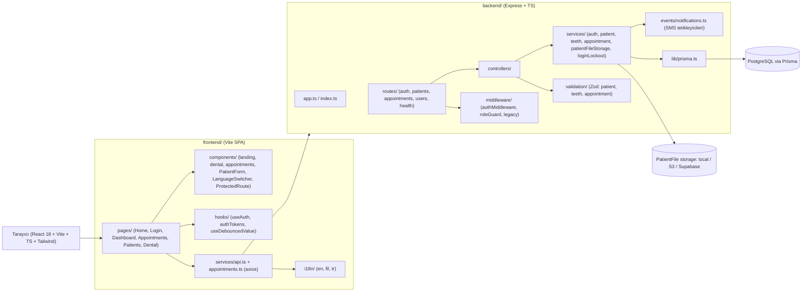
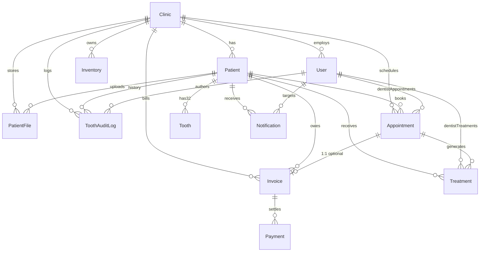
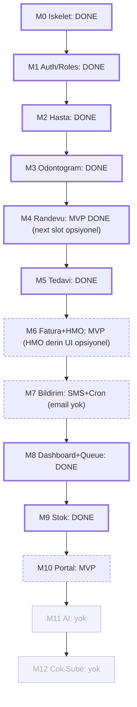
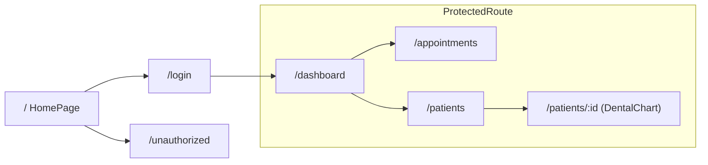

# DentEase PH — Güncel Durum Şeması

Son güncelleme: 2026-04-19

Bu belge projenin bugün itibarıyla mimari durumunu, tamamlanmış / devam eden / bekleyen modüllerini ve veri modelini tek sayfada özetler. Ayrıntılı görev listesi için bkz. [CHECKLIST.md](../CHECKLIST.md).

---

## 1. Yüksek Seviye Mimari



---

## 2. Monorepo Dizin Durumu

- Kök: `CHECKLIST.md` + `backend/` + `frontend/` + `docs/` (eski sari-sari / barber / food POS dosyaları git'te `D` olarak düştü, working tree temiz).
- [backend/prisma/schema.prisma](../backend/prisma/schema.prisma): 10 enum + 12 model kuruldu.
- [backend/src/app.ts](../backend/src/app.ts), [backend/src/index.ts](../backend/src/index.ts): Express bootstrap.
- [backend/src/routes/index.ts](../backend/src/routes/index.ts): `auth`, `patients`, `appointments`, `users`, `health`.
- [frontend/src/App.tsx](../frontend/src/App.tsx): Router (`/`, `/login`, `/unauthorized`, korumalı `/dashboard`, `/appointments`, `/patients`, `/patients/:id`).
- [frontend/src/i18n/locales/](../frontend/src/i18n/locales): `en.json`, `fil.json`, `tr.json` dolduruldu.
- [frontend/src/components/landing/DeviceMockups.tsx](../frontend/src/components/landing/DeviceMockups.tsx): Landing sayfası görselleri.
- [frontend/src/components/dental/](../frontend/src/components/dental): `DentalChart`, `ToothSvg`, `ToothEditModal`, `DentalChartLegend`, `toothGeometry`, `conditions`.
- [frontend/src/components/appointments/](../frontend/src/components/appointments): `NewAppointmentModal`, `AppointmentDetailSidebar`, `PatientAutocomplete`, `DentistSelect`.

---

## 3. Veri Modeli (Prisma)



Enumlar: `SubscriptionPlan`, `UserRole`, `Gender`, `BloodType`, `ToothCondition`, `AppointmentStatus`, `InvoiceStatus`, `PaymentMethod`, `NotificationChannel`, `NotificationDeliveryStatus`.

---

## 4. Modül Durumu (CHECKLIST özeti)



- **Özet (2026-04):** Çekirdek MVP modülleri (auth + hasta + odontogram + randevu + tedavi + fatura/PayMongo + HMO API + bildirim/SMS + dashboard/kuyruk + stok + portal OTP) çalışır durumda. Ayrıntılı işaretler için [CHECKLIST.md](../CHECKLIST.md).
- **Açık / iyileştirme:** HMO fatura UI derinliği, e-posta bildirimi, next-slot API, kök dizin POS kalıntısı temizliği (onaylı), AI/çok şube (yol haritası).

---

## 5. Frontend Rota Haritası



---

## 6. Backend API Yüzeyi (mevcut)

Tek kaynak: [backend/src/routes/index.ts](../backend/src/routes/index.ts) — `auth` (register/login/refresh/logout/**me**), `patients` (+ teeth, files, forms PDF), `appointments` (+ users/dentists), `treatments`, `invoices` (+ PayMongo, PDF), `hmo`, `inventory`, `notifications`, `reports`, `portal`, `perio`, `webhooks/paymongo`, `staff/users`, `clinic`, vb.

---

## 7. Açık Riskler ve Boşluklar

- Prod ortamı: `CORS_ORIGIN`, `PAYMONGO_WEBHOOK_SECRET`, `ALLOW_PUBLIC_REGISTER=false` — bkz. `backend/.env.example`.
- E-posta kanalı yok (SMS + cron var).
- Kök dizinde eski POS dosyaları silinmeyi bekliyor (CHECKLIST Bölüm 1 — kullanıcı onayı).
- Uzun TASK bölümleri (§9) tarihsel; tamamlanan maddeler için CHECKLIST ve kod tabanına bakın.

---

## 8. Önerilen Sıradaki Adımlar

1. [CHECKLIST.md](../CHECKLIST.md) Bölüm 7–9 öncelik sırası.
2. GAP / güvenlik ince ayarı (`docs/GAP_ANALYSIS.md`).

---

## 9. Agent Handoff — Yapılacak İşler (Diğer Agent'lar İçin Hazır Paket)

> **Not (2026-04):** Aşağıdaki TASK kartlarının çoğu **tarihsel taslaktır**; birçok madde kodda tamamlandı. Güncel öncelik için önce [CHECKLIST.md](../CHECKLIST.md) kullanın; burada yalnızca bağlam ve dosya yolları referansı kalır.

Bu bölüm, projeye girecek **diğer AI agent'ların** doğrudan iş alabilmesi için tasarlandı. Her kart; dosya yolları, değiştirilecek/eklenecek sembol adları, kabul kriterleri ve not düşülen tuzaklar içerir. Agent'lar sırayla (veya paralel uygun olanları) alıp CHECKLIST.md'deki ilgili kutucuğu işaretlemelidir.

### Genel Kurallar (tüm agent'lar için)

- **Stack sabit:** Backend Express + TS + Prisma + PostgreSQL, Frontend React 18 + Vite + TS + Tailwind, Zod validasyon, JWT auth (bkz. [CHECKLIST.md §0](../CHECKLIST.md)).
- **Bölge:** PHP (₱), Asia/Manila timezone, telefon `+63XXXXXXXXXX` regex.
- **i18n:** Hard-coded İngilizce metin YAZMA. [frontend/src/i18n/locales](../frontend/src/i18n/locales) altındaki `en.json` + `fil.json` + `tr.json` üçünü birden güncelle.
- **Tenant isolation:** Her query'de `clinicId` zorunlu; middleware `req.user.clinicId`'den gelir.
- **Hiç yeni MD dosyası yaratma** (kullanıcı istemediyse). Mevcut CHECKLIST.md ve bu STATUS.md güncellensin.
- **Git:** Commit atma (kullanıcı onayı yok). Sadece kod yaz + lint temiz bırak.
- **Dosya oluşturmadan önce** ilgili klasörün var olduğunu doğrula (`backend/src/routes/`, `frontend/src/services/` vs.).

---

### TASK-01 · `GET /api/auth/me` (M1 kapanışı) — 🟢 Kolay

**Amaç:** Frontend refresh sonrası kullanıcı bilgisini `id/email/role/clinicId/firstName/lastName/clinic.name` olarak verir.

**Değişecek dosyalar:**
- [backend/src/routes/auth.routes.ts](../backend/src/routes/auth.routes.ts) → `authenticate` middleware'i ile `router.get("/me", authenticate, meController)` ekle.
- [backend/src/controllers/auth.controller.ts](../backend/src/controllers/auth.controller.ts) → `meController` export et.
- [backend/src/services/auth.service.ts](../backend/src/services/auth.service.ts) → `getMe(userId: string)` fonksiyonu (Prisma `user.findUnique` + `clinic: { select: { id, name } }`).
- [frontend/src/hooks/useAuth.ts](../frontend/src/hooks/useAuth.ts) → mount'ta `/auth/me` çağır; 401'de token temizle.
- [frontend/src/services/api.ts](../frontend/src/services/api.ts) → `getMe()` helper.

**Kabul kriterleri:**
- Token geçersiz → 401 `{ code: "UNAUTHORIZED" }`.
- Kullanıcı `isActive=false` → 403 `{ code: "USER_INACTIVE" }`.
- `passwordHash`, `refreshSessionId` ASLA response'a çıkmasın.
- Frontend sayfa yenilendiğinde login state kaybolmasın.

---

### TASK-02 · M4 Randevu — Çakışma + İş Saati + FullCalendar — 🟡 Orta

**Amaç:** Randevu oluştururken `dentistId + scheduledAt + duration` ile çakışan başka bir randevu varsa 409 dön; Asia/Manila'ya göre 08:00–18:00 dışında ve Pazar günü 422 dön. Frontend'de FullCalendar `timeGridDay` + hekim kolonları.

**Backend değişecek dosyalar:**
- [backend/src/services/appointment.service.ts](../backend/src/services/appointment.service.ts):
  - `assertWithinBusinessHours(scheduledAt, duration)` — `date-fns-tz` ile `Asia/Manila` lokal saate çevir; `getDay() === 0` (Pazar) reddet; `hour < 8 || endHour > 18` reddet.
  - `assertNoOverlap(dentistId, start, duration, excludeId?)` — Prisma query: `status NOT IN (CANCELLED, NO_SHOW) AND dentistId = ? AND (start < newEnd AND end > newStart)`.
  - `suggestNextAvailable(dentistId, fromDate)` — 30 dk adımlarla ilk boş slot.
- [backend/src/validation/appointment.schemas.ts](../backend/src/validation/appointment.schemas.ts) → `duration` min 15, max 240, 15'in katı.
- DB katmanında **exclusion constraint** için [backend/prisma/exclusion-appointment-overlap.sql](../backend/prisma/exclusion-appointment-overlap.sql) var (CHECKLIST §2'de referans) — migration'a bağlanmalı.

**Frontend değişecek dosyalar:**
- [frontend/src/pages/AppointmentsPage.tsx](../frontend/src/pages/AppointmentsPage.tsx) → `@fullcalendar/react` + `@fullcalendar/timegrid` + `@fullcalendar/resource-timegrid` kullan; `resources` hekim listesi, `events` randevular.
- [frontend/src/components/appointments/NewAppointmentModal.tsx](../frontend/src/components/appointments/NewAppointmentModal.tsx) → 409 cevabında backend'den dönen `nextAvailableAt` önerisini göster ("Bu saat dolu. Önerilen: 14:30").

**Kabul kriterleri:**
- Çakışan randevu → 409 `{ code: "APPOINTMENT_CONFLICT", nextAvailableAt: ISO }`.
- Pazar veya 08-18 dışı → 422 `{ code: "OUTSIDE_BUSINESS_HOURS" }`.
- UI'da tarih değiştirince `events` & `resources` refetch.
- Sürükle-bırak ile saat değiştirince `PATCH /api/appointments/:id` çağır; 409'da revert.

---

### TASK-03 · M5 Treatment Kaydı + Otomatik Invoice — 🟡 Orta

**Amaç:** Tedavi tamamlanınca prosedürler + reçete + next visit kaydedilir, `Invoice` `UNPAID` olarak otomatik oluşur.

**Backend eklenecek dosyalar:**
- `backend/src/routes/treatment.routes.ts`
- `backend/src/controllers/treatment.controller.ts`
- `backend/src/services/treatment.service.ts` — tek transaction'da `Treatment[]` + `Invoice` + (opsiyonel) `Appointment.status = COMPLETED`.
- `backend/src/validation/treatment.schemas.ts` — Zod: `appointmentId`, `procedures: [{ toothIds?, procedure, quantity, unitPrice }]`, `prescription?`, `nextVisitAt?`, `notes?`.
- [backend/src/routes/index.ts](../backend/src/routes/index.ts) → `apiRouter.use("/treatments", treatmentRouter)`.

**Frontend eklenecek dosyalar:**
- `frontend/src/pages/TreatmentFormPage.tsx` — appointment detayından açılır, satır-satır prosedür ekleme.
- `frontend/src/components/treatment/TreatmentSummary.tsx` — yazdırılabilir kart (₱ toLocaleString('en-PH')).
- `frontend/src/services/treatments.ts` — `createTreatment`, `getByPatient`.

**Kabul kriterleri:**
- Aynı gün içinde `PUT /api/treatments/:id` düzenleme izni; sonraki gün 403 `CANNOT_EDIT_PAST_TREATMENT`.
- Invoice total = `sum(quantity * unitPrice) - discount`; `subtotal/discount/total` Prisma Decimal(12,2).
- `Appointment.status` yalnızca `CONFIRMED`/`PENDING` ise `COMPLETED`'e geçer; `CANCELLED` üzerinde 409.

---

### TASK-04 · M6 Invoice + Payment + HMO — 🔴 Büyük

**Amaç:** Faturayı ödeme ve HMO onay akışına bağla.

**Backend:**
- `backend/src/routes/invoice.routes.ts`, `invoice.controller.ts`, `invoice.service.ts`.
- `POST /api/invoices/:id/payments` → `PaymentMethod` (CASH, GCASH, MAYA, CREDIT_CARD, CHEQUE, PHILHEALTH). `sum(payments) >= total` → `status = PAID`, arada ise `PARTIAL`.
- PayMongo entegrasyonu: `lib/paymongo.ts` (create link + webhook handler `/api/webhooks/paymongo`). İmza doğrulaması zorunlu.
- **HMO:** Prisma'ya enum `HmoProvider` (MAXICARE, INTELLICARE, MEDICARE, MEDICARD, PHILHEALTH, NONE) + `Invoice.hmoProvider`, `hmoStatus` (PENDING_APPROVAL, APPROVED, REJECTED, NONE), `hmoCoverage Decimal`, `coPayment Decimal`. Migration gerekiyor.
- PDF: `pdfkit` ile BIR reg no + klinik logosu.

**Frontend:**
- `frontend/src/pages/InvoiceListPage.tsx` (filtre: tarih aralığı, status, hmoStatus; daily/weekly/monthly toplamlar).
- `frontend/src/pages/InvoiceDetailPage.tsx` (ödeme modal + HMO rozetleri).

**Kabul kriterleri:**
- HMO `APPROVED` olduğunda `total -= hmoCoverage`, `coPayment = total`.
- PayMongo webhook idempotent (`referenceNo` unique kontrol).
- 3'ten fazla `FAILED` payment denemesi log'a düşsün (lockout değil).

---

### TASK-05 · M7 Bildirim (SMS + Email + Cron) — 🔴 Büyük

**Amaç:** Semaphore.co (SMS) + Resend (Email) adapter'ları + cron job'lar.

**Backend eklenecek:**
- `backend/src/lib/semaphore.ts`, `backend/src/lib/resend.ts` — env `SEMAPHORE_API_KEY`, `RESEND_API_KEY`.
- `backend/src/services/notification.service.ts` — `sendAppointmentConfirmation`, `sendReminder`, `sendInvoiceEmail` (PDF attach), `sendBalanceDueSms`.
- `backend/src/jobs/cron.ts` — `node-cron`, `Asia/Manila`:
  - `0 9 * * *` → yarın randevusu olanlara reminder.
  - `0 18 * * *` → 7 gün+ unpaid invoice'lara SMS.
  - `0 10 * * 0` → kliniğe haftalık özet.
- Prisma `NotificationLog` modeli zaten var (`Notification`); `status` güncellensin, `FAILED` olanlar tekrar denenmesin (max 3 deneme).
- [backend/src/events/notifications.ts](../backend/src/events/notifications.ts) → stub yerine gerçek `EventEmitter` + subscriber olarak `notification.service`.

**Kabul kriterleri:**
- Klinik ayarlarında `notification-settings` (SMS open/close, email open/close) — `GET|PUT /api/clinics/:id/notification-settings`.
- `+63` dışı numaralar 422.
- Tüm cron'lar idempotent (aynı gün ikinci kez çalışsa duplicate göndermesin).

---

### TASK-06 · M8 Dashboard + Queue + Raporlar — 🟡 Orta

**Backend eklenecek:**
- `GET /api/dashboard/summary` → today appointments count, today revenue (₱), pending invoices, new patients (7 gün), upcoming 5 appointment.
- `GET /api/reports/revenue?period=DAILY|WEEKLY|MONTHLY` (30 puanlı line serisi).
- `GET /api/reports/procedures` (en sık yapılan 10 prosedür), `/dentist-performance`, `/patients`.

**Frontend:**
- [frontend/src/pages/DashboardPage.tsx](../frontend/src/pages/DashboardPage.tsx) şu an boş iskelet — 4 metrik kart + 30 gün chart (recharts) + bugünkü randevu listesi + hızlı aksiyonlar.
- `frontend/src/components/dashboard/PatientQueue.tsx` — `Checked-In | In-Progress | Update Status | Send Alert` satırları (WebSocket opsiyonel, ilk sürüm 30sn polling).
- `frontend/src/pages/ReportsPage.tsx` — tarih aralığı + CSV export (`papaparse`).

**Kabul kriterleri:**
- Tüm para değerleri `₱` + `toLocaleString('en-PH', { minimumFractionDigits: 2 })`.
- Timezone her zaman `Asia/Manila` — `new Date()` ham kullanma.

---

### TASK-07 · M9 Stok (Inventory) — 🟢 Kolay

- Prisma `Inventory` modeli var.
- `backend/src/routes/inventory.routes.ts` + service: `GET /list`, `POST /`, `PUT /:id`, `POST /:id/restock`, `POST /:id/use`, `GET /low-stock` (quantity < minimumStock).
- Kategori enum'u string alan olarak duruyor; dilersen Prisma enum'a al (`ANESTHETIC | FILLING | EXTRACTION | XRAY | CONSUMABLE | MEDICATION | EQUIPMENT`).
- Frontend: `InventoryListPage` + Dashboard low-stock widget.

---

### TASK-08 · i18n Hardening — 🟢 Kolay

- Mevcut `en/fil/tr` JSON'ları üzerinde hard-coded metin taraması yap:

  ```powershell
  rg -n "(?<![\w.])(?:'|\")[A-Z][a-zA-Z ]{3,}(?:'|\")" frontend/src --glob "*.tsx"
  ```

- Her tespit ettiğin sabit metni `t("namespace.key")` ile sarmala; üç dile de key ekle.
- [frontend/src/components/LanguageSwitcher.tsx](../frontend/src/components/LanguageSwitcher.tsx) zaten var; header'a sabitle.
- Tarih/saat: `Intl.DateTimeFormat(locale, { timeZone: 'Asia/Manila' })`.

---

### TASK-09 · Repo Temizliği + README — 🟢 Kolay

- [CHECKLIST.md §1](../CHECKLIST.md) listesindeki eski POS dosyaları git `D` durumunda (silinmiş ama commit edilmemiş). Kullanıcı onay verince `git rm --cached` tamamlansın.
- Kök dizindeki `build_error*.log`, `clean_error.log` atıkları silinsin.
- Yeni `README.md` yazılsın: DentEase PH tanıtımı + kurulum (`backend/` ve `frontend/` için `npm install && npm run dev`), env şablonları.
- Repo rename: `filipin mvp` → `dentease-ph` (kullanıcı kararı, otomatik yapma).

---

## 10. Agent'lar İçin Koordinasyon Notu

- Bir task'ı aldığında **CHECKLIST.md**'deki ilgili modüldeki `[ ]` kutucuğunu `[x]` yap.
- Tamamladığında bu `docs/STATUS.md` dosyasındaki **Bölüm 4 (Modül Durumu)** Mermaid diyagramında `:::todo` → `:::wip` → `:::done` güncelle.
- Paralel çalışabilen taskler: **TASK-07 (Inventory)**, **TASK-08 (i18n)**, **TASK-09 (Temizlik)** bağımsız; diğerleri M4 → M5 → M6 → M7 sırasına tabi.
- Kilit kararlar kullanıcıya kalır: HMO sağlayıcı listesi, repo rename, eski POS dosyalarının fiziksel silinmesi.
